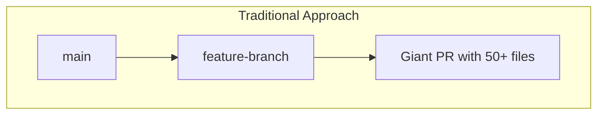
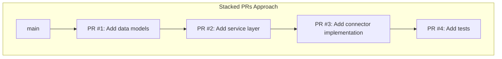
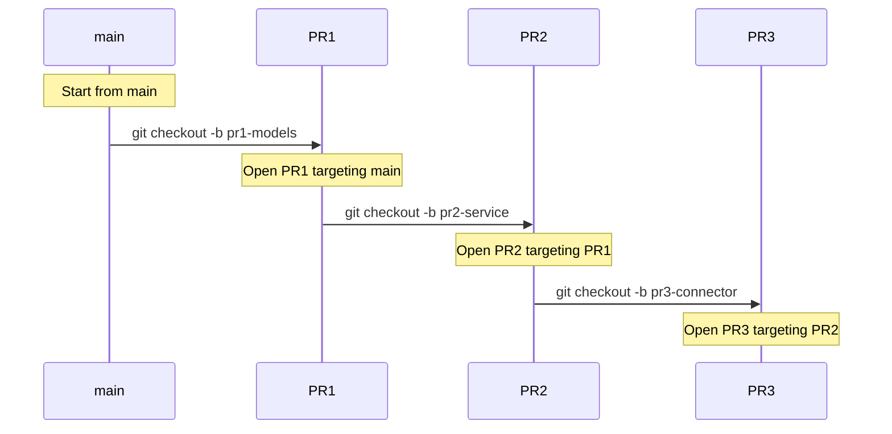
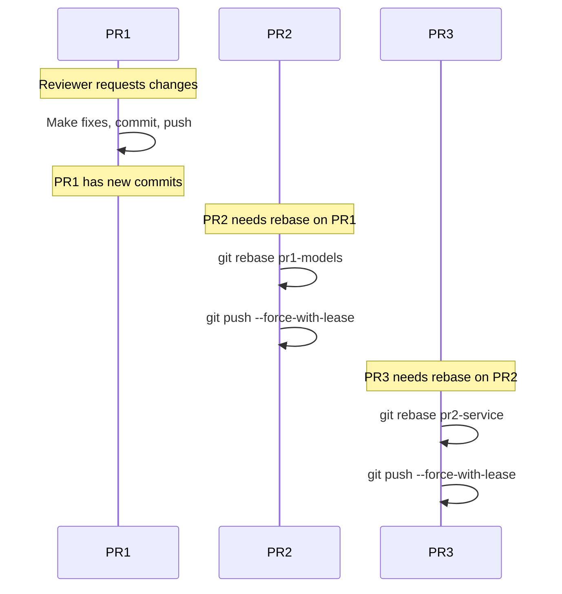
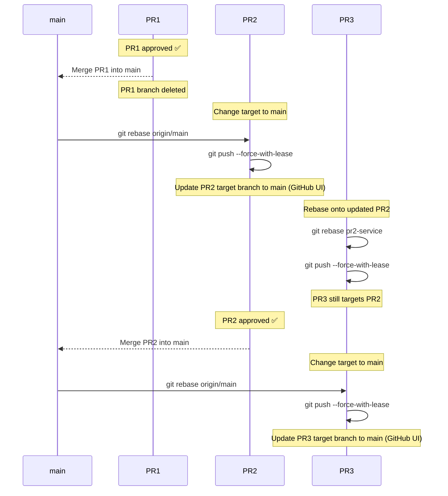
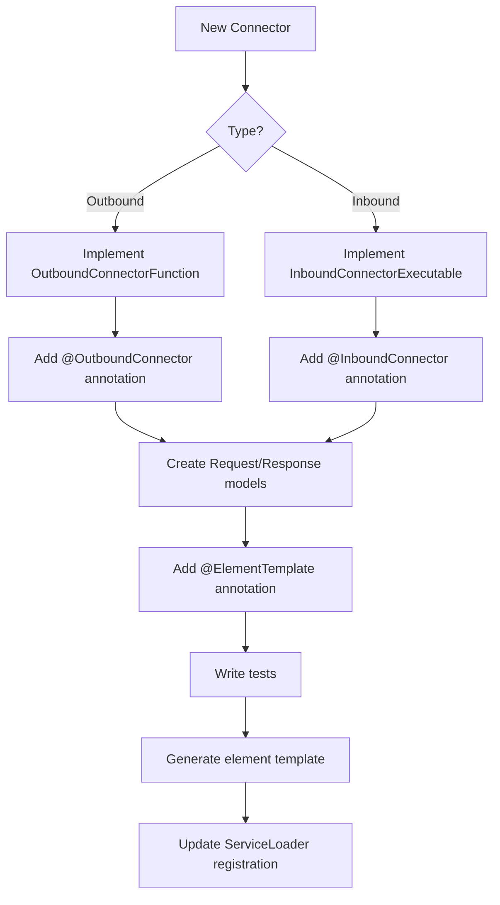

# Contributing to Camunda Connectors

We welcome new contributions! We take pride in maintaining and encouraging a friendly, welcoming, and collaborative
community.

Anyone is welcome to contribute to Camunda Connectors! The best way to get started is to choose an
existing [issue](#starting-on-an-issue).

- [Prerequisites](#prerequisites)
    - [Contributor License Agreement](#contributor-license-agreement)
    - [Code of Conduct](#code-of-conduct)
- [GitHub Issue Guidelines](#github-issue-guidelines)
    - [Starting on an Issue](#starting-on-an-issue)
- [Build and Run from Source](#build-and-run-from-source)
    - [Build](#build)
    - [Run](#run)
    - [Test Execution](#test-execution)
- [Creating a Pull Request](#creating-a-pull-request)
    - [Stacked Pull Requests](#stacked-pull-requests)
- [Reviewing a Pull Request](#reviewing-a-pull-request)
    - [Review Emoji Code](#review-emoji-code)
    - [Stale Pull Requests](#stale-pull-requests)
- [Commit Message Guidelines](#commit-message-guidelines)
- [Connector Development Guide](#connector-development-guide)

## Prerequisites

### Contributor License Agreement

You will be asked to sign our [Contributor License Agreement](https://cla-assistant.io/camunda-community-hub/community)
when you open a Pull Request. We are not asking you to assign copyright to us but to give us the right to distribute
your code without restriction. We ask this of all contributors to assure our users of the origin and continuing
existence of the code.

> [!NOTE]
> In most cases, you will only need to sign the CLA once.

### Code of Conduct

This project adheres to the [Camunda Code of Conduct](https://camunda.com/events/code-conduct/). By participating, you
are expected to uphold this code. Please [report](https://camunda.com/events/code-conduct/reporting-violations/)
unacceptable behavior as soon as possible.

## GitHub Issue Guidelines

If you want to report a bug or request a new feature, feel free to open a new issue
on [GitHub](https://github.com/camunda/connectors/issues).

If you report a bug, please help speed up problem diagnosis by providing as much information as possible. Ideally, that
would include:

- The connector name and version
- Steps to reproduce the issue
- Expected vs actual behavior
- Relevant logs or error messages
- Environment details (Camunda version, runtime configuration)

> [!NOTE]
> If you have a general usage question, please ask on the [forum](https://forum.camunda.io/).

Every issue should have a meaningful name and a description that either describes:

- A new feature with details about the use case the feature would solve or improve
- A problem, how we can reproduce it, and what the expected behavior would be
- A change and the intention of how this would improve the system

### Starting on an Issue

The `main` branch contains the current in-development state of the project. To work on an issue, follow these steps:

1. Check that a [GitHub issue](https://github.com/camunda/connectors/issues) exists for the task you want to work on. If
   one does not, create one.
2. Check that no one is already working on the issue, and make sure the team would accept a pull request for this topic.
3. Checkout the `main` branch and pull the latest changes.

   ```bash
   git checkout main
   git pull
   ```
4. Create a new branch with the naming scheme `issueId-description`.

   ```bash
   git checkout -b 123-add-new-connector
   ```
5. Follow the code style guidelines while coding (see [Connector Development Guide](#connector-development-guide)).
6. Implement the required changes on your branch and regularly push your changes to the origin so that the CI can run.

   ```bash
   git commit -am 'feat: add new feature'
   git push -u origin 123-add-new-connector
   ```
7. When ready, prepare the branch for review by squashing commits into meaningful units with helpful messages.
8. After finishing up the squashing, force push your changes to your branch.

   ```bash
   git push --force-with-lease
   ```

## Build and Run from Source

### Project Structure

```
connectors/
├── connector-sdk/          # SDK for building connectors (Java 17)
├── connector-runtime/      # Execution environment for connectors
├── connectors/             # 30+ out-of-the-box connectors
├── element-template-generator/  # Automated template generation
├── bundle/                 # Docker images
├── connector-commons/      # Shared utilities
└── connectors-e2e-test/    # End-to-end tests
```

### Build

> [!NOTE]
> - **SDK** uses Java 17
> - **Runtime and Connectors** use Java 21

#### Quick Build (Recommended for Development)

```bash
mvn clean package -Dquickly
```

This skips long-running tests for faster iteration.

#### Full Build

```bash
mvn clean package
```

#### Build Specific Connector

```bash
mvn clean package -pl connectors/http/rest
```

#### Generate Element Templates

```bash
./connectors/create-element-templates-symlinks.sh
```

#### Build Docker Bundle

```bash
cd bundle && docker build -t camunda/connectors-bundle:latest .
```

### Run

#### Run with Spring Boot

```bash
cd connector-runtime/connector-runtime-application
mvn spring-boot:run
```

#### Run Specific Tests

```bash
# Run unit tests for a specific connector
mvn test -pl connectors/http/rest -Dtest=HttpJsonFunctionTest

# Run integration tests (requires Docker)
mvn verify -pl connectors/kafka
```

### Test Execution

- **Unit tests**: `*Test.java` - Run with `mvn test`
- **Integration tests**: Use `@SlowTest` annotation - Run with `mvn verify`
- **E2E tests**: Located in `connectors-e2e-test/` - Run with `mvn verify -Pe2e`

#### Test Troubleshooting

If tests fail with Docker-related errors:

1. Ensure Docker is running
2. Check that required images are available
3. Verify `docker-images.properties` contains the correct image versions

## Creating a Pull Request

When creating a pull request, please:

1. **Link the related issue** in the PR description
2. **Provide a clear description** of what changes were made and why
3. **Include tests** for new functionality
4. **Update documentation** if needed (README, element templates, etc.)
5. **Ensure CI passes** before requesting review

### Stacked Pull Requests

For large features, we recommend using **stacked PRs** - breaking down a large change into smaller, incremental pull
requests that build on top of each other.





#### Benefits of Stacked PRs

| Benefit                  | Description                                |
|--------------------------|--------------------------------------------|
| **Easier reviews**       | 200-400 lines per PR instead of 2000+      |
| **Faster feedback**      | Get early feedback on foundational changes |
| **Reduced conflicts**    | Frequent merges to main minimize conflicts |
| **Incremental progress** | Ship partial features, easier rollbacks    |

#### How to Create Stacked PRs

**Initial Setup:**



#### Case 1: Addressing Review Comments on PR1

When you receive feedback on PR1 and need to make changes, all subsequent PRs must be rebased:



**Commands:**

```bash
# After fixing PR1, rebase PR2 onto updated PR1
git checkout pr2-service
git rebase pr1-models
git push --force-with-lease

# Then rebase PR3 onto updated PR2
git checkout pr3-connector
git rebase pr2-service
git push --force-with-lease
```

#### Case 2: PR1 Approved and Merged

When PR1 is merged into main, PR2 needs to rebase onto main, and subsequent PRs rebase onto their parent:



**Commands:**

```bash
# After PR1 is merged, rebase PR2 onto main
git fetch origin
git checkout pr2-service
git rebase origin/main
git push --force-with-lease
# Then update PR2's target branch to "main" in GitHub UI

# Rebase PR3 onto updated PR2 (PR3 still targets PR2)
git checkout pr3-connector
git rebase pr2-service
git push --force-with-lease

# After PR2 is merged, rebase PR3 onto main
git fetch origin
git checkout pr3-connector
git rebase origin/main
git push --force-with-lease
# Then update PR3's target branch to "main" in GitHub UI
```

#### Summary: Rebase Rules

| Scenario       | Action                                                         |
|----------------|----------------------------------------------------------------|
| Changes to PRn | Rebase all PRs after PRn (PRn+1, PRn+2, ...) onto their parent |
| PRn merged     | Rebase PRn+1 onto `main`, update target branch in GitHub UI    |

#### Why `--force-with-lease` instead of `--force`?

When rebasing stacked PRs, you need to force push because you're rewriting history. However, `git push --force` can
accidentally overwrite a teammate's commits if they pushed to your branch (e.g., a co-author fix).

`git push --force-with-lease` is a **safer alternative** that only overwrites the remote branch if no one else has
pushed to it since you last fetched:

| Command              | Behavior                                                           |
|----------------------|--------------------------------------------------------------------|
| `--force`            | Overwrites remote **unconditionally** — may lose teammate's work ❌ |
| `--force-with-lease` | Overwrites **only if** remote hasn't changed — safe ✅              |

If `--force-with-lease` fails, fetch first and review what changed:

```bash
git fetch origin
git log origin/pr2-service  # See what changed before deciding
```

#### Tools for Managing Stacked PRs

Managing stacked PRs manually can be tedious. These tools automate the rebasing and tracking:

| Tool                                                            | Description                                                                                              | Install                                       |
|-----------------------------------------------------------------|----------------------------------------------------------------------------------------------------------|-----------------------------------------------|
| [**stack-pr**](https://github.com/modular/stack-pr)             | Simple CLI tool for creating and managing stacked PRs on GitHub. Lightweight and easy to use.            | `pip install stack-pr`                        |
| [**Graphite**](https://graphite.dev)                            | Full-featured stacking platform with CLI + web UI. Auto-rebases, tracks dependencies, syncs with GitHub. | `brew install withgraphite/tap/graphite`      |
| [**git-town**](https://www.git-town.com)                        | Git extension for high-level workflow commands. Handles stacking, syncing, and shipping.                 | `brew install git-town`                       |
| [**gh-stack**](https://github.com/timothyandrew/gh-stack)       | Lightweight GitHub CLI extension for viewing/managing stacks.                                            | `gh extension install timothyandrew/gh-stack` |
| [**git-branchless**](https://github.com/arxanas/git-branchless) | Advanced Git workflow with undo, navigation, and stacking support.                                       | `brew install git-branchless`                 |

**Example with Graphite:**

```bash
# Create a stack
gt create pr1-models      # Creates PR1
gt create pr2-service     # Creates PR2 on top of PR1
gt create pr3-connector   # Creates PR3 on top of PR2

# After changes to PR1, rebase entire stack automatically
gt stack rebase

# Submit all PRs in the stack
gt stack submit
```

> [!TIP]
> **Want to learn more?**
> Read [Stacked Diffs (and why you should know about them)](https://newsletter.pragmaticengineer.com/p/stacked-diffs) by
> Gergely Orosz for an in-depth explanation of how companies like Google, Meta, and Uber use this workflow.

#### When to Use Stacked PRs

✅ **Good candidates:**

- Large features (500+ lines)
- Refactoring with new functionality
- Changes spanning multiple layers (model → service → connector)
- Team members waiting on your code

❌ **Not necessary for:**

- Small bug fixes
- Single-file changes
- Isolated utility functions

## Reviewing a Pull Request

### Review Emoji Code

We use emoji codes to communicate review feedback clearly:

| Emoji                  | Meaning                         |
|------------------------|---------------------------------|
| 👍 `:+1:`              | I like this                     |
| ❓ `:question:`         | I have a question               |
| 💭 `:thought_balloon:` | Thought or idea (non-blocking)  |
| 🔧 `:wrench:`          | Suggestion for improvement      |
| ❌ `:x:`                | This needs to change (blocking) |
| 🎨 `:art:`             | Style/formatting suggestion     |
| 📝 `:memo:`            | Documentation suggestion        |

### Stale Pull Requests

Pull requests with no activity for 30 days may be closed. If you need more time:

- Leave a comment explaining the delay
- Mark as draft if work is paused

## Commit Message Guidelines

We follow the [Conventional Commits](https://www.conventionalcommits.org/) specification.

### Format

```
<type>: <subject>

[optional body]

[optional footer(s)]
```

### Types

| Type       | Description                           |
|------------|---------------------------------------|
| `feat`     | A new feature                         |
| `fix`      | A bug fix                             |
| `docs`     | Documentation changes                 |
| `style`    | Code style changes (formatting, etc.) |
| `refactor` | Code refactoring                      |
| `test`     | Adding or updating tests              |
| `chore`    | Maintenance tasks                     |
| `deps`     | Dependency updates                    |

### Examples

```bash
# Feature
feat: add support for multipart uploads

# Bug fix
fix: handle empty request body gracefully

Fixes #1234

# Breaking change
feat!: change default timeout to 30s

BREAKING CHANGE: Default timeout changed from 10s to 30s.
Update your configurations if you rely on the previous default.
```

## Connector Development Guide

For detailed guidance on developing connectors, please refer to:

- [`.github/copilot-instructions.md`](.github/copilot-instructions.md) - Comprehensive development patterns
- [`connector-sdk/README.md`](connector-sdk/README.md) - SDK documentation
- [`connectors/http/rest/`](connectors/http/rest/) - Reference implementation for outbound connectors
- [`connectors/webhook/`](connectors/webhook/) - Reference implementation for inbound connectors

### Quick Reference



### Standard Connector Structure

```
my-connector/
├── pom.xml
├── src/main/java/io/camunda/connector/
│   ├── MyConnectorFunction.java
│   └── model/
│       ├── MyRequest.java
│       └── MyResponse.java
├── src/test/java/
│   ├── MyConnectorTest.java
│   ├── BaseTest.java
│   └── GenerateElementTemplate.java
├── src/test/resources/
│   └── docker-images.properties
└── element-templates/
    └── my-connector.json
```

---

Thank you for contributing to Camunda Connectors! 🚀
