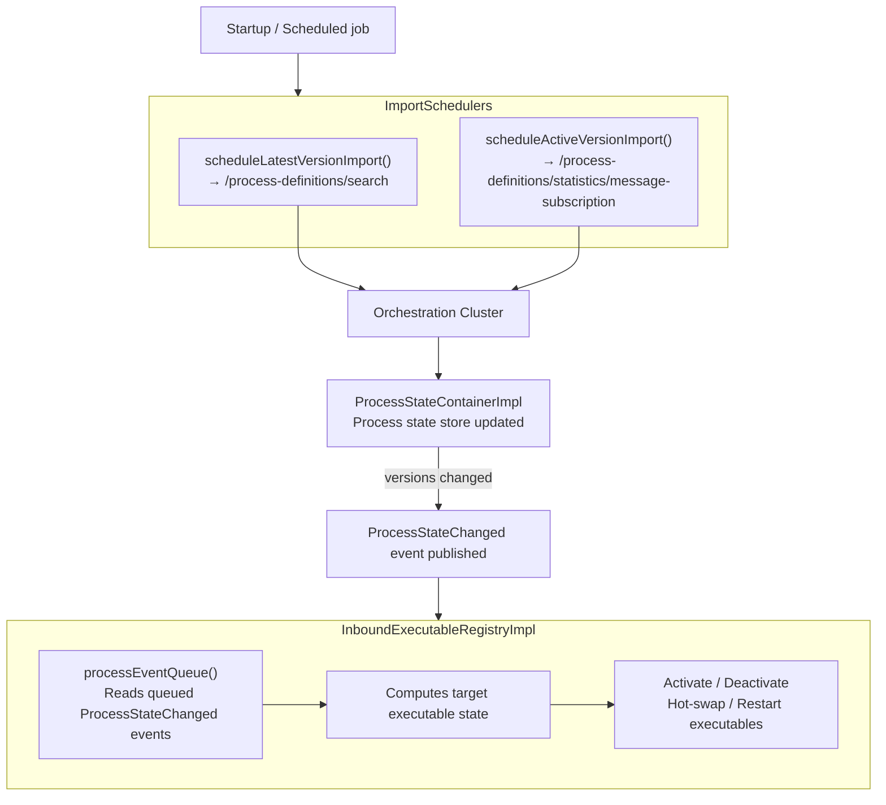
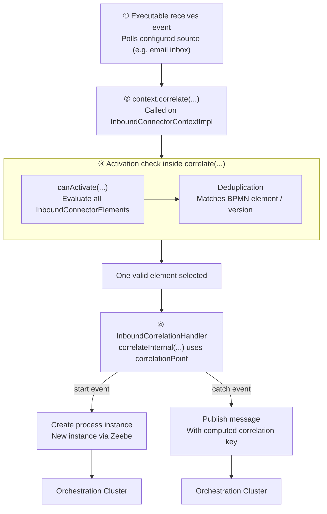

# Inbound Connectors

Inbound connectors allow external systems to trigger or continue Camunda processes, e.g. webhooks.

## Core Concepts

### Executables

An **executable** is a running instance of an inbound connector managed by the runtime. It
implements `InboundConnectorExecutable`, is activated when the runtime decides it is needed, and
listens for external events until it is deactivated or replaced.

### Deduplication

Deduplication determines whether multiple inbound connector elements in the BPMN can share the
same runtime executable, meaning they are handled by one shared client to the same external
source.

### Correlation

Correlation is the step where an incoming external event is mapped to a running process, for
example by matching the same `orderId` or email sender.


### Context

The **context** (`InboundConnectorContextImpl`) is passed to an executable during `activate()`. It
contains the connector configuration and runtime services such as correlation, validation, secret
resolution, and health reporting.

## Stores

The runtime keeps two independent in-memory stores: one for process definition state and one for
running executables.

### Process State Store (`ProcessStateContainerImpl`)

Tracks **which process definition versions should currently have active executables**. It is
updated by the scheduled polling cycle.

- Keyed by `ProcessDefinitionRef` (`bpmnProcessId` + `tenantId`)
- For each process, tracks relevant process definition versions
- For each version, stores two independent flags: `isLatest` and `hasActiveSubscriptions`
- Does **not** contain BPMN content or connector configuration, only lightweight version state

### Executable State Store (`InMemoryInboundExecutableStateStore`)

Tracks **all currently known connector executables**. This is the store that the rest of the
runtime reads from, for example, the webhook registry, REST endpoints, and health checks.

- Keyed by `ExecutableId` (SHA-256 of the `deduplicationId`)
- Each entry contains the executable instance and context, including connector configuration and
  all `InboundConnectorElements` in `connectorDetails` that share this `deduplicationId`

An activated entry looks like this:

```text
Activated
 ├── id          → ExecutableId (SHA-256 of deduplicationId)
 ├── executable  → InboundConnectorExecutable
 └── context     → InboundConnectorManagementContext
                        └── connectorDetails
                                └── List<InboundConnectorElement>
```

## Flows

### Regularly and on Startup

The runtime regularly synchronizes its internal state with Orchestration Cluster. This happens on startup and then
continuously via scheduled jobs, by calling these endpoints `/process-definitions/statistics/message-subscription` and `process-definitions/search`

First, the process state store is refreshed from Zeebe:

```text
ImportSchedulers:
  scheduleLatestVersionImport()
  scheduleActiveVersionImport()
```

These results are merged into the process state store. If the relevant versions for a process
change, the runtime publishes a `ProcessStateChanged` event.

Then the executable store is updated from those events:

```text
InboundExecutableRegistryImpl
  processEventQueue()
    └─ reads queued ProcessStateChanged events
       └─ computes the target executable state
          └─ activates, deactivates, hot-swaps, or restarts executables
```



### When the listener receives an event, e.g. a new email in the inbox

1. The already active executable receives the event because it is the one listening to that
   source, for example by polling the configured email inbox.
2. The executable then calls `context.correlate(...)` on its `InboundConnectorContextImpl`.
3. Inside `correlate(...)`, the runtime performs the activation check:
   - it evaluates the activation condition across all `InboundConnectorElements` in the context by
     calling `canActivate(...)`
   - if the executable is deduplicated, this is how the runtime selects the one matching BPMN element / process version for this event
4. Once one valid element is selected, `InboundCorrelationHandler.correlateInternal(...)` uses that
   element's `correlationPoint` to call Zeebe:
   - for a start event, it creates a new process instance
   - for an intermediate catch event, it publishes a message with the computed correlation key



