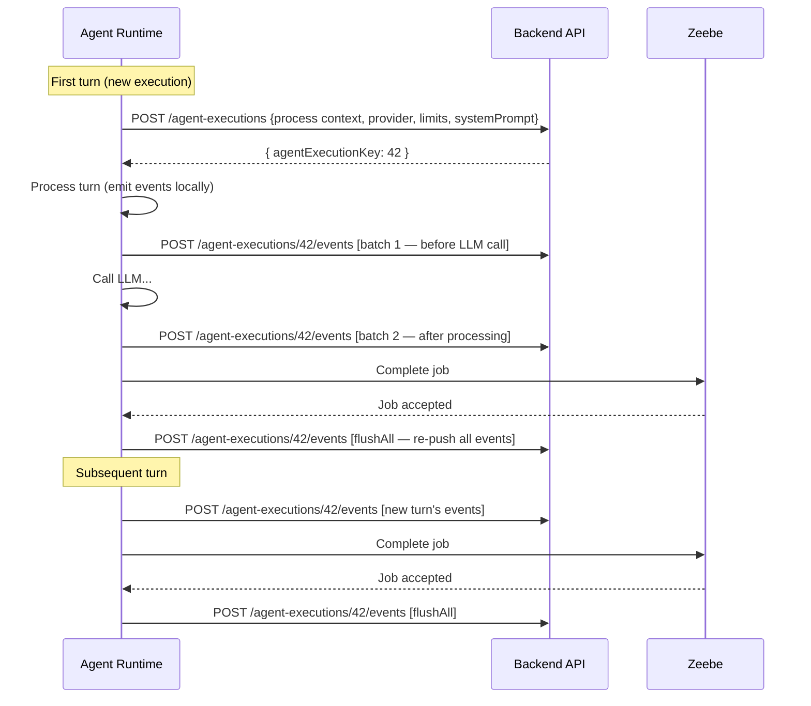
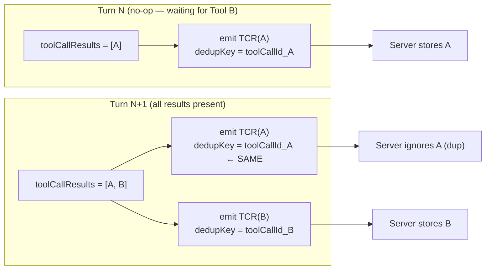
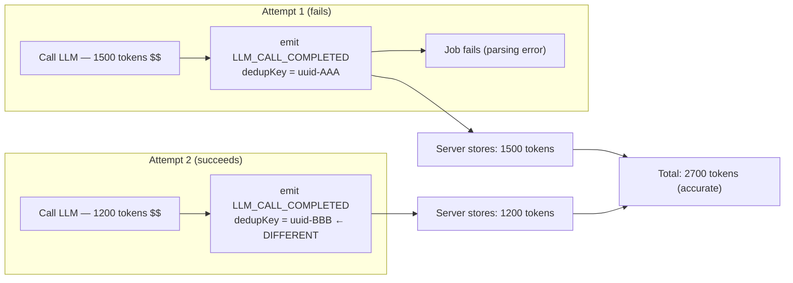

# Agent Execution Tracing — API Provider Guide

* Authors: Agentic AI Team
* Date: April 23, 2026
* Status: **Proposed** (PoC)
* Related: [Agent-Side Design](agent-execution-tracing-design.md), [Metrics Coverage](agent-execution-tracing-metrics.md), [Metrics Reference](https://github.com/camunda/camunda-hub-design-prototype/blob/main/docs/drafts/agent-visibility-metrics-reference.md)

---

This document is written for engineers building the Camunda backend API that receives agent
execution trace events. It covers the API contract, event semantics, deduplication requirements,
and how to derive metrics from the event stream — without requiring knowledge of the agent's
internal codebase.

For agent-side implementation details, see [agent-execution-tracing-design.md](agent-execution-tracing-design.md).
For the full metrics derivation reference, see [agent-execution-tracing-metrics.md](agent-execution-tracing-metrics.md).

---

## Table of Contents

1. [Overview](#1-overview)
2. [Why Events, Not Entity Updates](#2-why-events-not-entity-updates)
3. [API Endpoints](#3-api-endpoints)
4. [Event Model](#4-event-model)
5. [Deduplication Contract](#5-deduplication-contract)
6. [Conversation Reconstruction](#6-conversation-reconstruction)
7. [Interaction Patterns](#7-interaction-patterns)
8. [Correlating with Zeebe Data](#8-correlating-with-zeebe-data)

---

## 1. Overview

The Camunda AI Agent executes as a **distributed, stateless loop** across Zeebe and the connector
runtime. Each iteration (called a "turn") is a separate Zeebe job activation where the connector:

1. Loads conversation history
2. Calls an LLM
3. Emits tool calls or completes the agent
4. Completes the Zeebe job

The agent has no persistent in-memory state between turns. All state flows through Zeebe process
variables. This means:

- The agent cannot accumulate events locally across turns — it must push them per-turn
- Jobs can fail, be retried, or be superseded by Zeebe — each creating unique tracing challenges
- Multiple tools execute in parallel as BPMN elements, with results arriving together

The tracing system captures fine-grained events during each turn and pushes them to the backend
for aggregation, visualization, and auditability.

### What the agent sends



---

## 2. Why Events, Not Entity Updates

The API receives append-only events rather than entity update requests. This is not an
architectural preference — it is a requirement driven by the agent's distributed execution model.

### The core problem

When a job fails mid-processing (e.g., after calling the LLM but before completing the job),
Zeebe retries the job with **the same input variables from before the failed attempt**. If the
backend stored state via entity updates:

- First attempt: LLM called, 1500 tokens consumed, entity updated with "tokens: 1500"
- Job fails (e.g., JSON parsing error)
- Retry: LLM called again, 1200 tokens consumed, entity updated with "tokens: 1200"
- **Result**: first attempt's 1500 tokens silently erased

With events, both attempts produce separate records. The backend sums all `LLM_CALL_COMPLETED`
events to get the accurate total: 2700 tokens.

### Why entity updates fail

| Scenario | Entity update problem | Event solution |
|----------|----------------------|----------------|
| Job retry after LLM call | Overwrites first attempt's data | Both attempts stored with unique dedup keys |
| Job superseded by Zeebe | Race condition: two jobs updating the same entity | Both push events independently, append-only |
| Partial tool results (no-op) | Read-modify-write races on concurrent no-op jobs | Each emits events, server deduplicates by `toolCallId` |
| Network failure on push | Unknown state: was the update applied? | Re-push same events with same dedup keys, server ignores duplicates |

### The parent entity

Despite using events, the API still provides a creation endpoint (`POST /agent-executions`). This
parent entity:

- Returns the `agentExecutionKey` (Long) that all events reference
- Stores static execution metadata (process context, provider, limits, system prompt)
- Is **never updated by the agent** — the backend may update derived fields by processing events

---

## 3. API Endpoints

### 3.1 Create Execution: `POST /agent-executions`

Called **once** per agent execution, on the first job activation.

**Error behavior**: If this call fails, the agent fails the Zeebe job immediately (triggering a
retry). The agent cannot operate without a trace identity.

**Request:**

```java
public record CreateAgentExecutionRequest(
    long processDefinitionKey,
    long processInstanceKey,
    String elementId,
    long elementInstanceKey,
    String tenantId,
    ProviderInfo provider,
    LimitsInfo limits,
    String systemPrompt
) {
    public record ProviderInfo(String type, String model) {}
    public record LimitsInfo(int maxModelCalls) {}
}
```

**Response:**

```json
{ "agentExecutionKey": 42 }
```

The `agentExecutionKey` is a server-assigned Long (not a UUID) that the agent persists across
turns via Zeebe process variables.

### 3.2 Push Events: `POST /agent-executions/{agentExecutionKey}/events`

Called multiple times per turn (see [§7 Interaction Patterns](#7-interaction-patterns)).

**Error behavior**: Best-effort. Failures are logged by the agent but do not fail the job. The
agent re-pushes all events on job completion (`flushAll`) as a reliability mechanism. The server
must deduplicate by `(agentExecutionKey, dedupKey)`.

**Request:**

```java
public record PushEventsRequest(
    List<AgentTraceEvent> events
) {}
```

---

## 4. Event Model

### 4.1 Event wrapper

Every event has the same envelope:

```java
public record AgentTraceEvent(
    String dedupKey,              // deduplication key (see §5)
    AgentTraceEventType type,     // discriminator for payload type
    Instant timestamp,            // when the event occurred
    long jobKey,                  // Zeebe job key — groups events per turn
    AgentTraceEventPayload payload
) {}
```

The `jobKey` is critical: it groups all events from the same turn (job activation). The server
uses it to correlate with Zeebe job completion data (see [§8](#8-correlating-with-zeebe-data)).

### 4.2 Event types and payloads

```java
public enum AgentTraceEventType {
    TOOL_DISCOVERY_STARTED,
    TOOL_DEFINITIONS_CHANGED,
    TOOL_CALL_RESULT_RECEIVED,
    LLM_CALL_STARTED,
    LLM_CALL_COMPLETED,
    LLM_CALL_FAILED,
    TOOL_CALLS_EMITTED,
    TURN_COMPLETED,
    LIMIT_HIT,
    CONVERSATION_SNAPSHOT,
    SYSTEM_PROMPT_CHANGED,
    AGENT_COMPLETED
}
```

All payloads implement a sealed interface:

```java
public sealed interface AgentTraceEventPayload {

    /** Gateway tool discovery has started. */
    record ToolDiscoveryStarted(
        List<String> gatewayTypes
    ) implements AgentTraceEventPayload {}

    /**
     * The current set of tool definitions. Emitted when tools are first
     * resolved, after discovery completes, or after process migration.
     * Always carries the full current list (not a delta).
     */
    record ToolDefinitionsChanged(
        List<ToolDefinition> toolDefinitions
    ) implements AgentTraceEventPayload {}

    /**
     * A tool call result was received. Emitted per result, including on
     * no-op turns where the agent is waiting for more results.
     * Deduplicated by toolCallId (see §5).
     */
    record ToolCallResultReceived(
        String toolCallId,
        String llmToolName,
        String elementId,
        Object content,
        @Nullable Instant completedAt
    ) implements AgentTraceEventPayload {}

    /**
     * An LLM call is starting. Carries delta messages (excluding tool call
     * results, which have their own events) and a window boundary reference.
     */
    record LlmCallStarted(
        List<Message> messages,
        @Nullable UUID firstIncludedMessageId
    ) implements AgentTraceEventPayload {}

    /** An LLM call completed successfully. */
    record LlmCallCompleted(
        AssistantMessage assistantMessage,
        TokenUsageInfo tokenUsage,
        long durationMs
    ) implements AgentTraceEventPayload {}

    /** An LLM call failed. */
    record LlmCallFailed(
        String errorClass,
        String errorMessage
    ) implements AgentTraceEventPayload {}

    /**
     * The LLM requested tool calls. Each entry carries both the LLM-visible
     * name and the BPMN element ID (they differ for gateway tools like MCP).
     */
    record ToolCallsEmitted(
        List<EmittedToolCall> toolCalls
    ) implements AgentTraceEventPayload {}

    /**
     * A turn completed processing. Cross-reference with Zeebe job completion
     * data to determine if the turn was actually accepted (see §8).
     */
    record TurnCompleted() implements AgentTraceEventPayload {}

    /** A configured limit (guardrail) was hit. */
    record LimitHit(
        String limitType,
        int configuredThreshold,
        int actualValue
    ) implements AgentTraceEventPayload {}

    /**
     * Full conversation snapshot. Serves as a reset point for conversation
     * reconstruction. Emitted on mid-flight upgrade or future compaction.
     */
    record ConversationSnapshot(
        List<Message> messages
    ) implements AgentTraceEventPayload {}

    /** System prompt changed (reserved, not yet emitted). */
    record SystemPromptChanged(
        String systemPrompt
    ) implements AgentTraceEventPayload {}

    /** Agent completed — no more tool calls, execution is done. */
    record AgentCompleted() implements AgentTraceEventPayload {}
}
```

### 4.3 Supporting types

```java
public record TokenUsageInfo(
    int inputTokenCount,
    int outputTokenCount
    // Future: int reasoningTokenCount, int cachedTokenCount
) {}

/**
 * A tool call carrying both identifiers:
 * - llmToolName: what the LLM called it (e.g., "MCP_Files___readFile")
 * - elementId: the BPMN element that executes (e.g., "MCP_Files")
 * For non-gateway tools, these are identical.
 */
public record EmittedToolCall(
    String toolCallId,
    String llmToolName,
    String elementId,
    Map<String, Object> arguments
) {}
```

### 4.4 Quick reference: where to find key data

| What you're looking for | Event type | Field path |
|------------------------|-----------|------------|
| **AI response text** | `LLM_CALL_COMPLETED` | `payload.assistantMessage.content` — list of content blocks (text, images, etc.) |
| **Tool calls the LLM requested** | `TOOL_CALLS_EMITTED` | `payload.toolCalls[]` — each has `toolCallId`, `llmToolName`, `elementId`, `arguments` |
| **Tool call results** | `TOOL_CALL_RESULT_RECEIVED` | `payload.content` — the raw output returned by the tool |
| **Token usage (per LLM call)** | `LLM_CALL_COMPLETED` | `payload.tokenUsage.inputTokenCount`, `.outputTokenCount` |
| **LLM call duration** | `LLM_CALL_COMPLETED` | `payload.durationMs` |
| **User prompt / input messages** | `LLM_CALL_STARTED` | `payload.messages[]` — delta messages added this turn (excluding tool results) |
| **Tool call duration** | `TOOL_CALLS_EMITTED` + `TOOL_CALL_RESULT_RECEIVED` | Pair by `toolCallId`: duration = `TOOL_CALL_RESULT_RECEIVED.completedAt` − `TOOL_CALLS_EMITTED.timestamp` |
| **Available tools** | `TOOL_DEFINITIONS_CHANGED` | `payload.toolDefinitions[]` |
| **System prompt** | `CreateAgentExecutionRequest` | `systemPrompt` field on the parent entity |
| **Model / provider** | `CreateAgentExecutionRequest` | `provider.type`, `provider.model` |
| **Limit violations** | `LIMIT_HIT` | `payload.limitType`, `.configuredThreshold`, `.actualValue` |
| **Full conversation at a point in time** | Replay all events (see [§6](#6-conversation-reconstruction)) | Or use `CONVERSATION_SNAPSHOT.messages` as a reset point |

> **AI response content vs tool calls**: The LLM's response is always in `LLM_CALL_COMPLETED.assistantMessage`.
> This message may contain **both** text content (`content` field) **and** tool call requests (`toolCalls` field).
> When the LLM requests tool calls, the same tool calls are also emitted as a separate `TOOL_CALLS_EMITTED` event
> with the additional `elementId` mapping. The `TOOL_CALLS_EMITTED` event is the authoritative source for tool
> call details because it includes the BPMN element ID (which the raw assistant message does not carry).

---

## 5. Deduplication Contract

The server **must** deduplicate events by `(agentExecutionKey, dedupKey)`. This is not optional —
the agent's push pattern (flush + flushAll) guarantees duplicate pushes in normal operation.

### 5.1 Server-side rule

- First push with a given `(agentExecutionKey, dedupKey)` → **store**
- Subsequent pushes with the same pair → **ignore** (idempotent, return success)

### 5.2 How the agent derives dedup keys

| Event type | Dedup key value | Why |
|-----------|----------------|-----|
| `TOOL_CALL_RESULT_RECEIVED` | The `toolCallId` (stable string) | The same tool result arrives in multiple job activations: once on a no-op turn (partial results), again on the real turn when all results are present. The `toolCallId` is unique per tool call. First-write-wins. |
| All other events | A random UUID (generated at emit time) | Each emission is unique. On `flushAll()`, the same events are re-pushed with the same UUIDs → deduplicated. On a job retry, new events get new UUIDs → both attempts are stored (critical for token accuracy). |

### 5.3 Why tool call results need special dedup



### 5.4 Why job retries must NOT be deduplicated



Both attempts consumed real tokens. If deduplicated, 1500 tokens would be lost from the audit
trail and cost tracking.

---

## 6. Conversation Reconstruction

The event stream carries enough data for the server to reconstruct the complete agent conversation
without accessing the agent's conversation store. This is important for the conversation history
data requirement (D8) and for future auditability where the event stream may replace the
conversation store as source of truth.

### 6.1 How messages are distributed across events

Each turn's new messages are split across three event types:

| Message type | Carried by | Notes |
|-------------|-----------|-------|
| Tool call results | `TOOL_CALL_RESULT_RECEIVED` (one per result) | Each event carries the full result content |
| User messages, event messages | `LLM_CALL_STARTED.messages` | Only messages not covered by `TOOL_CALL_RESULT_RECEIVED` |
| Assistant message (LLM response) | `LLM_CALL_COMPLETED.assistantMessage` | The LLM's full response including tool calls |

### 6.2 Reconstruction algorithm

```
conversation = []

for each event in order:
    if event.type == CONVERSATION_SNAPSHOT:
        conversation = event.payload.messages  // reset point
    elif event.type == TOOL_CALL_RESULT_RECEIVED:
        conversation.append(toolCallResultMessage(event.payload))
    elif event.type == LLM_CALL_STARTED:
        conversation.extend(event.payload.messages)
    elif event.type == LLM_CALL_COMPLETED:
        conversation.append(event.payload.assistantMessage)
```

After replaying all events, `conversation` contains the full, unfiltered message history.

### 6.3 What the LLM actually saw (message windowing)

The agent uses a sliding message window — the LLM may not see the entire conversation history.
The `LLM_CALL_STARTED.firstIncludedMessageId` field tells the server where the window boundary
is:

- `firstIncludedMessageId = <UUID>` → messages before this ID were not sent to the LLM
- `firstIncludedMessageId = null` → either no windowing occurred, or the boundary falls on a
  pre-upgrade message without an ID

The server has the full history from reconstruction. The `firstIncludedMessageId` identifies which
subset the LLM saw — without the server needing to understand the agent's windowing algorithm.

### 6.4 Message IDs

Each message carries a `UUID id` (UUIDv7). IDs are assigned at message creation time and are
**not** backfilled to pre-existing messages (some stores are append-only). Pre-upgrade messages
have `id = null`.

### 6.5 Conversation snapshots

A `CONVERSATION_SNAPSHOT` event carries the full conversation state. The server should **replace**
its reconstructed history with the snapshot content and continue appending from subsequent events.

Emitted when:
- **Mid-flight upgrade**: the agent was running before tracing was enabled. The snapshot catches
  the server up on the existing conversation.
- **Conversation compaction** (future): the agent summarized/dropped old messages. The snapshot
  records the new ground truth.

---

## 7. Interaction Patterns

### 7.1 Normal turn (tool results arrive → LLM call → tool calls emitted)

This is the most common pattern. The agent receives tool results from a previous iteration,
calls the LLM, and the LLM requests new tool calls.

```
Agent receives job activation
├── emit: TOOL_CALL_RESULT_RECEIVED ×N      (one per tool result)
├── emit: LLM_CALL_STARTED                  (delta messages + window boundary)
├── → flush()                               ← PUSH batch 1
├── [call LLM — may take seconds]
├── emit: LLM_CALL_COMPLETED                (assistant message, tokens, duration)
├── emit: TOOL_CALLS_EMITTED                (tool calls with both names)
├── emit: TURN_COMPLETED
├── → flush()                               ← PUSH batch 2
├── [complete Zeebe job]
└── → flushAll()                            ← PUSH all events (dedup ensures safety)
```

**Example event batch** (what the server receives in batch 1):

```json
[
  {
    "dedupKey": "tc_call_01",
    "type": "TOOL_CALL_RESULT_RECEIVED",
    "timestamp": "2026-04-23T14:30:01.100Z",
    "jobKey": 2251799813685312,
    "payload": {
      "toolCallId": "tc_call_01",
      "llmToolName": "getCustomerInfo",
      "elementId": "getCustomerInfo",
      "content": "{\"name\": \"Alice\", \"plan\": \"Enterprise\", \"accountId\": \"A-1234\"}",
      "completedAt": "2026-04-23T14:30:00.950Z"
    }
  },
  {
    "dedupKey": "tc_call_02",
    "type": "TOOL_CALL_RESULT_RECEIVED",
    "timestamp": "2026-04-23T14:30:01.101Z",
    "jobKey": 2251799813685312,
    "payload": {
      "toolCallId": "tc_call_02",
      "llmToolName": "MCP_Jira___getOpenTickets",
      "elementId": "MCP_Jira",
      "content": "[{\"id\": \"JIRA-456\", \"summary\": \"Login fails on mobile\"}]",
      "completedAt": "2026-04-23T14:30:00.800Z"
    }
  },
  {
    "dedupKey": "f47ac10b-58cc-4372-a567-0e02b2c3d479",
    "type": "LLM_CALL_STARTED",
    "timestamp": "2026-04-23T14:30:01.105Z",
    "jobKey": 2251799813685312,
    "payload": {
      "messages": [],
      "firstIncludedMessageId": "019078a1-3f5c-7d4e-8b2a-1c9d0e8f7a6b"
    }
  }
]
```

> Note: `LLM_CALL_STARTED.messages` is empty here because the only new messages this turn are
> tool call results, which are already covered by the `TOOL_CALL_RESULT_RECEIVED` events.
> `firstIncludedMessageId` references the oldest non-system message the LLM will see.

**Example event batch** (what the server receives in batch 2):

```json
[
  {
    "dedupKey": "a1b2c3d4-e5f6-7890-abcd-ef1234567890",
    "type": "LLM_CALL_COMPLETED",
    "timestamp": "2026-04-23T14:30:03.450Z",
    "jobKey": 2251799813685312,
    "payload": {
      "assistantMessage": {
        "role": "assistant",
        "id": "019078a1-4b2d-7f1e-9c3a-2d8e1f9a0b3c",
        "content": [
          {"type": "text", "text": "I can see Alice is on the Enterprise plan and has an open ticket about mobile login. Let me check the ticket details and recent deployments."}
        ],
        "toolCalls": [
          {"id": "tc_call_03", "name": "MCP_Jira___getTicketDetails", "arguments": {"ticketId": "JIRA-456"}},
          {"id": "tc_call_04", "name": "getRecentDeployments", "arguments": {"service": "auth-mobile"}}
        ]
      },
      "tokenUsage": {
        "inputTokenCount": 1847,
        "outputTokenCount": 312
      },
      "durationMs": 2340
    }
  },
  {
    "dedupKey": "b2c3d4e5-f6a7-8901-bcde-f12345678901",
    "type": "TOOL_CALLS_EMITTED",
    "timestamp": "2026-04-23T14:30:03.455Z",
    "jobKey": 2251799813685312,
    "payload": {
      "toolCalls": [
        {
          "toolCallId": "tc_call_03",
          "llmToolName": "MCP_Jira___getTicketDetails",
          "elementId": "MCP_Jira",
          "arguments": {"ticketId": "JIRA-456"}
        },
        {
          "toolCallId": "tc_call_04",
          "llmToolName": "getRecentDeployments",
          "elementId": "getRecentDeployments",
          "arguments": {"service": "auth-mobile"}
        }
      ]
    }
  },
  {
    "dedupKey": "c3d4e5f6-a7b8-9012-cdef-123456789012",
    "type": "TURN_COMPLETED",
    "timestamp": "2026-04-23T14:30:03.460Z",
    "jobKey": 2251799813685312,
    "payload": {}
  }
]
```

> Note how the tool calls appear in **both** `LLM_CALL_COMPLETED.assistantMessage.toolCalls` and
> `TOOL_CALLS_EMITTED.toolCalls`. The key difference: `TOOL_CALLS_EMITTED` carries the `elementId`
> (the BPMN element that will execute the tool). For `MCP_Jira___getTicketDetails`, the LLM name
> and element ID differ — the BPMN element is `MCP_Jira` (one MCP server element handling multiple
> tools). For `getRecentDeployments`, they are identical (regular tool = direct BPMN element).

### 7.2 First turn (user prompt → LLM call → tool calls)

On the very first turn, there are no tool results. The `LLM_CALL_STARTED` carries the initial
messages (system + user prompt).

**Example batch 1:**

```json
[
  {
    "dedupKey": "d4e5f6a7-b8c9-0123-defa-234567890123",
    "type": "TOOL_DEFINITIONS_CHANGED",
    "timestamp": "2026-04-23T14:29:58.200Z",
    "jobKey": 2251799813685300,
    "payload": {
      "toolDefinitions": [
        {"name": "getCustomerInfo", "description": "Look up customer by ID", "parameters": {}},
        {"name": "MCP_Jira___getOpenTickets", "description": "List open Jira tickets", "parameters": {}},
        {"name": "MCP_Jira___getTicketDetails", "description": "Get Jira ticket details", "parameters": {}}
      ]
    }
  },
  {
    "dedupKey": "e5f6a7b8-c9d0-1234-efab-345678901234",
    "type": "LLM_CALL_STARTED",
    "timestamp": "2026-04-23T14:29:58.210Z",
    "jobKey": 2251799813685300,
    "payload": {
      "messages": [
        {
          "role": "system",
          "id": "019078a1-1a2b-7c3d-4e5f-6a7b8c9d0e1f",
          "content": [{"type": "text", "text": "You are a support agent. Help the customer with their issue."}]
        },
        {
          "role": "user",
          "id": "019078a1-2b3c-7d4e-5f6a-7b8c9d0e1f2a",
          "content": [{"type": "text", "text": "My mobile app login is broken, customer ID C-5678"}]
        }
      ],
      "firstIncludedMessageId": null
    }
  }
]
```

> `firstIncludedMessageId` is `null` because all messages fit in the context window (no eviction).

### 7.3 Agent completion (LLM responds with text, no tool calls)

When the LLM's response has no tool calls, the agent is done.

**Example batch 2:**

```json
[
  {
    "dedupKey": "f6a7b8c9-d0e1-2345-fabc-456789012345",
    "type": "LLM_CALL_COMPLETED",
    "timestamp": "2026-04-23T14:30:08.900Z",
    "jobKey": 2251799813685320,
    "payload": {
      "assistantMessage": {
        "role": "assistant",
        "id": "019078a1-5c3d-7e2f-1a0b-3c4d5e6f7a8b",
        "content": [
          {"type": "text", "text": "I've investigated the issue. The mobile login failure was caused by a deployment of auth-mobile v2.3.1 yesterday which introduced a regression in the OAuth token refresh flow. The team has already rolled back to v2.3.0 and your login should work now. I've also added a comment to JIRA-456 with the root cause analysis."}
        ],
        "toolCalls": []
      },
      "tokenUsage": {
        "inputTokenCount": 3421,
        "outputTokenCount": 187
      },
      "durationMs": 1850
    }
  },
  {
    "dedupKey": "a7b8c9d0-e1f2-3456-abcd-567890123456",
    "type": "AGENT_COMPLETED",
    "timestamp": "2026-04-23T14:30:08.905Z",
    "jobKey": 2251799813685320,
    "payload": {}
  },
  {
    "dedupKey": "b8c9d0e1-f2a3-4567-bcde-678901234567",
    "type": "TURN_COMPLETED",
    "timestamp": "2026-04-23T14:30:08.910Z",
    "jobKey": 2251799813685320,
    "payload": {}
  }
]
```

> The `assistantMessage.content` contains the AI's final text response. `toolCalls` is empty —
> this is how the server knows the agent decided it's done. `AGENT_COMPLETED` confirms this.

### 7.4 No-op turn (partial tool results — waiting)

When not all expected tool results have arrived, the agent completes the job without calling the
LLM. Tool results received so far are still recorded.

**Example:**

```json
[
  {
    "dedupKey": "tc_call_03",
    "type": "TOOL_CALL_RESULT_RECEIVED",
    "timestamp": "2026-04-23T14:30:04.200Z",
    "jobKey": 2251799813685315,
    "payload": {
      "toolCallId": "tc_call_03",
      "llmToolName": "MCP_Jira___getTicketDetails",
      "elementId": "MCP_Jira",
      "content": "{\"id\": \"JIRA-456\", \"description\": \"OAuth refresh fails on iOS 17...\"}",
      "completedAt": "2026-04-23T14:30:04.100Z"
    }
  },
  {
    "dedupKey": "c9d0e1f2-a3b4-5678-cdef-789012345678",
    "type": "TURN_COMPLETED",
    "timestamp": "2026-04-23T14:30:04.205Z",
    "jobKey": 2251799813685315,
    "payload": {}
  }
]
```

> No `LLM_CALL_STARTED` or `LLM_CALL_COMPLETED` — the agent is waiting for `tc_call_04`
> (`getRecentDeployments`) to complete. When the next turn arrives with both results, the
> server will receive `TOOL_CALL_RESULT_RECEIVED` for `tc_call_03` again (same `dedupKey` =
> `"tc_call_03"`) and deduplicate it.

### 7.5 Tool discovery

```
First turn:
├── emit: TOOL_DISCOVERY_STARTED
├── emit: TURN_COMPLETED
├── → flush()
└── → flushAll()

Second turn (discovery results arrive):
├── emit: TOOL_DEFINITIONS_CHANGED          (full tool set)
├── [proceed to normal LLM call flow]
```

### 7.6 Mid-flight upgrade (8.9 → 8.10)

```
First post-upgrade turn:
├── emit: CONVERSATION_SNAPSHOT             (full loaded conversation)
├── [proceed to normal flow]
```

### 7.7 Limit hit

```
├── emit: LIMIT_HIT                         (limitType, threshold, actual)
├── [agent throws exception — job fails]
├── → flushAll() via onJobCompletionFailed   ← events from failed processing preserved
```

### 7.8 Push timing and batching

The agent pushes at defined flush points, not per-event. Expect:

- **2-3 pushes per normal turn**: before LLM call, after processing, on job completion
- **1-2 pushes per no-op turn**: after processing, on job completion
- **Batch sizes**: typically 2-6 events per push, but can be larger on first turn (snapshot)

The `flushAll()` push on job completion re-sends all events from the turn. This is the reliability
mechanism — if a prior push failed silently, this recovers. The server deduplicates by
`(agentExecutionKey, dedupKey)`.

---

## 8. Correlating with Zeebe Data

Several metrics require joining the event stream with Zeebe engine data. The
`CreateAgentExecutionRequest` provides the correlation keys:

| Event stream field | Zeebe data it joins with |
|-------------------|------------------------|
| `processInstanceKey` | Process instance lifecycle, user tasks, incidents |
| `processDefinitionKey` | Process definition version, aggregation scope |
| `elementId` | AHSP element in the BPMN model |
| `elementInstanceKey` | Specific AHSP element instance (incidents, duration) |
| `tenantId` | Tenant-scoped queries |
| `jobKey` (on each event) | Job completion status, retries |

### 8.1 Iteration counting (critical)

The event stream cannot determine on its own whether a turn was successfully completed. The agent
emits `TURN_COMPLETED` at the end of processing, but the Zeebe job may still fail after that
(e.g., the complete command is rejected, or an error expression triggers `failJob`).

**Iteration count** = `TURN_COMPLETED` events from jobs that:
1. Zeebe confirmed as **completed** (not failed, not superseded)
2. Have a matching `LLM_CALL_COMPLETED` event with the same `jobKey` (excludes no-op turns)

### 8.2 Incident correlation

The event stream provides error context; Zeebe provides incident lifecycle:

- `LLM_CALL_FAILED.errorClass` → what error caused the agent to fail
- Zeebe incident on `elementInstanceKey` → the resulting incident (raised after retries exhausted)
- `TOOL_CALLS_EMITTED.toolCalls[].elementId` → which tool elements were activated
- Zeebe incidents on those element IDs → tool-level incidents

### 8.3 Tool call duration

Tool calls execute as BPMN elements in parallel. Duration is computed by pairing:
- `TOOL_CALLS_EMITTED` event timestamp (≈ start time)
- `TOOL_CALL_RESULT_RECEIVED.completedAt` (end time, stamped by the element template)

Both are joined by `toolCallId`. If `completedAt` is missing (pre-upgrade element templates),
the `TOOL_CALL_RESULT_RECEIVED` event timestamp is used as a fallback (less precise — includes
Zeebe scheduling overhead and may reflect the next job activation time rather than tool completion
time).

### 8.4 Token accuracy

The event stream provides **more accurate** token counts than `AgentContext.metrics` (which only
persists on successful job completion). `LLM_CALL_COMPLETED` events are emitted and pushed
during processing — before the job completes. If the job fails and retries, both attempts'
token usage is captured. The server's `SUM(LLM_CALL_COMPLETED.tokenUsage)` includes all
attempts.
