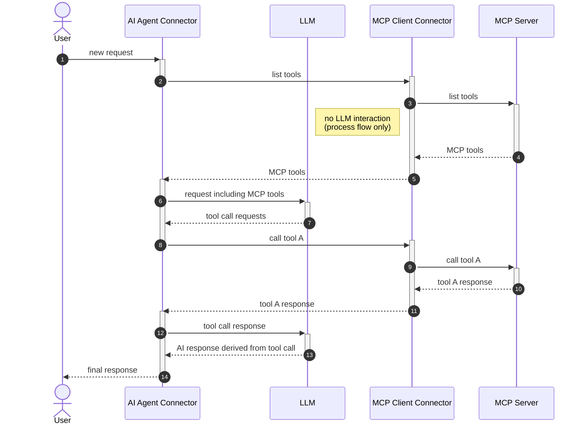

# MCP Client tools detection

```mermaid
sequenceDiagram
  autonumber
  actor User as User
  participant AAC as AI Agent Connector
  participant LLM as LLM
  participant MCPC as MCP Client Connector
  participant MCPS as MCP Server

  User ->>+ AAC: new request

  %% MCP tool lookup
  AAC ->>+ MCPC: list tools
  deactivate AAC
  MCPC ->>+ MCPS: list tools
  note left of MCPC: no LLM interaction<br>(process flow only)
  MCPS -->>- MCPC: MCP tools
  MCPC -->>- AAC: MCP tools
  
  %% LLM call with tool definitions
  activate AAC
  AAC ->>+ LLM: request including MCP tools
  LLM -->>- AAC: tool call requests

  %% MCP tool call
  AAC ->>+ MCPC: call tool A
  deactivate AAC
  MCPC ->>+ MCPS: call tool A
  MCPS -->>- MCPC: tool A response
  MCPC -->>- AAC: tool A response
  activate AAC

  %% LLM feedback based on tool call
  AAC ->>+ LLM: tool call response
  LLM -->>- AAC: AI response derived from tool call

  AAC -->>- User: final response
```
