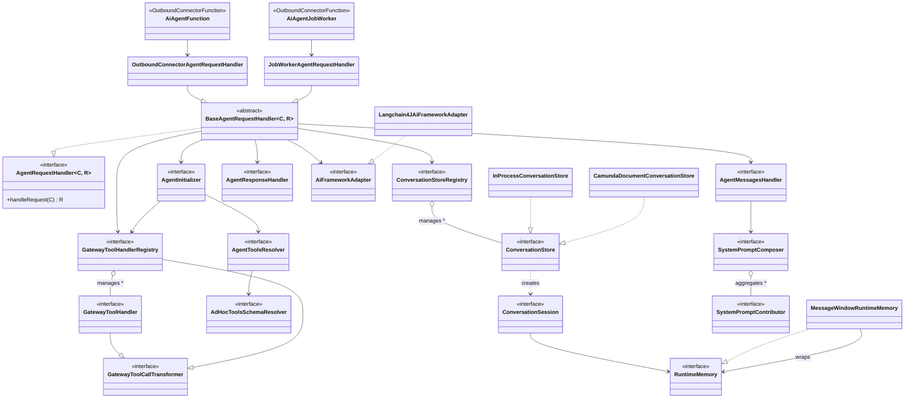

# Camunda Agentic AI – AI Agent Reference

This document provides a comprehensive, code-level reference for the AI Agent implementation within the Camunda
Connectors `agentic-ai` module. It covers concepts, interaction patterns, data flow, concurrency challenges, and all
nuances of the distributed agent loop.

For MCP integration details, see [`mcp.md`](mcp.md).
For A2A integration details, see [`a2a.md`](a2a.md).

---

## Table of Contents

1. [Foundational Concepts](#1-foundational-concepts)
2. [Two Flavors: AI Agent Task vs AI Agent Sub-process](#2-two-flavors)
3. [The Agentic Loop – Distributed Execution Model](#3-the-agentic-loop)
4. [Agent State Machine & Initialization](#4-agent-state-machine)
5. [Data Model & Agent Context](#5-data-model)
6. [Conversation Memory & Storage](#6-conversation-memory)
7. [Tool Resolution & Ad-Hoc Sub-Process Integration](#7-tool-resolution)
8. [Job Completion – The Heart of the Distributed Loop](#8-job-completion)
9. [What Happens When Tools Complete](#9-tool-completion)
10. [Concurrency Challenges & Race Conditions](#10-concurrency)
11. [Event Handling](#11-event-handling)
12. [Framework Abstraction & Converter Chain (LangChain4J)](#12-framework-abstraction)
13. [System Prompt Composition](#13-system-prompt-composition)
14. [Response Handling](#14-response-handling)
15. [Error Codes](#15-error-codes)
16. [Spring Auto-Configuration](#16-spring-auto-configuration)
17. [Process Instance Migration](#17-migration)
18. [Key Code Paths Reference](#18-code-paths)
19. [Gateway Tool Pattern](#19-gateway-tool-pattern)
20. [MCP Integration](#20-mcp-integration)
21. [A2A Integration](#21-a2a-integration)
22. [Azure AI Foundry Provider](#22-azure-ai-foundry-provider)
23. [Examples Directory Reference](#23-examples)

---

## 1. Foundational Concepts

### What is a Camunda Connector?

A **connector** is a reusable integration component that runs within the Camunda connector runtime. It implements `OutboundConnectorFunction` and is invoked as a **service task** in a BPMN process. The runtime:

1. Subscribes to Zeebe jobs of the connector's declared `type`
2. Activates a job when a process instance reaches the service task
3. Calls `execute(OutboundConnectorContext)` on the connector
4. Completes the job with the return value

Connectors are stateless from their own perspective — all state lives in process variables. The runtime handles job activation, secret injection, variable binding, and job completion.

### What is a Job Worker?

A **job worker** is a lower-level construct. While connectors use the job worker mechanism under the hood (the runtime is a job worker), a raw job worker gives direct control over:

- Which variables to fetch (`fetchVariables`)
- Whether to auto-complete (`autoComplete = false`)
- The exact `CompleteJobCommand` sent back to Zeebe, including ad-hoc sub-process control commands

### AdHocSubProcessConnectorResponse — Custom Job Completion via the SDK

The AI Agent Sub-process flavor needs custom job completion (ad-hoc sub-process directives) but is implemented as a standard `OutboundConnectorFunction`. This is enabled by the `ConnectorResponse` sealed interface hierarchy in the Connectors SDK:

- The connector returns an `AdHocSubProcessConnectorResponse` from `execute()`
- The runtime translates the response's `elementActivations()`, `completionConditionFulfilled()`, and `cancelRemainingInstances()` into the Zeebe complete command with `.withResult().forAdHocSubProcess()` configuration
- Completion variables are provided via `variables()`, and result expression evaluation is skipped by the runtime for `AdHocSubProcessConnectorResponse`
- The SDK continues to handle error expressions, retries, and metrics

This avoids duplicating SDK concerns in the connector. See [ADR 002](../adr/002-consolidate-job-worker-into-sdk.md) for the decision rationale.

### What is an Ad-Hoc Sub-Process?

An **ad-hoc sub-process** is a BPMN construct where inner elements (activities) are **not connected** to start/end events. Each element can be:

- Activated independently, in any order, multiple times, or skipped
- Connected internally via sequence flows for structured sub-sequences

**BPMN implementation** (default): Elements are activated via an `activeElementsCollection` expression evaluated on entry. A `completionCondition` expression controls when the sub-process completes.

**Job worker implementation**: The ad-hoc sub-process creates a **job** that a worker must handle. The worker controls:
1. Which elements to activate (via the completion command's `adHocSubProcess` result)
2. Whether the completion condition is fulfilled
3. Whether to cancel remaining active instances

Critical behavioral contract of the job worker ad-hoc sub-process:
- **One active job at a time**: Zeebe creates exactly one job for the ad-hoc sub-process
- **Job recreation on inner flow completion**: When any inner element/flow completes, Zeebe creates a **new** job for the ad-hoc sub-process
- **Job supersession**: A new job may be created while the worker is still processing the previous one. The old job becomes stale — completing it results in a `NOT_FOUND` rejection
- **`adHocSubProcessElements` variable**: Auto-created by Zeebe, contains metadata about activatable elements (ID, name, documentation, `fromAi()` parameters)

### Variable Scoping in Ad-Hoc Sub-Processes

Variables inside an ad-hoc sub-process have their own scope:
- **Input mappings** are evaluated once on entry (this matters for the Sub-process flavor — configuration is fixed for the lifetime of the sub-process)
- **Output collection**: `outputCollection` + `outputElement` expressions are evaluated when inner flows complete, collecting results into a local list variable
- **Variable propagation**: Local variables only propagate to the parent scope when the sub-process completes, unless explicitly mapped via output mappings

---

<a id="2-two-flavors"></a>

## 2. Two Flavors: AI Agent Task vs AI Agent Sub-process

### AI Agent Task (Outbound Connector)

- **BPMN element**: Service task with connector template applied
- **Class**: `AiAgentFunction` implements `OutboundConnectorFunction`
- **Type**: `io.camunda.agenticai:aiagent:1`
- **Execution context**: `OutboundConnectorAgentExecutionContext`
- **Request handler**: `OutboundConnectorAgentRequestHandler`
- **Tool resolution**: Fetches process definition XML via the Camunda API to resolve tool elements from a referenced ad-hoc sub-process (eventually consistent — can fail on first deploy)
- **Feedback loop**: Must be **modeled explicitly** in BPMN — the process must route tool calls to a multi-instance ad-hoc sub-process and route results back to the AI Agent task
- **Agent context**: Flows through process variables — the modeler must wire `agent.context` back as input for the next iteration
- **No event handling support**: Does not support event sub-processes
- **Job completion**: Handled by the connector runtime (auto-complete) — returns `AgentResponse` directly

### AI Agent Sub-process (Job Worker)

- **BPMN element**: Ad-hoc sub-process with job worker element template applied
- **Class**: `AiAgentJobWorker` with `@OutboundConnector`
- **Type**: `io.camunda.agenticai:aiagent-job-worker:1`
- **Execution context**: `JobWorkerAgentExecutionContext`
- **Request handler**: `JobWorkerAgentRequestHandler`
- **Tool resolution**: Tools come directly from the `adHocSubProcessElements` variable (populated by Zeebe) — no API call needed
- **Feedback loop**: **Implicit** — the job worker completes the job with element activation commands, and Zeebe automatically creates a new job when those elements complete
- **Agent context**: Stored as `agentContext` variable within the ad-hoc sub-process scope
- **Event handling**: Supports non-interrupting event sub-processes with configurable behavior
- **Job completion**: Manual via `jobClient.newCompleteCommand(job).withResult(...)` including ad-hoc sub-process directives

### Key Differences Summary

| Aspect                               | AI Agent Task                            | AI Agent Sub-process                                |
|--------------------------------------|------------------------------------------|-----------------------------------------------------|
| BPMN element                         | Service task                             | Ad-hoc sub-process                                  |
| Feedback loop                        | Explicit (modeled)                       | Implicit (engine-managed)                           |
| Tool resolution source               | Camunda API (XML fetch)                  | `adHocSubProcessElements` variable                  |
| Agent context management             | Via process variable wiring              | Scoped within sub-process                           |
| Event sub-process support            | No                                       | Yes (non-interrupting)                              |
| Config re-evaluation per iteration   | Yes (input mappings per task execution)  | No (input mappings evaluated once on AHSP entry)    |
| Process migration config changes     | Supported                                | Not supported (frozen at entry)                     |
| Job completion                       | Auto (connector runtime)                 | Custom (`AdHocSubProcessConnectorResponse`)         |

---

<a id="3-the-agentic-loop"></a>

## 3. The Agentic Loop – Distributed Execution Model

### AI Agent Sub-process Loop (Primary Focus)

The loop operates as a distributed state machine between the connector runtime and the Zeebe engine:

```
┌─────────────────────────────────────────────────────────────────┐
│                    Ad-Hoc Sub-Process Scope                      │
│                                                                  │
│  ┌──────┐    ┌──────────┐    ┌─────────┐    ┌───────────────┐  │
│  │Zeebe │───>│Job Worker│───>│   LLM   │───>│Complete Job + │  │
│  │creates│    │activates │    │ request │    │activate tools │  │
│  │ job   │    │& handles │    │         │    │ in AHSP       │  │
│  └──────┘    └──────────┘    └─────────┘    └───────┬───────┘  │
│       ▲                                             │           │
│       │         ┌──────────────────────┐            │           │
│       │         │ Tools execute within │            │           │
│       └─────────│ AHSP scope. On each  │◄───────────┘           │
│    (new job     │ completion, result   │                        │
│     created)    │ added to             │                        │
│                 │ toolCallResults via  │                        │
│                 │ outputCollection     │                        │
│                 └──────────────────────┘                        │
│                                                                  │
│  Loop terminates when: completionConditionFulfilled = true      │
│  (LLM returns no tool calls → agent has reached its goal)       │
└─────────────────────────────────────────────────────────────────┘
```

**Step-by-step flow:**

1. **Process enters AHSP**: Zeebe creates the first job for the ad-hoc sub-process. Input mappings are evaluated (provider config, prompts, memory config, etc. become local variables).

2. **Job activation**: The `AiAgentJobWorker` picks up the job with `fetchVariables = [adHocSubProcessElements, agentContext, toolCallResults, provider, data]`.

3. **Agent initialization** (`AgentInitializerImpl`):
   - First invocation: `agentContext` is null → state = `INITIALIZING`
   - Resolves tool definitions from `adHocSubProcessElements`
   - If no gateway tools → state transitions to `READY`
   - If gateway tools (MCP) → state = `TOOL_DISCOVERY`, returns discovery tool calls

4. **LLM interaction** (when state = `READY`, handled by `BaseAgentRequestHandler`):
   - Load conversation from memory store into runtime memory (via `ConversationSession`)
   - Validate limits (max model calls)
   - Add system prompt, user prompt / tool call results to memory
   - Call LLM via `AiFrameworkAdapter` with runtime memory
   - Store updated conversation back to memory store (via `ConversationSession`)
   - Transform tool calls and create response

5. **Job completion** (`AiAgentSubProcessConnectorResponse`):
   - Sets `agentContext` variable with updated state
   - If tool calls present:
     - `completionConditionFulfilled = false`
     - For each tool call: `activateElement(toolName)` with variables `{toolCall: <data>, toolCallResult: ""}`
     - Clears `toolCallResults = []` for the next iteration
   - If no tool calls:
     - `completionConditionFulfilled = true`
     - Sets `agent` response variable
     - AHSP completes, output propagates to parent scope

6. **Tool execution**: Activated elements run within the AHSP scope. Each tool receives `toolCall` variable with `_meta.id`, `_meta.name`, and the LLM-provided arguments at the top level. The tool is expected to produce a `toolCallResult` variable.

7. **Tool completion → new job**: When an inner flow completes, Zeebe:
   - Evaluates the `outputElement` expression: `={id: toolCall._meta.id, name: toolCall._meta.name, content: toolCallResult}`
   - Appends the result to the `toolCallResults` output collection
   - Creates a new job for the AHSP

8. **Loop continues**: The new job is picked up by the worker with the updated `toolCallResults`. The agent processes tool call results as `ToolCallResultMessage` entries and calls the LLM again.

### AI Agent Task Loop

The Task variant requires explicit BPMN modeling:

```
Start → AI Agent Task → Gateway (tool calls?)
           ▲                    │ yes          │ no
           │         Multi-Instance AHSP       ▼
           └─── (toolCallResults) ◄────    End/User Task
```

- The multi-instance ad-hoc sub-process executes all tool calls in parallel
- Results are collected into `toolCallResults` via the multi-instance output collection
- The process loops back to the AI Agent Task with the updated `toolCallResults` and `agent.context`

---

<a id="4-agent-state-machine"></a>

## 4. Agent State Machine & Initialization

The agent context tracks state via `AgentState` enum:

```
INITIALIZING ──────────────────────────────────> READY
      │                                            ▲
      │ (if gateway tools present)                 │
      ▼                                            │
TOOL_DISCOVERY ──(all results present)────────────┘
      │
      │ (not all results yet)
      ▼
  AgentDiscoveryInProgressInitializationResult
  (complete job as no-op, wait for more results)
```

**`AgentInitializerImpl.initializeAgent()`** is the entry point:

- **INITIALIZING**: First execution. Loads ad-hoc tool schema, determines tool definitions. If gateway tools exist, initiates discovery (returns tool calls to activate MCP/A2A clients). Otherwise transitions to READY.
- **TOOL_DISCOVERY**: Waiting for gateway tool discovery results. Checks if all expected results are present. If not, returns `AgentDiscoveryInProgressInitializationResult` (no-op completion). If yes, processes results and transitions to READY.
- **READY** (or any other state): Normal operation. Validates that the process definition hasn't changed (for migration detection). Updates tool definitions if needed.

---

<a id="5-data-model"></a>

## 5. Data Model & Agent Context

### AgentContext (the persistent state)

```java
record AgentContext(
    AgentState state,           // INITIALIZING, TOOL_DISCOVERY, READY
    AgentMetadata metadata,     // processDefinitionKey, processInstanceKey
    AgentMetrics metrics,       // modelCalls count, tokenUsage
    List<ToolDefinition> toolDefinitions,  // resolved tools
    ConversationContext conversation,       // memory storage reference
    Map<String, Object> properties         // extensible properties (e.g., gateway tool state)
)
```

This is the **central piece of persisted state**. It is:
- Stored as the `agentContext` process variable (Sub-process) or part of `agent.context` (Task)
- Serialized/deserialized as JSON via Jackson
- Passed between every job activation
- Updated and written back on every job completion

### AgentExecutionContext (the transient request context)

Contains everything needed for a single execution:
- `jobContext()`: Job metadata (process definition key, element ID, etc.)
- `initialAgentContext()`: The `AgentContext` from input variables
- `initialToolCallResults()`: Tool call results from the current invocation
- `provider()`: LLM provider configuration
- `systemPrompt()`, `userPrompt()`: Prompt configurations
- `memory()`, `limits()`, `events()`, `response()`: Various configurations

### AgentResponse (the output)

```java
record AgentResponse(
    AgentContext context,                    // updated agent context
    List<ToolCallProcessVariable> toolCalls, // tool calls to execute
    AssistantMessage responseMessage,         // optional full message
    String responseText,                      // optional text response
    Object responseJson                       // optional parsed JSON response
)
```

### AiAgentSubProcessConnectorResponse (job worker specific)

Implements `AdHocSubProcessConnectorResponse` with job completion control:
```java
record AiAgentSubProcessConnectorResponse(
    AgentResponse agentResponse,
    boolean completionConditionFulfilled,   // true = AHSP done
    boolean cancelRemainingInstances,        // true = cancel active tools
    Map<String, Object> variables            // variables to set
)
```

### ToolCallProcessVariable (tool call format for process variables)

```java
record ToolCallProcessVariable(
    @JsonProperty("_meta") ToolCallMetadata metadata,  // {id, name}
    @JsonAnySetter @JsonAnyGetter Map<String, Object> arguments  // flattened at root
)
```

Arguments are **flattened to the top level** so BPMN expressions can access them directly as `toolCall.myParameter` rather than `toolCall.arguments.myParameter`. The `_meta` object holds the tool call ID and name.

---

<a id="6-conversation-memory"></a>

## 6. Conversation Memory & Storage

### Architecture

Memory is managed through a layered architecture:

```
RuntimeMemory (in-process, transient)
    ▲ loadMessages           │ storeMessages
    │                        ▼
ConversationSession (per-invocation, AutoCloseable)
    ▲ createSession          │ persist
    │                        ▼
ConversationStore (registered backend)
    │
    ├── InProcessConversationStore
    ├── CamundaDocumentConversationStore
    ├── AwsAgentCoreConversationStore
    └── Custom implementations
```

### RuntimeMemory

`RuntimeMemory` is the in-process working memory for a single agent execution:
- `DefaultRuntimeMemory`: Simple list of messages
- `MessageWindowRuntimeMemory`: Wraps a delegate with a sliding window filter:
  - Keeps at most `maxMessages` (default: 20) messages
  - System message is never evicted
  - When evicting an `AssistantMessage` with tool calls, also evicts the follow-up `ToolCallResultMessage` entries
  - `allMessages()` returns the full history (for persistence)
  - `filteredMessages()` returns the windowed view (for LLM API calls)

### ConversationStore Implementations

**InProcessConversationStore** (`type = "in-process"`):
- Stores entire message history inside `AgentContext.conversation` as `InProcessConversationContext`
- Messages are serialized as part of the `agentContext` process variable
- **Durable**: Once job completion succeeds, all data is persisted by the Zeebe engine and survives runtime restarts
- Simple, but subject to Zeebe variable size limits — conversation growth inflates the process variable
- No transactional behavior, no compensation needed

**CamundaDocumentConversationStore** (`type = "camunda-document"`):
- Stores messages as a JSON document in Camunda Document Storage
- `AgentContext.conversation` only contains a `CamundaDocumentConversationContext` with a document reference and `previousDocuments` list
- On load: fetches document content, deserializes messages into `RuntimeMemory`
- On store: creates a **new document** each time (immutable documents), adds the previous reference to `previousDocuments`
- Supports configurable TTL and custom properties
- Supports transparent migration from `InProcessConversationContext`: if the context is in-process, it reads messages directly (no document to load)

**AwsAgentCoreConversationStore** (`type = "aws-agentcore"`):
- Stores messages as events in AWS Bedrock AgentCore Memory
- Uses a **branch-per-turn** strategy for isolation: each agent turn writes to a fresh branch, so failed job completions leave orphaned branches that are invisible on retry
- `AgentContext.conversation` contains `AwsAgentCoreConversationContext` with branch pointer (`branchName`, `lastEventId`) and system message
- On load: `ListEvents` with branch filter + `includeParentBranches=true` returns the full conversation chain
- On store: new messages written to a new branch forked from the previous turn's last event
- Conversational payloads feed AWS long-term memory extraction; structured data (tool calls, results) stored as versioned blob envelopes
- System messages preserved in context (AgentCore has no SYSTEM role)
- See [AWS AgentCore Memory reference](aws-agentcore-memory.md) for full details

**Custom implementations**: Fully pluggable via `ConversationStoreRegistry`. Users can register custom stores by:
1. Implementing `ConversationStore` (with `createSession` factory method), `ConversationSession` (with `loadMessages`/`storeMessages`), and `ConversationContext`
2. Annotating the custom `ConversationContext` with `@JsonTypeName("my-type")` and registering the subtype with the runtime `ObjectMapper` (e.g., via a Spring `Jackson2ObjectMapperBuilderCustomizer` calling `registerSubtypes()`)
3. Selecting "Custom Implementation" as memory storage type in the element template and specifying the implementation type string
4. Registering the store as a Spring component

See the [`CustomMemoryStorageConfiguration`](../../src/main/java/io/camunda/connector/agenticai/aiagent/model/request/MemoryStorageConfiguration.java) type for configuration, and [camunda-agentic-ai-customizations](https://github.com/maff/camunda-agentic-ai-customizations) for a working example with a JPA-backed store.

### Storage Contract

Every `ConversationStore` implementation must follow the **write-ahead with pointer-based visibility** pattern to guarantee correctness across retries.

#### The fundamental invariant

The `AgentContext` stored in Zeebe is the **sole source of truth** for which conversation data to read. The `ConversationContext` inside it acts as a pointer (storage cursor) to the data. The conversation store may write data ahead of Zeebe — but that data only becomes "committed" when Zeebe accepts the job completion containing the updated `AgentContext`.

If job completion fails (e.g., the job was superseded), Zeebe retries with the **old** `AgentContext`, which contains the **old** pointer. The newly written data is invisible to the retry and becomes an orphan.

#### Rules for implementations

1. **`storeMessages` must always write to a new location.** Never mutate or overwrite the data that the current `ConversationContext` points to. Create a new version, snapshot, branch, or record — then return a new `ConversationContext` pointing to it. This ensures the old pointer always resolves to the old data.

2. **`loadMessages` must be guided by the pointer.** Load only the data that the `ConversationContext` (from `agentContext.conversation()`) references. Do not load "latest" or "most recent" — that would break retry safety.

3. **Orphaned writes are expected.** When job completion fails after `storeMessages`, the written data is never pointed to. Implementations should tolerate orphans and may clean them up via background processes or future completion callbacks.

4. **`ConversationContext` must be serializable and self-contained.** It is persisted as part of the `agentContext` process variable in Zeebe. It must contain everything needed to locate the conversation data (e.g., a document reference, a version number, a branch pointer) — without relying on external state that could change between turns.

#### How each built-in store satisfies this contract

| Store | Write target | Pointer | Orphan on failure |
|-------|-------------|---------|-------------------|
| **InProcess** | `agentContext` variable itself (messages in `ConversationContext`) | The variable *is* the data | No orphan — variable update and job completion fail together |
| **CamundaDocument** | New immutable document per turn | `document` reference in context | Orphaned document (tracked in `previousDocuments` for cleanup) |
| **AwsAgentCore** | New branch per turn (events forked from previous turn's last event) | `branchName` + `lastEventId` | Orphaned branch (invisible without pointer, no parent-chain traversal reaches it) |

### ConversationSession Lifecycle

`ConversationStore.createSession()` returns an `AutoCloseable` session. The handler manages it via try-with-resources:

```java
try (var session = store.createSession(executionContext, agentContext)) {
    var loadResult = session.loadMessages(agentContext);          // load history
    runtimeMemory.addMessages(loadResult.messages());
    // [add messages, call LLM, etc.]
    var cursor = session.storeMessages(agentContext, request);    // persist
    agentContext = agentContext.withConversation(cursor);          // assemble
}
```

1. `ConversationStore.createSession()` creates and returns a session (the caller owns its lifecycle)
2. `session.loadMessages(agentContext)` returns a `ConversationLoadResult` containing the stored message history
3. Agent logic adds messages to `RuntimeMemory`, calls LLM, gets response
4. `session.storeMessages(agentContext, request)` persists and returns only the `ConversationContext` (storage cursor)
5. The caller assembles the updated `AgentContext` via `agentContext.withConversation(cursor)`
6. `session.close()` handles resource cleanup (e.g., closing AWS clients)
7. Job completion sends the updated `AgentContext` back to Zeebe

**Critical insight**: The conversation is stored **before** job completion. This is safe because all stores follow the write-ahead with pointer-based visibility contract — see [Storage Contract](#storage-contract) above.

---

<a id="7-tool-resolution"></a>

## 7. Tool Resolution & Ad-Hoc Sub-Process Integration

### Job Worker Flavor

Tools come from the `adHocSubProcessElements` special variable populated by Zeebe:

```json
[
  {
    "elementId": "check_weather",
    "elementName": "Check Weather",
    "documentation": "Retrieves current weather data",
    "properties": { ... },
    "parameters": { ... }  // from fromAi() FEEL function
  }
]
```

The `AdHocToolsSchemaResolver` processes these into:
1. **ToolDefinitions**: Regular tools with name, description, and JSON schema for input parameters
2. **GatewayToolDefinitions**: Special tools (MCP clients, A2A) that need discovery

### Connector (Task) Flavor

The `ProcessDefinitionAdHocToolElementsResolver` fetches the BPMN XML from Camunda's API:
1. `ProcessDefinitionClient` calls `GET /process-definitions/{key}/xml` (with retries for eventual consistency)
2. `CamundaClientProcessDefinitionAdHocToolElementsResolver` parses the XML to find the ad-hoc sub-process by element ID
3. Extracts element metadata similar to the Zeebe-provided `adHocSubProcessElements`
4. Results are cached by `CachingProcessDefinitionAdHocToolElementsResolver` (Caffeine cache, default: max 100 entries, 10min TTL, configurable via `camunda.connector.agenticai.tools.process-definition.cache.*`)

### FEEL Parameter Extraction

`CamundaClientProcessDefinitionAdHocToolElementsResolver` extracts tool parameters from BPMN input/output mappings that use FEEL expressions with the `fromAi()` tagging function:

1. For each flow node in the AHSP, reads `ZeebeIoMapping` extension elements
2. For each mapping with a FEEL expression source (starts with `=`), calls `AdHocToolElementParameterExtractor.extractParameters()`
3. `AdHocToolElementParameterExtractorImpl` uses `FeelEngineApi` to parse the expression and `TaggedParameterExtractor` to extract `fromAi()` tagged parameters
4. Each `AdHocToolElementParameter` has: `name`, `description` (nullable), `type` (nullable), `schema` (nullable `Map<String,Object>`), `options` (nullable — contains `required` flag)

### Tool Schema Generation

`AdHocToolSchemaGeneratorImpl` converts extracted parameters into JSON Schema:
- Parameter names are stripped of `toolCall.` prefix and validated (no dots, no `_meta`)
- `schema` map from the parameter is used as base, with `type` and `description` overlaid
- If `type` is unset, defaults to `"string"`
- Required unless `options.required == false`
- Output: `{type: "object", properties: {...}, required: [...]}`

---

<a id="8-job-completion"></a>

## 8. Job Completion – The Heart of the Distributed Loop

### Job Worker Completion Flow

`AiAgentJobWorker` is an `OutboundConnectorFunction` wrapped by `SpringConnectorJobHandler` at runtime. The flow:

```
SpringConnectorJobHandler.handle(jobClient, job)
  │
  ├─ Creates OutboundConnectorContext from job variables
  │
  ├─ AiAgentJobWorker.execute(context)
  │    ├─ Binds variables to JobWorkerAgentRequest
  │    └─ agentRequestHandler.handleRequest(executionContext)
  │         └─ Returns AiAgentSubProcessConnectorResponse (AdHocSubProcessConnectorResponse)
  │
  ├─ SpringConnectorJobHandler examines error expression
  │    └─ Checks for error expressions (BPMN error handling)
  │
  └─ SpringConnectorJobHandler builds Zeebe command from response / failJob / throwBpmnError
       └─ Asynchronous command execution via CommandWrapper
```

### The Complete Command Structure

```java
jobClient.newCompleteCommand(job)
    .variables(completion.variables())    // {agentContext, toolCallResults/agent}
    .withResult(result -> {
        var adHocSubProcess = result.forAdHocSubProcess()
            .completionConditionFulfilled(...)  // true = done, false = continue
            .cancelRemainingInstances(...);      // true = cancel active tools

        for (toolCall : agentResponse.toolCalls()) {
            adHocSubProcess = adHocSubProcess
                .activateElement(toolCall.metadata().name())
                .variables(Map.of(
                    "toolCall", toolCall,
                    "toolCallResult", ""    // empty default to scope the variable locally
                ));
        }

        return adHocSubProcess;
    });
```

**Key design decisions in the completion command:**

1. **`toolCallResult` = ""**: An empty `toolCallResult` variable is created for each activated tool element. This prevents the variable from "bubbling up" to the parent AHSP scope during variable merging. Each tool writes its own `toolCallResult` in its local scope.

2. **`toolCallResults = []`**: When tool calls are present, the agent clears the results array so the next iteration starts fresh. This is set as a variable on the AHSP scope.

3. **`completionConditionFulfilled`**: Directly controls whether the AHSP terminates. When `true`, the AHSP completes and output mappings propagate results to the parent process.

4. **`cancelRemainingInstances`**: Used when event handling interrupts tool calls — cancels all still-running tool instances. Currently determined via a mutable flag on `JobWorkerAgentExecutionContext`, set as a side effect in `handleAddedUserMessages()`. **Future improvement**: move detection into `buildResponse()` by inspecting `executionContext.initialToolCallResults()` directly for interrupted results, eliminating the mutable state.

5. **Async execution**: The complete command is sent asynchronously via `CommandWrapper` with up to 3 retries. This is important because:
   - The job may have been superseded (NOT_FOUND)
   - Network issues may occur

### No-Op Completion (Waiting for More Results)

When the agent cannot proceed (e.g., not all tool call results are present yet, or discovery is in progress):

```java
return AiAgentSubProcessConnectorResponse.builder()
    .completionConditionFulfilled(false)
    .cancelRemainingInstances(false)
    .build();
// No agentResponse, no variables, no element activations
// Just complete the job without doing anything → wait for next job
```

---

<a id="9-tool-completion"></a>

## 9. What Happens When Tools Complete

### Single Tool Completion

1. The tool activity (e.g., a script task, connector, user task) completes within the AHSP scope
2. The tool is expected to have produced a `toolCallResult` variable in its local scope
3. Zeebe evaluates the `outputElement` expression:
   ```
   ={id: toolCall._meta.id, name: toolCall._meta.name, content: toolCallResult}
   ```
4. The result is **appended** to the `toolCallResults` output collection list
5. Zeebe creates a **new job** for the AHSP

### Multiple Tools Completing Simultaneously / In Quick Succession

This is where the distributed nature creates interesting dynamics:

**Scenario: LLM requests tools A and B simultaneously**

```
Time    Zeebe                           Job Worker
─────────────────────────────────────────────────────
t0      Activates tools A, B
        (from previous job completion)

t1      Tool A completes
        → outputElement evaluated
        → toolCallResults = [{A result}]
        → Creates Job #1                Job #1 picked up
                                        Sees: toolCallResults = [{A result}]
                                        But LLM requested A AND B
                                        → Missing B result!

t2      Tool B completes                Job #1 still processing...
        → toolCallResults = [{A}, {B}]
        → Creates Job #2                (Job #1 is now STALE)

t3                                      Job #1: Determines B is missing
                                        → No user messages added
                                        → Handler returns null agentResponse (no-op)
                                        → No LLM call made
                                        → Job #1 completion may get NOT_FOUND
                                        → (or succeeds as no-op if Job #2 not created yet)

t4                                      Job #2 picked up
                                        Sees: toolCallResults = [{A}, {B}]
                                        → Both results present!
                                        → Calls LLM with all results
                                        → Proceeds normally
```

**The critical mechanism: `createToolCallResultMessage`**

In `AgentMessagesHandlerImpl`, when the last message in memory is an `AssistantMessage` with tool calls:

```java
if (lastChatMessage instanceof AssistantMessage assistantMessage
    && assistantMessage.hasToolCalls()) {
    ToolCallResultMessage toolCallResultMessage =
        createToolCallResultMessage(
            agentContext, assistantMessage.toolCalls(),
            actualToolCallResults, interruptMissingToolCalls);

    if (toolCallResultMessage != null) {
        messages.add(toolCallResultMessage);
    }
    // If null → not all results present → no messages added
}
```

The method checks each tool call from the last assistant message against the available results:
- If all present: creates a `ToolCallResultMessage` with results ordered to match the original tool call order
- If missing and NOT interrupting: returns `null` → no messages added → handler returns null response → no-op
- If missing and interrupting (due to event): creates cancelled results for missing tools

### No-Op Detection in BaseAgentRequestHandler

`BaseAgentRequestHandler` checks whether any user messages were added after the message assembly step via the abstract `modelCallPrerequisitesFulfilled` method:

```java
// BaseAgentRequestHandler.handleRequest()
var addedUserMessages = messagesHandler.addUserMessages(...);
if (!modelCallPrerequisitesFulfilled(addedUserMessages)) {
    return buildConnectorResponse(executionContext, null);
}
```

This is the key gate: if no user messages were added (because tool results were incomplete), the handler returns a null response. The job worker handler (`modelCallPrerequisitesFulfilled` returns `false`) completes the job as a no-op and waits for the next job (which will have more results). The outbound connector handler throws a `ConnectorException` since it cannot proceed without user content.

---

<a id="10-concurrency"></a>

## 10. Concurrency Challenges & Race Conditions

### Challenge 1: Job Supersession (NOT_FOUND)

**Problem**: When a tool completes, Zeebe creates a new job. The previous job may still be processing. Completing the old job results in `NOT_FOUND`.

**Mitigation**:
- The `CommandWrapper` retries up to 3 times via `CommandExceptionHandlingStrategy`
- The no-op completion pattern means most superseded jobs were doing nothing anyway
- Completion callbacks for conversation stores are planned for a follow-up (not yet implemented)

### Challenge 2: Conversation Store Ahead of Zeebe

**Problem**: The conversation is written to storage **before** the job completion command is sent to Zeebe. If job completion fails, the store has data that Zeebe doesn't know about.

**Mitigation**: This is safe by design. All stores follow the [Storage Contract](#storage-contract): they write to a new location each turn, and the `ConversationContext` pointer in the old `AgentContext` still resolves to the old data. The newly written data becomes an orphan — harmless to correctness, and cleanable via future completion callbacks.

### Challenge 3: Duplicate LLM Calls on Rapid Tool Completion

**Problem**: If tools A and B complete almost simultaneously, Job #1 (with only A's result) and Job #2 (with both results) may both attempt LLM calls.

**Mitigation**: This CANNOT happen due to the missing-results check. Job #1 will see that B's result is missing, return `null` for `addedUserMessages`, and `modelCallPrerequisitesFulfilled` returns `false`. Only Job #2 (with complete results) will call the LLM.

### Challenge 4: Variable Scoping and Merging

**Problem**: When multiple tools run in parallel within the AHSP, their variables could conflict.

**Mitigation**:
- Each activated element gets its own scoped variables (`toolCall` and `toolCallResult` are created per-activation)
- The `toolCallResult = ""` empty default prevents the variable from bubbling up from a parent scope
- The `outputCollection`/`outputElement` mechanism properly collects results into a list

### Challenge 5: Stale Agent Context After Migration

**Problem**: After a process instance migration, the `agentContext` may reference tools from the old process definition.

**Mitigation**:
- `AgentInitializerImpl.handleReadyState()` checks if `processDefinitionKey` in the agent metadata matches the current execution's key
- If different: calls `toolsResolver.updateToolDefinitions()` which re-resolves from the new process definition
- Validates that no gateway tools were added/removed (not supported)
- Validates that no tools were removed (not supported)
- Updated/new tool definitions are merged

---

<a id="11-event-handling"></a>

## 11. Event Handling

Event handling is **exclusive to the Sub-process flavor**. In the AHSP, non-interrupting event sub-processes can fire while tools are running.

### How Events Arrive

1. An event sub-process fires within the AHSP (e.g., timer, message)
2. The event handler flow runs to completion
3. Optionally creates a `toolCallResult` variable (without an ID — this is what distinguishes it from a tool result)
4. The event flow completing triggers a new AHSP job

### Event Result Identification

In `AgentMessagesHandlerImpl.addUserMessages()`:

```java
// Partition tool call results: those WITH an id are tool results,
// those WITHOUT are event results
final var partitionedByToolCallId = toolCallResults.stream()
    .collect(Collectors.partitioningBy(result -> result.id() != null));
final List<ToolCallResult> actualToolCallResults = partitionedByToolCallId.get(true);
final List<Message> eventMessages = partitionedByToolCallId.get(false).stream()
    .map(eventResult -> createEventMessage(eventResult, interruptToolCallsOnEventResults))
    .toList();
```

Events produce `ToolCallResult` entries with `id = null`, which are separated from actual tool results.

### Two Behaviors

**WAIT_FOR_TOOL_CALL_RESULTS** (default):
- Event messages are queued but the agent still waits for all tool call results
- Only after all tools complete, the event messages are added as user messages after the tool results
- Example message sequence: `[Tool A result, Tool B result, Event message]`

**INTERRUPT_TOOL_CALLS**:
- If events are present AND tool results are missing:
  - Missing tools get synthetic "cancelled" results: `ToolCallResult.forCancelledToolCall(id, name)`
  - The `cancelRemainingInstances` flag is set to `true` on the completion command
  - Active tool instances are terminated by Zeebe
- Example message sequence: `[Tool A cancelled, Tool B result, Event message]`
- The `PROPERTY_INTERRUPTED` flag on cancelled results triggers `cancelRemainingInstances` in the `BaseAgentRequestHandler`

### Event Payload

Events create their payload in `toolCallResult`:
- If non-empty: added as a user message (text or object content)
- If empty/null/blank: a generic message is generated:
  - With interrupt: "An event was triggered but no content was returned. All in-flight tool executions were canceled."
  - Without interrupt: "An event was triggered but no content was returned. Execution waited for all in-flight tool executions to complete before proceeding."

---

<a id="12-framework-abstraction"></a>

## 12. Framework Abstraction & Converter Chain (LangChain4J)

### Interface

```java
public interface AiFrameworkAdapter<R extends AiFrameworkChatResponse<?>> {
    R executeChatRequest(
        AgentExecutionContext executionContext,
        AgentContext agentContext,
        RuntimeMemory runtimeMemory);
}
```

The adapter receives a `RuntimeMemory` instance (which provides the context window via `filteredMessages()`) and returns a response. `BaseAgentRequestHandler` manages the runtime memory lifecycle and passes it to the adapter.

The agent core is framework-agnostic. `AiFrameworkAdapter` abstracts:
- Converting internal message models to framework-specific formats
- Calling the LLM
- Converting the framework response back to internal models
- Updating `AgentContext` with metrics (model calls, token usage)

### LangChain4J Implementation

The current (and only) implementation uses LangChain4J:
- Configured via `AgenticAiLangchain4JFrameworkConfiguration`
- Supports multiple providers: Anthropic, OpenAI, AWS Bedrock, Google Vertex AI, Azure OpenAI, OpenAI Compatible, Azure AI Foundry
- **Does NOT use LangChain4J's built-in tool execution** — tool calls are returned as data, execution happens via BPMN

For the Azure AI Foundry provider specifically, see [§22 Azure AI Foundry Provider](#22-azure-ai-foundry-provider).

### Converter Chain Architecture

The module maintains its own domain model (framework-agnostic `Message`, `ToolCall`, `Content` types) separate from LangChain4J types. The converter chain translates between them:

```
Langchain4JAiFrameworkAdapter
  ├── ChatMessageConverter         # Message ↔ LangChain4J ChatMessage
  │     ├── ContentConverter       # Content → LangChain4J Content (for user messages)
  │     │     └── DocumentToContentConverter  # Camunda Document → LangChain4J Content
  │     └── ToolCallConverter      # ToolCall ↔ ToolExecutionRequest, ToolCallResult → ToolExecutionResultMessage
  ├── ToolSpecificationConverter   # ToolDefinition ↔ LangChain4J ToolSpecification
  │     └── JsonSchemaConverter    # Map<String,Object> ↔ LangChain4J JsonSchemaElement
  │           └── JsonSchemaElementModule  # Jackson module for JsonSchemaElement round-trip
  └── ChatModelFactory             # creates LangChain4J ChatModel per provider config
```

**Key converters:**

- **`ChatMessageConverter`**: Top-level converter. `map(Message)` dispatches on sealed type (System/User/Assistant/ToolCallResult). `toAssistantMessage(ChatResponse)` converts back, attaching metadata (timestamp, finishReason, tokenUsage).
- **`ContentConverter`**: Converts `TextContent` → text, `DocumentContent` → delegates to `DocumentToContentConverter`, `ObjectContent` → JSON string. Uses a copy of `ObjectMapper` with `DocumentToContentModule` for nested document serialization.
- **`DocumentToContentConverter`**: Dispatches on MIME type: `text/*` → `TextContent`; `application/pdf` → `PdfFileContent`; images → `ImageContent`; throws `DocumentConversionException` for unsupported types.
- **`ToolSpecificationConverter`**: Uses `JsonSchemaConverter` to convert between `Map<String,Object>` (domain) and `JsonObjectSchema` (LangChain4J). Throws `ParseSchemaException` if schema is not an object.
- **`JsonSchemaElementModule`**: Custom Jackson module needed because LangChain4J doesn't expose standard polymorphic annotations on `JsonSchemaElement`. Serializer/deserializer handle all concrete types (`JsonObjectSchema`, `JsonEnumSchema`, `JsonStringSchema`, `JsonArraySchema`, `JsonAnyOfSchema`, `JsonReferenceSchema`, etc.).
- **`DocumentToContentModule`**: Jackson module registering `DocumentToContentSerializer` for Camunda `Document` objects in tool call result content — serializes to `{type, media_type, data}` structure.

All converter beans are `@ConditionalOnMissingBean`, activated when `camunda.connector.agenticai.framework=langchain4j` (default).

---

<a id="13-system-prompt-composition"></a>

## 13. System Prompt Composition

### SystemPromptContributor Interface

```java
public interface SystemPromptContributor {
    String contributeSystemPrompt(AgentExecutionContext executionContext, AgentContext agentContext);
    default int getOrder() { return 0; }  // lower values sort earlier
}
```

Spring auto-wires all `SystemPromptContributor` beans into the composer.

### SystemPromptComposerImpl

`composeSystemPrompt(executionContext, agentContext, baseSystemPrompt)`:
1. Starts with the base system prompt from `SystemPromptConfiguration.prompt()`
2. Iterates contributors sorted by `getOrder()` ascending
3. Non-blank contributions are collected and all parts joined with `"\n\n"`

### Known Implementations

| Implementation               | Order | Activation Condition                                  |
|------------------------------|-------|-------------------------------------------------------|
| `A2aSystemPromptContributor` | 100   | `agentContext.properties["a2aClients"]` is non-empty  |

The architecture supports adding more contributors by creating a Spring bean implementing the interface — the composer picks them up automatically.

### Usage Site

`AgentMessagesHandlerImpl.addSystemMessage()` calls `systemPromptComposer.composeSystemPrompt(...)` and adds the result as a `SystemMessage` to `RuntimeMemory`.

---

<a id="14-response-handling"></a>

## 14. Response Handling

### AgentResponseHandlerImpl

Creates the `AgentResponse` from the LLM's assistant message:

1. **Response format**:
   - `TextResponseFormatConfiguration`: Response text returned as `responseText`. Optionally parse JSON from it.
   - `JsonResponseFormatConfiguration`: Response text must be valid JSON, parsed into `responseJson`. Fails with `FAILED_TO_PARSE_RESPONSE_CONTENT` if invalid.

2. **Markdown stripping**: Before JSON parsing, markdown code fences (` ```json ... ``` `) are stripped to handle models that wrap JSON in code blocks.

3. **Full message**: If `includeAssistantMessage` is true, the raw `AssistantMessage` is included in the response.

### Job Worker Response Variables

On final completion (no tool calls):
- `agent` variable = `JobWorkerAgentResponse` containing:
  - `responseText`, `responseJson`, `responseMessage`
  - Optionally `context` (if `includeAgentContext` is true)
- `agentContext` variable = updated agent context

On tool call iteration (tool calls present):
- `agentContext` = updated agent context
- `toolCallResults` = `[]` (cleared for next iteration)

---

<a id="15-error-codes"></a>

## 15. Error Codes

### AgentErrorCodes

| Constant                                                | Value                                          | Where Thrown                                                                   |
|---------------------------------------------------------|------------------------------------------------|--------------------------------------------------------------------------------|
| `ERROR_CODE_NO_USER_MESSAGE_CONTENT`                    | `NO_USER_MESSAGE_CONTENT`                      | `OutboundConnectorAgentRequestHandler` — user messages list empty              |
| `ERROR_CODE_TOOL_CALL_RESULTS_ON_EMPTY_CONTEXT`        | `TOOL_CALL_RESULTS_ON_EMPTY_CONTEXT`           | `AgentMessagesHandlerImpl` — tool results arrive but no prior conversation     |
| `ERROR_CODE_MAXIMUM_NUMBER_OF_MODEL_CALLS_REACHED`     | `MAXIMUM_NUMBER_OF_MODEL_CALLS_REACHED`        | `AgentLimitsValidatorImpl` — model calls >= maxModelCalls                      |
| `ERROR_CODE_FAILED_TO_PARSE_RESPONSE_CONTENT`          | `FAILED_TO_PARSE_RESPONSE_CONTENT`             | `AgentResponseHandlerImpl` — JSON parse failure (explicit JSON format only)    |
| `ERROR_CODE_FAILED_MODEL_CALL`                          | `FAILED_MODEL_CALL`                            | `Langchain4JAiFrameworkAdapter` — any exception from `ChatModel.chat()`        |
| `ERROR_CODE_MIGRATION_MISSING_TOOLS`                    | `MIGRATION_MISSING_TOOLS`                      | `AgentToolsResolverImpl` — existing tools removed after migration              |
| `ERROR_CODE_MIGRATION_GATEWAY_TOOL_DEFINITIONS_CHANGED` | `MIGRATION_GATEWAY_TOOL_DEFINITIONS_CHANGED`  | `AgentToolsResolverImpl` — gateway tools added/removed after migration         |

Additional errors from `CamundaClientProcessDefinitionAdHocToolElementsResolver`:
- `AD_HOC_SUB_PROCESS_NOT_FOUND` — element ID doesn't resolve to an `AdHocSubProcess` in BPMN
- `AD_HOC_TOOL_DEFINITION_INVALID` — FEEL expression on a mapping fails to parse

All errors are thrown as `ConnectorException(errorCode, message)`.

For MCP error codes, see [mcp.md §15](mcp.md#15-error-codes).
For A2A error codes, see [a2a.md §15](a2a.md#15-error-codes).

---

<a id="16-spring-auto-configuration"></a>

## 16. Spring Auto-Configuration

### AgenticAiConnectorsAutoConfiguration

Master configuration class. Activated by `@ConditionalOnBooleanProperty("camunda.connector.agenticai.enabled", matchIfMissing=true)` — on by default.

Imports:
- `AgenticAiLangchain4JFrameworkConfiguration` — LangChain4J converter chain and adapter
- `McpDiscoveryConfiguration`, `McpClientConfiguration`, `McpRemoteClientConfiguration` — MCP (see [mcp.md §14](mcp.md#14-spring-configuration))
- `A2aClientOutboundConnectorConfiguration`, `A2aClientAgenticToolConfiguration`, `A2aClientPollingConfiguration`, `A2aClientWebhookConfiguration` — A2A (see [a2a.md §14](a2a.md#14-spring-configuration))

### Key Differences from Standard Connectors

1. **Dual activation modes**: Both an outbound connector (`AiAgentFunction`) and a job worker (`AiAgentJobWorker`) are registered. The job worker bypasses the standard connector runtime, handling variable resolution, secret injection, and exception handling directly.
2. **Pluggable AI framework**: `AiFrameworkAdapter<?>` SPI allows the LangChain4J stack to be replaced. The LangChain4J config is guarded by `@ConditionalOnProperty(camunda.connector.agenticai.framework)` (default: `langchain4j`).
3. **Pluggable system prompt contributors**: All `SystemPromptContributor` beans are auto-collected into `SystemPromptComposerImpl`.
4. **Pluggable gateway tool handlers**: All `GatewayToolHandler` beans are auto-collected into `GatewayToolHandlerRegistryImpl`.
5. **Caffeine caching of BPMN resolution**: Process definition fetch (API + XML parse + FEEL extraction) is cached with configurable TTL and max size.
6. **Dual conversation stores**: `InProcessConversationStore` and `CamundaDocumentConversationStore` are both registered; `ConversationStoreRegistry` selects based on request config.

### Feature Toggles

| Property                                                          | Default      | Controls                           |
|-------------------------------------------------------------------|--------------|------------------------------------|
| `camunda.connector.agenticai.enabled`                             | `true`       | Master switch                      |
| `camunda.connector.agenticai.aiagent.outbound-connector.enabled`  | `true`       | AI Agent Task connector            |
| `camunda.connector.agenticai.aiagent.job-worker.enabled`          | `true`       | AI Agent Sub-process job worker    |
| `camunda.connector.agenticai.ad-hoc-tools-schema-resolver.enabled` | `true`     | Ad-Hoc Tools Schema connector     |
| `camunda.connector.agenticai.framework`                           | `langchain4j` | AI framework implementation      |

### Key Configuration Defaults

From `AgenticAiConnectorsConfigurationProperties`:
- `tools.processDefinition.retries.maxRetries` = 4
- `tools.processDefinition.retries.initialRetryDelay` = PT0.5S
- `tools.processDefinition.cache.enabled` = true
- `tools.processDefinition.cache.maximumSize` = 100
- `tools.processDefinition.cache.expireAfterWrite` = PT10M
- `aiagent.chatModel.api.defaultTimeout` = PT3M

---

<a id="17-migration"></a>

## 17. Process Instance Migration

### How Detection Works

`AgentInitializerImpl.handleReadyState()`:

```java
if (agentMetadata == null
    || !executionMetadata.processDefinitionKey().equals(agentMetadata.processDefinitionKey())) {
    agentContext = toolsResolver.updateToolDefinitions(executionContext, agentContext)
        .withMetadata(executionMetadata);
}
```

If the `processDefinitionKey` stored in the agent context doesn't match the current job's key, tool definitions are refreshed.

### What's Allowed

- **Adding new tools**: Merged into existing definitions
- **Changing tool descriptions/parameters**: Updated in-place
- **Changing tool implementation** (without changing definition): Transparent — agent doesn't see the change

### What's Blocked

- **Removing/renaming tools**: `ERROR_CODE_MIGRATION_MISSING_TOOLS`
- **Adding/removing gateway tools (MCP/A2A)**: `ERROR_CODE_MIGRATION_GATEWAY_TOOL_DEFINITIONS_CHANGED`

### Task vs Sub-process Migration Difference

- **Task**: Input mappings are re-evaluated each loop iteration, so config changes (system prompt, model, etc.) are picked up immediately
- **Sub-process**: Input mappings are evaluated once on AHSP entry. Config changes via migration are **not** picked up for running instances

---

<a id="18-code-paths"></a>

## 18. Key Code Paths Reference

### Entry Points
- `AiAgentFunction.execute()` → Connector (Task) entry point
- `AiAgentJobWorker.execute()` → Job worker (Sub-process) entry point
- `AiAgentJobWorker.execute()` wraps into `AiAgentSubProcessConnectorResponse` → handled by `SpringConnectorJobHandler`

### Core Agent Logic
- `BaseAgentRequestHandler.handleRequest()` → Core orchestrator: init → memory → messages → LLM → response → complete
- `AgentInitializerImpl.initializeAgent()` → State machine / initialization
- `AgentMessagesHandlerImpl.addUserMessages()` → Message assembly (tool results, events, user prompt)
- `AgentMessagesHandlerImpl.createToolCallResultMessage()` → Tool result matching & missing detection
- `AgentResponseHandlerImpl.createResponse()` → Response formatting

### Job Completion
- `AiAgentSubProcessConnectorResponse.elementActivations()` → AHSP element activations from tool calls
- `JobWorkerAgentRequestHandler.buildConnectorResponse()` → Job worker response assembly (no-op vs response)

### Memory
- `ConversationStoreRegistryImpl.getConversationStore()` → Store resolution
- `InProcessConversationSession.loadMessages()` / `storeMessages()` → In-process persistence
- `CamundaDocumentConversationSession.loadMessages()` / `storeMessages()` → Document persistence
- `MessageWindowRuntimeMemory.filteredMessages()` → Context window sliding (used by BaseAgentRequestHandler)

### Tool Resolution
- `AgentToolsResolverImpl.loadAdHocToolsSchema()` → Tool schema loading
- `AgentToolsResolverImpl.updateToolDefinitions()` → Migration tool refresh
- `AdHocToolsSchemaResolverImpl` → Schema generation from tool elements
- `AdHocToolElementParameterExtractorImpl` → FEEL expression parameter extraction
- `AdHocToolSchemaGeneratorImpl` → Parameter → JSON Schema conversion

### System Prompt
- `SystemPromptComposerImpl.composeSystemPrompt()` → Aggregates base prompt + contributions
- `A2aSystemPromptContributor` → A2A protocol instructions (order 100)

### Framework (LangChain4J)
- `Langchain4JAiFrameworkAdapter.executeChatRequest()` → Main LLM call path
- `ChatMessageConverterImpl` → Message conversion chain
- `ToolSpecificationConverterImpl` → Tool definition conversion
- `ChatModelFactoryImpl` → Provider-specific ChatModel creation (see [§22](#22-azure-ai-foundry-provider) for Azure AI Foundry)
- `AnthropicOnFoundryClientFactory` → Builds Foundry Anthropic client (custom JDK HttpClient SPI)
- `AnthropicOnFoundryChatModel` → LangChain4J `ChatModel` adapter for Foundry Anthropic

### Configuration
- `AgenticAiConnectorsAutoConfiguration` → Spring Boot bean definitions
- `ConnectorConfigurationOverrides` (connector-runtime-core) → Type/timeout overrides via env vars

### Class Diagram



### E2E Tests
- `connectors-e2e-test/connectors-e2e-test-agentic-ai/` — Full integration tests
- `BaseAiAgentJobWorkerTest` — Job worker test base
- `BaseAiAgentConnectorTest` — Connector test base
- `L4JAiAgentJobWorkerFeedbackLoopTests` — Feedback loop tests
- `L4JAiAgentJobWorkerToolCallingTests` — Tool calling tests

---

<a id="19-gateway-tool-pattern"></a>

## 19. Gateway Tool Pattern

The Gateway Tool Pattern is the extensibility mechanism that allows the AI Agent to integrate with external tool providers that expose **multiple tools behind a single BPMN element**. MCP and A2A are both implementations of this pattern.

### Core Concept

A regular tool in the ad-hoc sub-process is a 1:1 mapping: one BPMN element = one tool the LLM can call. A **gateway tool** breaks this: one BPMN element = a **gateway** to many tools that are discovered at runtime.

For example, an MCP Client element "MyFilesystem" might expose `readFile`, `writeFile`, and `listDirectory`. The LLM sees three separate tools, but the BPMN only has one element.

### Architecture

```
┌──────────────────────────────────────────────────────────────────────┐
│ Tool Schema Resolution (AdHocToolsSchemaResolverImpl)                │
│                                                                      │
│  adHocSubProcessElements → for each element:                         │
│    1. Check GatewayToolDefinitionResolvers                           │
│       - McpClientGatewayToolDefinitionResolver (type = "mcpClient")  │
│       - A2aGatewayToolDefinitionResolver (type = "a2aClient")        │
│    2. If match → GatewayToolDefinition (not a regular tool)          │
│    3. If no match → ToolDefinition (regular tool with JSON schema)   │
│                                                                      │
│  Result: AdHocToolsSchemaResponse {                                  │
│    toolDefinitions: [...],          // regular tools                 │
│    gatewayToolDefinitions: [...]    // gateway tools needing discovery│
│  }                                                                   │
└──────────────────────────────────────────────────────────────────────┘
```

### Gateway Detection

Gateway elements are identified via BPMN **extension properties**. The element template sets:

```
extensionProperties = {
  @ExtensionProperty(
    name = "io.camunda.agenticai.gateway.type",   // GatewayToolDefinitionResolver.GATEWAY_TYPE_EXTENSION
    value = "mcpClient",                            // or "a2aClient"
    condition = @PropertyCondition(property = "data.connectorMode.type", equals = "aiAgentTool"))
}
```

`TypePropertyBasedGatewayToolDefinitionResolver` checks each element's properties for a matching `io.camunda.agenticai.gateway.type` value. Both `McpClientGatewayToolDefinitionResolver` and `A2aGatewayToolDefinitionResolver` extend this base class.

### Gateway Tool Handler Interface

`GatewayToolHandler` is the core interface that each gateway type implements:

```java
public interface GatewayToolHandler extends GatewayToolCallTransformer {
    String type();                              // e.g., "mcpClient", "a2aClient"
    boolean isGatewayManaged(String toolName);  // tool name prefix check

    // Discovery lifecycle
    GatewayToolDiscoveryInitiationResult initiateToolDiscovery(agentContext, gatewayToolDefinitions);
    boolean allToolDiscoveryResultsPresent(agentContext, toolCallResults);
    boolean handlesToolDiscoveryResult(toolCallResult);
    List<ToolDefinition> handleToolDiscoveryResults(agentContext, toolCallResults);

    // Migration
    GatewayToolDefinitionUpdates resolveUpdatedGatewayToolDefinitions(agentContext, gatewayToolDefinitions);
}

// From GatewayToolCallTransformer:
public interface GatewayToolCallTransformer {
    List<ToolCall> transformToolCalls(agentContext, toolCalls);             // LLM → process
    List<ToolCallResult> transformToolCallResults(agentContext, results);   // process → LLM
}
```

### Gateway Tool Handler Registry

`GatewayToolHandlerRegistryImpl` wraps multiple `GatewayToolHandler` instances and distributes operations:

- **Discovery initiation**: Iterates all handlers, collects discovery tool calls, merges agent context updates
- **Discovery result check**: All handlers must report all results present
- **Discovery result processing**: Groups results by handler type, merges discovered tool definitions into agent context
- **Tool call transformation**: Chains through all handlers (each transforms its own tool calls, passes others through)
- **Tool call result transformation**: Same chaining for results

### Discovery Flow (State Machine Integration)

The discovery flow integrates with the agent state machine from [§4](#4-agent-state-machine):

```
INITIALIZING
  ├─ AdHocToolsSchemaResolver → identifies gateway elements
  ├─ GatewayToolHandlerRegistry.initiateToolDiscovery()
  │   ├─ MCP handler: creates ToolCall("MCP_toolsList_<elementId>", "<elementId>", {method: "tools/list"})
  │   └─ A2A handler: creates ToolCall("A2A_fetchAgentCard_<elementId>", "<elementId>", {operation: "fetchAgentCard"})
  │
  ├─ If discovery calls exist:
  │   └─ Return AgentResponseInitializationResult with tool calls
  │      State → TOOL_DISCOVERY
  │      Job completed with: activateElement for each discovery call
  │
  └─ If no discovery calls:
      └─ State → READY (proceed normally)

TOOL_DISCOVERY
  ├─ Tool results arrive (e.g., MCP listTools response, A2A agent card)
  ├─ GatewayToolHandlerRegistry.allToolDiscoveryResultsPresent()
  │   ├─ Not all present → AgentDiscoveryInProgressInitializationResult (no-op completion)
  │   └─ All present:
  │       ├─ GatewayToolHandlerRegistry.handleToolDiscoveryResults()
  │       │   ├─ MCP: each tool from listTools → ToolDefinition("MCP_<elementId>___<mcpToolName>")
  │       │   └─ A2A: agent card → single ToolDefinition("A2A_<elementId>")
  │       ├─ Merge into agentContext.toolDefinitions
  │       └─ State → READY
```

### Tool Call Name Transformation

The gateway pattern uses namespaced tool names to maintain uniqueness:

**LLM sees** (fully qualified): `MCP_MyFilesystem___readFile`
**Process sees** (element activation): `MyFilesystem` with variables `{toolCall: {method: "tools/call", params: {name: "readFile", arguments: {...}}}}`

This mapping happens in `transformToolCalls()` (LLM → process) and `transformToolCallResults()` (process → LLM).

### Agent Context Properties

Gateway handlers store per-handler state in `AgentContext.properties`:

- MCP: `properties.mcpClients = ["elementId1", "elementId2"]` — list of MCP client element IDs
- A2A: `properties.a2aClients = ["elementId1", "elementId2"]` — list of A2A client element IDs

These are used during discovery checking and tool call result transformation.

---

<a id="20-mcp-integration"></a>

## 20. MCP Integration

MCP (Model Context Protocol) enables the AI Agent to discover and call tools from MCP servers. Two connector types:

- **MCP Client** (`McpClientFunction`, type `io.camunda.agenticai:mcpclient:1`): Pre-configured MCP connections on the runtime
- **MCP Remote Client** (`McpRemoteClientFunction`, type `io.camunda.agenticai:mcpremoteclient:1`): On-demand remote connections

Tool naming: `MCP_<elementName>___<mcpToolName>` — one MCP server = many tools, triple-underscore separates gateway element from tool name.

For the complete MCP reference including data model, client lifecycle, transport/auth configuration, filtering, Spring configuration, and error codes, see **[`mcp.md`](mcp.md)**.

---

<a id="21-a2a-integration"></a>

## 21. A2A Integration

A2A (Agent-to-Agent) enables the AI Agent to interact with remote autonomous agents. Unlike MCP (discrete tools), A2A exposes **entire agents** as single tools.

- **A2A Client Outbound** (`A2aClientOutboundConnectorFunction`, type `io.camunda.agenticai:a2aclient:0`)
- **A2A Client Polling Inbound** (`A2aClientPollingExecutable`, type `io.camunda.agenticai:a2aclient:polling:0`)
- **A2A Client Webhook Inbound** (`A2aClientWebhookExecutable`, type `io.camunda.agenticai:a2aclient:webhook:0`)

Tool naming: `A2A_<elementName>`. `A2aSystemPromptContributor` injects protocol instructions when A2A tools are detected.

For the complete A2A reference including data model, connector modes, SDK client layer, async patterns, Spring configuration, and error codes, see **[`a2a.md`](a2a.md)**.

---

<a id="22-azure-ai-foundry-provider"></a>

## 22. Azure AI Foundry Provider

The Azure AI Foundry provider (`azureAiFoundry`) gives the AI Agent access to both Anthropic (Claude) and OpenAI
(GPT) model families deployed behind a single Azure AI Foundry resource endpoint. It was introduced in Milestone 2
of the Foundry integration — see [ADR 004](../adr/004-azure-ai-foundry-provider.md) for decision context.

### Dispatch by model family

`ChatModelFactoryImpl.createChatModel(AzureFoundryProviderConfiguration)` switches on the sealed
`AzureAiFoundryModel` discriminator (`family` JSON field):

| `family`    | Route                                                                                                     |
|-------------|-----------------------------------------------------------------------------------------------------------|
| `anthropic` | `AnthropicOnFoundryClientFactory.create(...)` → `AnthropicOnFoundryChatModel`                            |
| `openai`    | Shared `buildAzureOpenAiChatModel(...)` helper → `AzureOpenAiChatModel` (reuses Azure OpenAI code path)  |

### Anthropic path: custom HttpClient SPI

The Anthropic on Foundry path uses the `anthropic-java-core` + `anthropic-java-foundry` SDK
(v2.26.0) without OkHttp, so that JDK-level authenticated proxies are preserved.

**Package layout:**

| Package                                                            | Contents                                                             |
|--------------------------------------------------------------------|----------------------------------------------------------------------|
| `io.camunda.connector.agenticai.azurefoundry`                      | `AnthropicOnFoundryClientFactory` — builds `AnthropicClient`         |
| `io.camunda.connector.agenticai.azurefoundry.http`                 | `JdkAnthropicHttpClient` (SPI impl over `java.net.http.HttpClient`); `BackendAwareAnthropicHttpClient` (injects `FoundryBackend` URL/auth per-request) |
| `io.camunda.connector.agenticai.azurefoundry.langchain4j`          | `AnthropicOnFoundryChatModel` — LangChain4J `ChatModel` adapter      |

`AnthropicOnFoundryClientFactory` wires the chain: `JdkAnthropicHttpClient` →
`BackendAwareAnthropicHttpClient` → `AnthropicClientImpl` (with `FoundryBackend` as the URL/auth
source) → `AnthropicOnFoundryChatModel`.

### ArchUnit boundary enforcement

`azurefoundry/ArchitectureTest.java` contains two rules:

1. **`sdk_layer_must_not_depend_on_langchain4j`** — only `azurefoundry.langchain4j` may import
   `dev.langchain4j.*`. The factory and HTTP SPI layers must survive a future framework swap unchanged.
2. **`azurefoundry_must_not_depend_on_agent_framework_internals`** — the Foundry packages must not
   import `aiagent.agent`, `aiagent.memory`, or `adhoctoolsschema`; the sole integration point is
   the `ChatModel` interface.

### Key classes

| Class                           | Package                   | Purpose                                                   |
|---------------------------------|---------------------------|-----------------------------------------------------------|
| `AnthropicOnFoundryClientFactory` | `azurefoundry`          | Builds `AnthropicClient` from endpoint + auth config      |
| `JdkAnthropicHttpClient`        | `azurefoundry.http`       | anthropic-java `HttpClient` SPI backed by JDK HTTP client |
| `BackendAwareAnthropicHttpClient` | `azurefoundry.http`     | Wraps `JdkAnthropicHttpClient`; sets backend URL and auth |
| `AnthropicOnFoundryChatModel`   | `azurefoundry.langchain4j`| LangChain4J `ChatModel` over `AnthropicClient`            |

---

<a id="23-examples"></a>

## 23. Examples Directory Reference

The `examples/` directory contains reference BPMN processes and configurations. When making code changes that affect
connector behavior, element template properties, or data model shapes, update the relevant examples to stay in sync.

### AI Agent Examples

- **`ai-agent/ad-hoc-sub-process/`**: Recommended approach — AI Agent as job worker on AHSP
  - Shows tool elements inside AHSP, event handling, and the implicit feedback loop
- **`ai-agent/service-task/`**: AI Agent as connector on service task
  - Shows explicit BPMN loop with gateway checking for tool calls
  - Multi-instance AHSP for parallel tool execution

### MCP Examples

- **`mcp/standalone/`**: MCP Client used independently (not as AI Agent tool)
  - Shows direct tool listing, tool calling, resource and prompt operations

### A2A Examples

- **`a2a/a2a-agent-integration/`**: A2A Client integrated as AI Agent gateway tool
  - Shows A2A Client element inside AHSP alongside regular tools
  - Demonstrates multi-turn interaction with remote agents
- **`a2a/a2a-polling/`**: A2A Client with polling for async tasks
  - Shows outbound → intermediate catch event pattern for async task completion
- **`a2a/a2a-push-notification/`**: A2A Client with webhook push notifications
  - Shows outbound → webhook intermediate catch event pattern

### Ad-Hoc Tools Schema Example

- **`ad-hoc-tools-schema/`**: Direct use of the Ad-Hoc Tools Schema Resolver
  - For custom LLM connectors that want to leverage AHSP tool metadata without the full AI Agent
