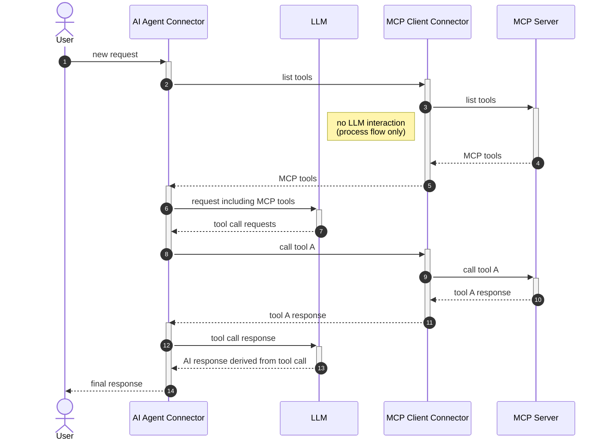

# MCP Integration Reference

This document provides a comprehensive, code-level reference for the MCP (Model Context Protocol) integration in the
`agentic-ai` module. MCP enables the AI Agent to discover and call tools from MCP servers.

For the core AI Agent architecture, see [`ai-agent.md`](ai-agent.md).
For the Gateway Tool Pattern that MCP implements, see [ai-agent.md §19](ai-agent.md#19-gateway-tool-pattern).

---

## Table of Contents

1. [Overview](#1-overview)
2. [Connector Types](#2-connector-types)
3. [Package Structure](#3-package-structure)
4. [MCP Client Architecture](#4-mcp-client-architecture)
5. [Tool Name Convention](#5-tool-name-convention)
6. [Discovery Flow](#6-discovery-flow)
7. [Tool Call Execution Flow](#7-tool-call-execution-flow)
8. [Request Data Model](#8-request-data-model)
9. [Result Data Model](#9-result-data-model)
10. [Client Lifecycle](#10-client-lifecycle)
11. [Transport & Authentication](#11-transport--authentication)
12. [Filtering](#12-filtering)
13. [Binary Content & Document Handling](#13-binary-content--document-handling)
14. [Spring Configuration](#14-spring-configuration)
15. [Error Codes](#15-error-codes)
16. [Key Source Files](#16-key-source-files)

---

<a id="1-overview"></a>

## 1. Overview

MCP integration is bidirectional:

1. **Agent Integration**: MCP Client elements inside the AHSP act as gateway tools, exposing MCP server tools to the LLM
2. **Standalone**: MCP Client connector used independently (not as an AI Agent tool)

MCP exposes **multiple discrete tools per server** — one MCP Client BPMN element becomes N tools the LLM can call.

### End-to-End Sequence (Agent Integration)



---

<a id="2-connector-types"></a>

## 2. Connector Types

**MCP Client** (`McpClientFunction`):
- Type: `io.camunda.agenticai:mcpclient:1`
- Uses pre-configured MCP connections on the runtime (via Spring properties)
- Client lifecycle managed by `McpClientRegistry`
- Supports STDIO and HTTP/SSE transports

**MCP Remote Client** (`McpRemoteClientFunction`):
- Type: `io.camunda.agenticai:mcpremoteclient:1`
- Connects to remote MCP servers via HTTP (Streamable HTTP or SSE)
- Connection configured per connector instance (URL, auth, etc.)
- Client lifecycle managed by `McpRemoteClientRegistry` with Caffeine cache
- Cache key: `(processDefinitionKey, elementId)` — scoped per deployment + element
- Supports Basic, Bearer, and OAuth authentication

---

<a id="3-package-structure"></a>

## 3. Package Structure

See `io.camunda.connector.agenticai.mcp` — split into `client` (connectors, handlers, execution, framework, model) and `discovery` (gateway tool integration) sub-packages.

---

<a id="4-mcp-client-architecture"></a>

## 4. MCP Client Architecture

```
McpClientFunction / McpRemoteClientFunction
  │
  ├── McpClientHandler / McpRemoteClientHandler
  │     └── resolves client from registry, creates operation
  │
  ├── McpClientExecutor
  │     ├── routes to McpClientDelegate method by operation
  │     └── McpClientResultDocumentHandler (binary → document conversion)
  │
  ├── McpClientDelegate (interface)
  │     ├── listTools(filter)
  │     ├── callTool(params, filter)
  │     ├── listResources(filter), readResource(params, filter)
  │     └── listPrompts(filter), getPrompt(params, filter)
  │
  └── Implementation: MCP SDK (mcpsdk package)
        └── McpSdkClientFactory → creates MCP SDK client instances
```

### MCP Operations

| Operation                 | Method                     | Used By                                       |
|---------------------------|----------------------------|-----------------------------------------------|
| `LIST_TOOLS`              | `listTools()`              | Discovery (agent integration) and standalone  |
| `CALL_TOOL`               | `callTool(name, arguments)` | Tool execution (agent integration) and standalone |
| `LIST_RESOURCES`          | `listResources()`          | Standalone only                               |
| `LIST_RESOURCE_TEMPLATES` | `listResourceTemplates()`  | Standalone only                               |
| `READ_RESOURCE`           | `readResource(uri)`        | Standalone only                               |
| `LIST_PROMPTS`            | `listPrompts()`            | Standalone only                               |
| `GET_PROMPT`              | `getPrompt(name)`          | Standalone only                               |

### RPC Layer

Each operation is implemented by a package-private request class in the `rpc` subpackage:
- `ListToolsRequest`: Calls `McpSyncClient.listTools()`, applies `AllowDenyList`, maps `McpSchema.Tool` → `McpToolDefinition`
- `ToolCallRequest`: Validates tool name, parses parameters, and calls `McpSyncClient.callTool()`. Maps response
  content: `TextContent` → `McpTextContent`, `ImageContent`/`AudioContent` → `McpBlobContent` (Base64 decoded),
  `EmbeddedResource` → `McpEmbeddedResourceContent`, `ResourceLink` → `McpResourceLinkContent`,
  `structuredContent` → `McpObjectContent`. Failures during the MCP call or response mapping are caught and returned as
  `McpClientCallToolResult` with `isError = true`; earlier validation/argument parsing failures (e.g.,
  `ConnectorException(MCP_CLIENT_INVALID_PARAMS)` or null tool name) propagate as exceptions to the caller.

---

<a id="5-tool-name-convention"></a>

## 5. Tool Name Convention

`McpToolCallIdentifier` manages the naming scheme:

```
MCP_<elementName>___<mcpToolName>
```

- Prefix: `MCP_`
- Element name: BPMN element ID of the MCP Client in the AHSP — must NOT contain `___`
- Separator: `___` (triple underscore)
- MCP tool name: the tool's name on the MCP server — CAN contain `___`

Example: `MCP_MyFilesystem___readFile`

Pattern: `^MCP_(?<elementName>\S+?)___(?<mcpToolName>\S+)$` — note `\S+?` (non-greedy) on element name so any `___`
in the tool name is captured correctly.

Discovery tool call IDs use a different format: `MCP_toolsList_<elementId>` — NOT a valid `McpToolCallIdentifier`.

---

<a id="6-discovery-flow"></a>

## 6. Discovery Flow

```
1. Agent enters INITIALIZING state
2. AdHocToolsSchemaResolver identifies MCP Client element via gateway type extension
3. McpClientGatewayToolHandler.initiateToolDiscovery():
   - Validates element IDs don't contain "___"
   - Stores MCP client element IDs in agentContext.properties.mcpClients
   - Creates tool call: id="MCP_toolsList_<elementId>", name="<elementId>",
     args={method: "tools/list"}
4. Agent completes job with activateElement("<elementId>") and
   variables {toolCall: {method: "tools/list"}, toolCallResult: ""}
5. MCP Client connector picks up the tool call, calls listTools on MCP server
6. Result (McpClientListToolsResult with tool definitions) flows back via outputElement
7. Agent receives result in TOOL_DISCOVERY state
8. McpClientGatewayToolHandler.handleToolDiscoveryResults():
   - Converts each McpToolDefinition → ToolDefinition
   - Name: MCP_<elementId>___<mcpToolName>
   - Schema: inputSchema from MCP server
9. Tools merged into agentContext.toolDefinitions
10. State → READY, tools available to LLM
```

---

<a id="7-tool-call-execution-flow"></a>

## 7. Tool Call Execution Flow

```
1. LLM requests tool call: "MCP_MyFilesystem___readFile" with args {path: "/foo"}
2. McpClientGatewayToolHandler.transformToolCalls():
   - Parses McpToolCallIdentifier: elementName="MyFilesystem", mcpToolName="readFile"
   - Transforms to: ToolCall(id=<original>, name="MyFilesystem",
     args={method: "tools/call", params: {name: "readFile", arguments: {path: "/foo"}}})
3. Agent completes job with activateElement("MyFilesystem")
4. MCP Client connector executes callTool("readFile", {path: "/foo"})
5. Result flows back as toolCallResult (McpClientCallToolResult)
6. McpClientGatewayToolHandler.transformToolCallResults():
   - Extracts tool name from result, rebuilds fully qualified name
   - Maps content: if single McpTextContent → use string directly, else use the typed
     List<McpContent> as the transformed ToolCallResult content
   - Returns ToolCallResult with name="MCP_MyFilesystem___readFile"
7. Agent presents result to LLM with the original fully qualified tool name
8. McpClientGatewayToolHandler.extractDocuments() walks the List<McpContent> via a sealed-type
   switch and collects Camunda Documents from McpDocumentContent and
   McpEmbeddedResourceContent.BlobDocumentResource entries — feeding the synthetic document
   UserMessage produced by ToolCallResultDocumentExtractor (see ai-agent.md §19 "Document
   Extraction from Tool Call Results").
```

---

<a id="8-request-data-model"></a>

## 8. Request Data Model

### McpClientRequest (runtime-configured)

```
McpClientRequest
└── data: McpClientRequestData
    ├── client: ClientConfiguration
    │   └── clientId: String              // ID registered in the runtime
    └── connectorMode: McpConnectorModeConfiguration
```

### McpRemoteClientRequest (on-demand remote)

```
McpRemoteClientRequest
└── data: McpRemoteClientRequestData
    ├── transport: McpRemoteClientTransportConfiguration  (sealed: StreamableHttp | SSE)
    ├── options: McpRemoteClientOptionsConfiguration
    │   └── clientCache: Boolean          // whether to cache the client
    └── connectorMode: McpConnectorModeConfiguration
```

### McpConnectorModeConfiguration (sealed interface)

Discriminated by `type` JSON property:

**`ToolModeConfiguration`** (`type = "aiAgentTool"`): Used as AI agent tool gateway.
- `toolOperation: McpClientOperationConfiguration` — method + params
- `toolModeFilters: McpClientToolModeFiltersConfiguration` — optional tool allow/deny

**`StandaloneModeConfiguration`** (`type = "standalone"`): Used for direct invocation.
- `operation: McpStandaloneOperationConfiguration` — method + optional params
- `standaloneModeFilters: McpClientStandaloneFiltersConfiguration` — tools + resources + prompts allow/deny

Both implement `toMcpClientOperation()` → `McpClientOperation` and `createFilterOptions()` → `Optional<FilterOptions>`.

### McpClientOperation (sealed interface)

```java
McpMethod method();             // enum: LIST_TOOLS, CALL_TOOL, LIST_RESOURCES,
                                //       LIST_RESOURCE_TEMPLATES, READ_RESOURCE,
                                //       LIST_PROMPTS, GET_PROMPT
Map<String, Object> params();   // method-specific parameters
```

`McpMethod` enum maps to MCP JSON-RPC method strings: `"tools/list"`, `"tools/call"`, `"resources/list"`, etc.

`McpClientOperationDefinitions` provides factory methods: `listTools()`, `callTool(name, arguments)`.

---

<a id="9-result-data-model"></a>

## 9. Result Data Model

### Result Type Hierarchy

```
McpClientResult (sealed interface)
├── McpClientListToolsResult         (toolDefinitions: List<McpToolDefinition>)
├── McpClientListPromptsResult
├── McpClientListResourcesResult
├── McpClientListResourceTemplatesResult
└── McpClientResultWithStorableData (sealed sub-interface)
    ├── McpClientCallToolResult      (name, content: List<McpContent>, isError)
    ├── McpClientGetPromptResult
    └── McpClientReadResourceResult
```

`McpClientResultWithStorableData` has method `convertStorableMcpResultData(DocumentFactory)` for binary→document
conversion.

### McpContent (sealed interface)

Jackson polymorphic on `type` property:

| Type            | Class                        | Fields                                      |
|-----------------|------------------------------|---------------------------------------------|
| `text`          | `McpTextContent`             | `String text`                               |
| `blob`          | `McpBlobContent`             | `byte[] blob`, `String mimeType`            |
| `object`        | `McpObjectContent`           | structured JSON                             |
| `resource`      | `McpEmbeddedResourceContent` | `EmbeddedResource` (Text/Blob/BlobDocument) |
| `resource_link` | `McpResourceLinkContent`     | `uri, name, description, mimeType`          |
| `document`      | `McpDocumentContent`         | Camunda Document reference                  |

### McpToolDefinition

```java
record McpToolDefinition(String name, @Nullable String title, @Nullable String description, Map<String, Object> inputSchema)
```

---

<a id="10-client-lifecycle"></a>

## 10. Client Lifecycle

### McpClientFactory (interface)

```java
McpClientDelegate createClient(String clientId, McpClientConfiguration config);
```

`McpSdkClientFactory` implements this using the `io.modelcontextprotocol:mcp` SDK:
- Client info: `Camunda 8 MCP Connector` / `1.0.0`
- Default timeout: 30 seconds
- Supported protocol versions: `MCP_2024_11_05`, `MCP_2025_03_26`, `MCP_2025_06_18`

### Pre-configured Clients (McpClientRegistry)

- `Map<String, Supplier<McpClientDelegate>>` — registered lazily during Spring context init
- `Map<String, McpClientDelegate>` — `ConcurrentHashMap`, `computeIfAbsent` on first `getClient()`
- Duplicate registration throws; `close()` only closes actually-constructed clients

### Remote Clients (McpRemoteClientRegistry)

- Caffeine `Cache<McpRemoteClientIdentifier, McpClientDelegate>`
- Key: `McpRemoteClientIdentifier(processDefinitionKey: Long, elementId: String)`
- `getClient(id, transport, cacheable)`: if `cacheable=true`, uses cache; if `false`, creates new client (caller
  responsible for closing)
- Eviction listener auto-closes evicted clients
- Default: max 15 entries, expires 10 minutes after last access

---

<a id="11-transport--authentication"></a>

## 11. Transport & Authentication

### Transport Types

`McpSdkClientFactory` creates transports:
- **STDIO**: `StdioClientTransport(ServerParameters.builder(command).args(args).build())`
- **Streamable HTTP**: `HttpClientStreamableHttpTransport.builder(url)` with custom headers supplier
- **SSE**: `HttpClientSseClientTransport.builder(url)` with custom headers supplier

### McpRemoteClientTransportConfiguration (sealed interface)

Discriminated by `type` property:

**`StreamableHttpMcpRemoteClientTransportConfiguration`** (`type = "http"`):
- `http.url` — URL ending with `/mcp`
- `http.headers` — static headers map
- `http.authentication` — `Authentication` sealed interface
- `http.timeout` — ISO-8601 Duration

**`SseHttpMcpRemoteClientTransportConfiguration`** (`type = "sse"`):
- `sse.url` — URL ending with `/sse`
- `sse.headers`, `sse.authentication`, `sse.timeout`

### Authentication (sealed interface)

Jackson polymorphic on `type` property:
- `NoAuthentication` (`type = "noAuth"`)
- `BasicAuthentication` (`type = "basic"`) — username + password
- `BearerAuthentication` (`type = "bearer"`) — token
- `OAuthAuthentication` (`type = "oauth"`) — full OAuth2 config

`McpClientHeadersSupplierFactory` builds a composite `Supplier<Map<String, String>>` merging static headers with auth
headers (uses `OAuthService` + `CustomApacheHttpClient` for OAuth).

---

<a id="12-filtering"></a>

## 12. Filtering

### AllowDenyList

```java
record AllowDenyList(List<String> allowed, List<String> denied)
boolean isPassing(String toolName)
// passes if: (allowed is empty OR name in allowed) AND name not in denied
```

### FilterOptions

```java
record FilterOptions(AllowDenyList toolFilters, AllowDenyList resourceFilters, AllowDenyList promptFilters)
```

Filters are configured per connector instance via the element template. Both MCP Client types support allow/deny
filtering for tools, resources, and prompts.

---

<a id="13-binary-content--document-handling"></a>

## 13. Binary Content & Document Handling

`McpClientResultDocumentHandler` checks if `McpClientResult instanceof McpClientResultWithStorableData` and calls
`convertStorableMcpResultData(documentFactory)`. This converts:

- `McpBlobContent` → `McpDocumentContent` (Camunda Document)
- `McpEmbeddedResourceContent.BlobResource` → `McpEmbeddedResourceContent.BlobDocumentResource`

This handles MCP resources that return binary data (images, files) by storing them as Camunda Documents.

---

<a id="14-spring-configuration"></a>

## 14. Spring Configuration

### McpDiscoveryConfiguration

**Condition**: `camunda.connector.agenticai.mcp.discovery.enabled` (default: **true**)

Beans: `McpClientGatewayToolDefinitionResolver`, `McpClientGatewayToolHandler`

### McpClientBaseConfiguration

Always imported by both runtime and remote configs. Creates:
`McpClientExecutor`, `McpClientHeadersSupplierFactory`, `McpClientResultDocumentHandler`

### McpClientConfiguration (runtime clients)

**Condition**: `camunda.connector.agenticai.mcp.client.enabled` (default: **false** — opt-in)

Beans: `McpClientFunction`, `DefaultMcpClientHandler`, `McpClientRegistry`

Imports: `McpClientBaseConfiguration`, `McpSdkMcpClientConfiguration`

### McpRemoteClientConfiguration (remote clients)

**Condition**: `camunda.connector.agenticai.mcp.remote-client.enabled` (default: **true**)

Beans: `McpRemoteClientFunction`, `DefaultMcpRemoteClientHandler`, `McpRemoteClientRegistry`

Imports: `McpClientBaseConfiguration`, `McpSdkMcpRemoteClientConfiguration`

### Configuration Properties

**Runtime client** (`camunda.connector.agenticai.mcp.client`):

```yaml
camunda.connector.agenticai.mcp.client:
  enabled: false          # opt-in
  clients:
    my-server:
      enabled: true
      type: STDIO | HTTP | SSE
      stdio:
        command: "npx"
        args: ["-y", "@modelcontextprotocol/server-filesystem"]
        env: {}
      http:
        url: "https://my-mcp-server.com/mcp"
        headers: {}
        authentication:
          type: NONE | BASIC | BEARER | OAUTH
          ...
        timeout: PT30S
      initializationTimeout: PT30S
      toolExecutionTimeout: PT30S
      reconnectInterval: PT5S
```

**Remote client** (`camunda.connector.agenticai.mcp.remote-client`):

```yaml
camunda.connector.agenticai.mcp.remote-client:
  enabled: true           # on by default
  client:
    cache:
      enabled: true
      maximumSize: 15
      expireAfter: PT10M
```

### SDK Factory Disambiguation

`McpSdkMcpClientConfiguration` creates `McpSdkClientFactory` annotated `@RuntimeMcpClientFactory`.
`McpSdkMcpRemoteClientConfiguration` creates `McpSdkClientFactory` annotated `@RemoteMcpClientFactory`.
These Spring `@Qualifier` meta-annotations disambiguate the two factory beans.

---

<a id="15-error-codes"></a>

## 15. Error Codes

From `McpClientErrorCodes`:

| Constant                           | Value                            | Context                                     |
|------------------------------------|----------------------------------|---------------------------------------------|
| `ERROR_CODE_INVALID_PARAMS`        | `MCP_CLIENT_INVALID_PARAMS`      | Tool call params deserialization failure     |
| `ERROR_CODE_GET_PROMPT_ERROR`      | `MCP_CLIENT_GET_PROMPT_ERROR`    | Error during get-prompt operation            |
| `ERROR_CODE_READ_RESOURCE_ERROR`   | `MCP_CLIENT_READ_RESOURCE_ERROR` | Error during read-resource operation         |
| `ERROR_CODE_INVALID_METHOD`        | `MCP_CLIENT_INVALID_METHOD`      | Unknown MCP method string                   |

From `McpClientGatewayToolHandler`:
- `MCP_GATEWAY_INVALID_TOOL_DEFINITIONS` — Activity IDs contain `___` separator (would break naming)

---

<a id="16-key-source-files"></a>

## 16. Key Source Files

| File                                           | Purpose                                                       |
|------------------------------------------------|---------------------------------------------------------------|
| `McpClientFunction.java`                       | Pre-configured MCP client connector entry point               |
| `McpRemoteClientFunction.java`                 | Remote MCP client connector entry point                       |
| `McpClientGatewayToolHandler.java`             | Gateway handler: discovery, name transform, result transform  |
| `McpToolCallIdentifier.java`                   | Tool name parsing/construction (`MCP_<element>___<tool>`)     |
| `McpClientGatewayToolDefinitionResolver.java`  | Identifies MCP elements in AHSP                               |
| `McpClientRegistry.java`                       | Pre-configured client lifecycle management                    |
| `McpRemoteClientRegistry.java`                 | Remote client cache with Caffeine                             |
| `McpClientExecutor.java`                       | Routes operations to McpClientDelegate methods                |
| `McpClientDelegate.java`                       | Abstract MCP client interface                                 |
| `McpSdkClientFactory.java`                     | Creates MCP SDK client instances                              |
| `McpClientResultDocumentHandler.java`          | Binary content → Camunda document conversion                  |
| `McpDiscoveryConfiguration.java`               | Spring config for MCP gateway beans                           |
