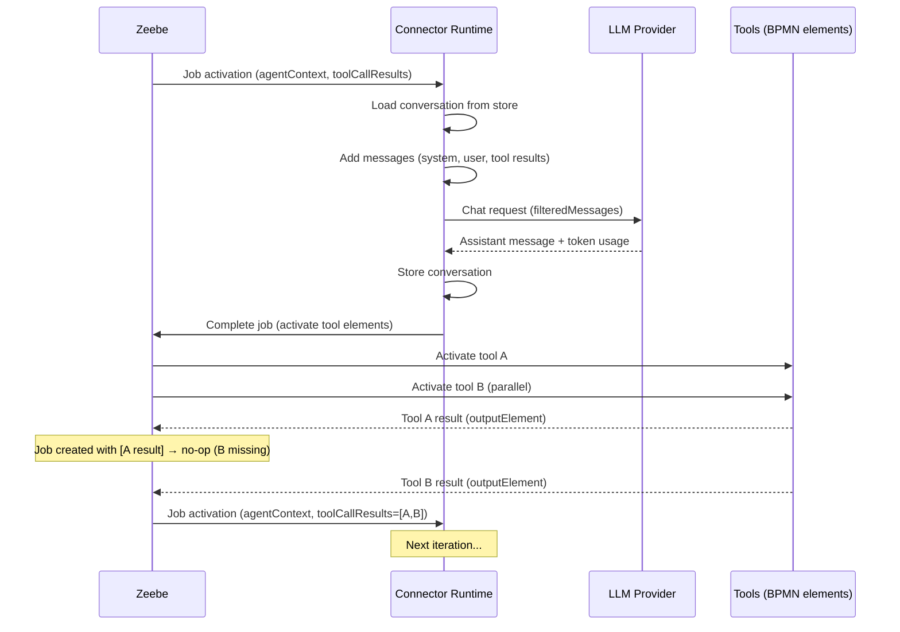
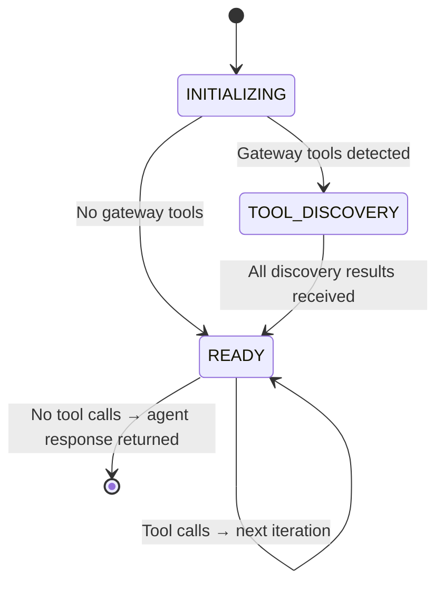
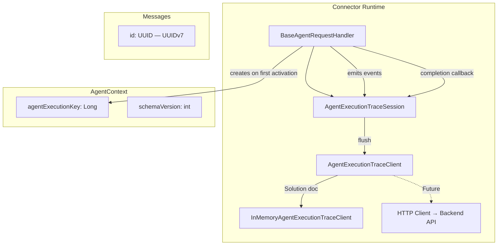
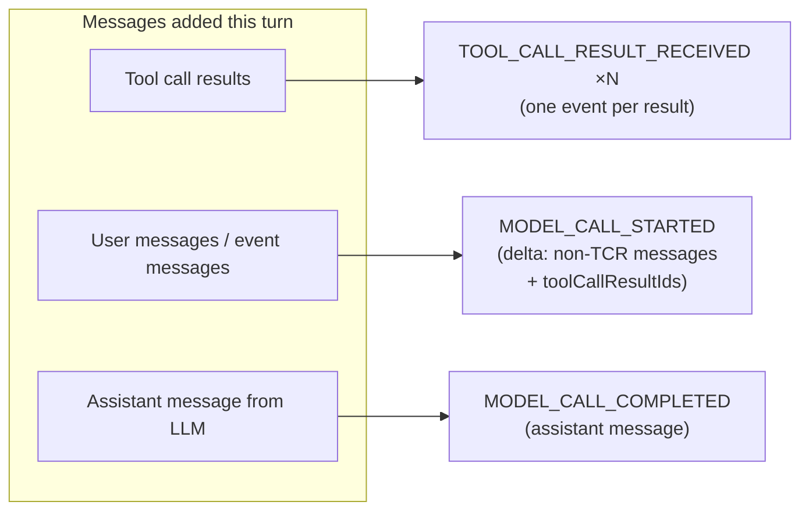
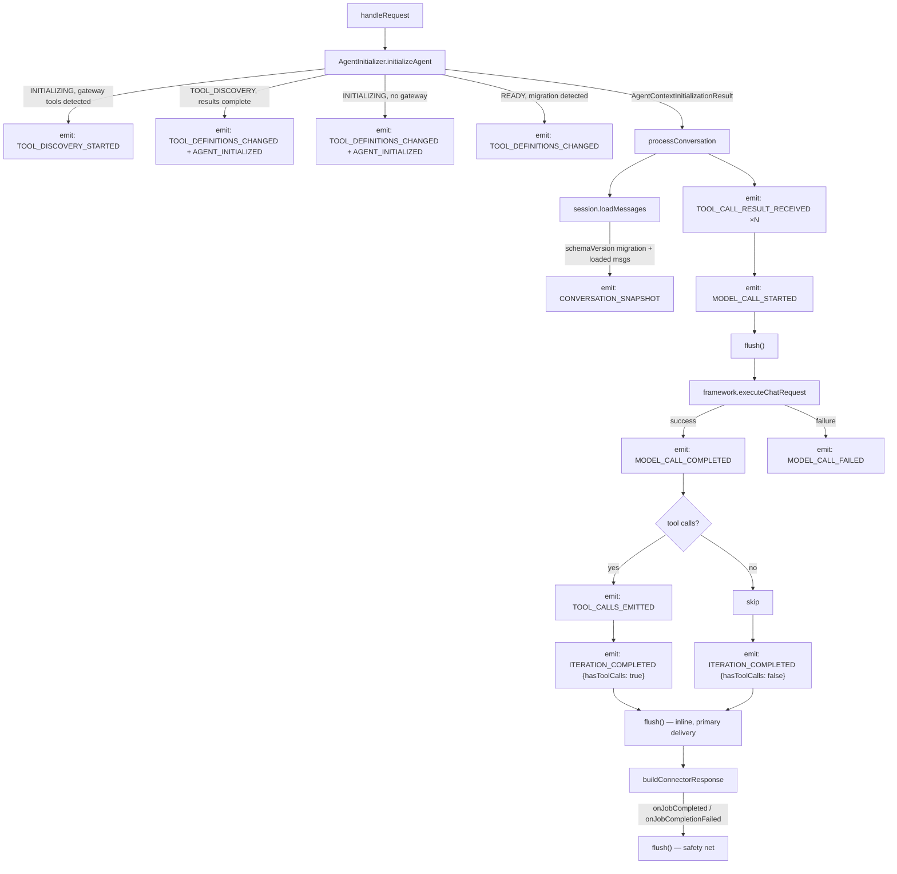
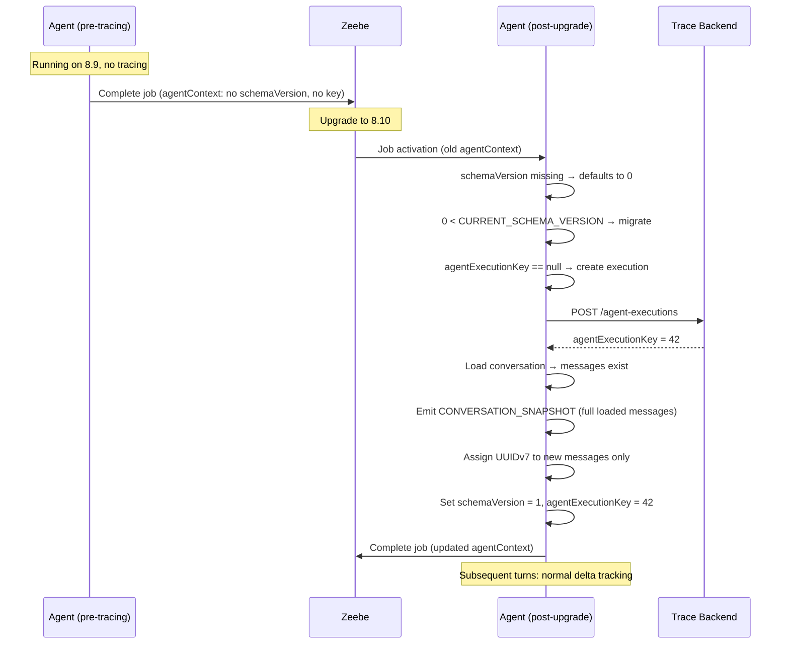

# Agent Execution Tracing — Design Document

* Authors: Agentic AI Team
* Date: April 23, 2026
* Status: **Proposed**
* Related: [Metrics Coverage](metrics.md), [Metrics Reference](https://github.com/camunda/camunda-hub-design-prototype/blob/main/docs/drafts/agent-visibility-metrics-reference.md), [AI Agent Reference](../reference/ai-agent.md), [Conversation Storage SPI Redesign](../adr/003-conversation-storage-spi-redesign.md)

---

## Table of Contents

1. [Problem Statement](#1-problem-statement)
2. [Goals & Non-Goals](#2-goals--non-goals)
3. [Why Events, Not Entity Updates](#3-why-events-not-entity-updates)
4. [Background: The Distributed Agent Loop](#4-background-the-distributed-agent-loop)
5. [High-Level Architecture](#5-high-level-architecture)
6. [Event Model](#6-event-model)
7. [Quick Reference: Where to Find Key Data](#7-quick-reference-where-to-find-key-data)
8. [Deduplication Strategy](#8-deduplication-strategy)
9. [Delta Tracking & Conversation Reconstruction](#9-delta-tracking--conversation-reconstruction)
10. [API Design](#10-api-design)
11. [Integration Points](#11-integration-points)
12. [Event Examples](#12-event-examples)
13. [Backwards Compatibility](#13-backwards-compatibility)
14. [Metrics Coverage](#14-metrics-coverage)
15. [Feature Gaps & Planned Work](#15-feature-gaps--planned-work)
16. [Solution Scope](#16-solution-scope)

---

## 1. Problem Statement

The Camunda AI Agent executes as a distributed loop across Zeebe and the connector runtime. Each
iteration involves LLM calls (with associated token costs), tool invocations (which may include
user tasks, API calls, or remote agents), and conversation state mutations. Today, there is no
structured mechanism to observe what happened during an agent execution — which LLM calls were
made, what tokens were consumed, which tools ran and for how long, or how the conversation evolved
over time.

The [Agent Visibility Metrics Reference](https://github.com/camunda/camunda-hub-design-prototype/blob/main/docs/drafts/agent-visibility-metrics-reference.md)
defines a comprehensive set of metrics and data requirements across multiple scopes (tool call,
agent, process instance, process definition, cluster). Many of these metrics — token usage (#6-8),
LLM call duration (#10), agent iterations (#11), tool call count (#12), conversation history (D8),
tool call sequence (D5) — require structured event data that the agent runtime must produce.

This document describes the design for an **agent execution tracing system** that captures
fine-grained events during agent execution and pushes them to a Camunda backend for aggregation,
visualization, and auditability.

---

## 2. Goals & Non-Goals

### Goals

- **Auditability**: Every LLM call, tool invocation, and conversation state change is recorded
  so the full agent execution history is auditable — attempts, retries, and superseded
  activations remain visible as immutable facts.
- **Metrics support**: Produce the data required to fuel the metrics defined in the
  [Agent Visibility Metrics Reference](metrics.md).
- **Resilience**: Events are pushed best-effort during execution and re-pushed on job completion.
  Server-side deduplication ensures correctness without requiring exactly-once delivery.
- **Backwards compatibility**: Agents that started on a pre-tracing version (e.g., 8.9) continue
  to work after upgrade. Tracing activates transparently on the first post-upgrade job activation.
- **Decoupled contract**: Event payloads are properly typed DTOs that form the contract between
  the agent runtime and the backend. The backend does not need to understand the agent's
  internal execution model (windowing algorithm, eviction rules, etc.). The message, content,
  and tool types referenced in trace events will be provided by the **Camunda SDK** as shared
  API contract types, and the agent runtime maps from its internal types into those SDK types
  at emit time — isolating the wire contract from agent-internal evolution. Within this
  connectors repository, the PoC defines PoC-local mirror types that stand in for the eventual
  SDK types; those mirrors are intended to be replaced by SDK-provided types before the feature
  is productionized. The contract is a **metrics-driven subset** of the runtime shape, not a
  mandated 1:1 copy: the runtime may carry additional fields (internal state, debug metadata,
  in-progress features) that are intentionally not part of the API contract. Extending the
  contract is a deliberate action driven by new metric requirements; the absence of a runtime
  field in the contract types is not drift.

### Non-Goals

- **OpenTelemetry integration**: This is a Camunda-specific tracing system, not an OTel exporter.
- **Real-time streaming**: Events are batched and flushed at defined points, not streamed per-emit.
- **Cost calculation**: Token costs are derived server-side (Optimize/Hub). The agent only produces
  raw token counts.
- **Alerting / drift detection**: These are backend capabilities built on top of the event data.

---

## 3. Why Events, Not Entity Updates

A natural first instinct is to model tracing as a mutable server-side entity: create an agent
execution record on the first activation, then PATCH/PUT it on each turn to update token counts,
append messages, and record tool calls. This approach fundamentally breaks in the AI Agent's
distributed execution model.

### The core problem: lost data from failed and retried jobs

Consider a turn where the agent calls the LLM (consuming tokens), receives a response, but fails
while parsing the result JSON. The job is retried by Zeebe with the **same job key and the same
input variables** — the `AgentContext` from before the failed attempt, not after. If we had
updated a server entity with "tokens consumed: 1500" during the first attempt, the retry would
call the LLM again and update the entity to "tokens consumed: 1200" (the retry's usage),
**silently erasing** the first attempt's token spend. For auditability and accurate cost tracking,
both attempts must be visible.

### Why entity updates fail in this execution model

| Scenario | Entity update behavior | Event behavior |
|----------|----------------------|----------------|
| **Job fails after LLM call, retried** | Retry overwrites first attempt's data. Tokens from the failed attempt are lost. | Both attempts produce separate events with unique deduplication keys. Server records both. Total token usage is accurate. |
| **Job superseded** | Superseded job's update may race with the new job's update. Last-write-wins destroys data. | Both jobs push events independently. No conflict — events are append-only. |
| **Partial tool results (no-op turn)** | Entity would need a read-modify-write cycle to "append" a tool result. Concurrent no-op jobs (from rapid tool completions) would race. | Each no-op turn emits `TOOL_CALL_RESULT_RECEIVED` events. Server deduplicates by `traceId` (§8.3). No coordination needed. |
| **Conversation reconstruction** | Entity stores "current conversation" — previous states are lost. No way to see what the LLM saw at iteration 3 vs iteration 7. | Events carry per-turn deltas. Server can reconstruct the conversation at any point in time by replaying events up to that turn. |
| **Network failure on push** | A failed PUT leaves the entity in an unknown state. Was the update applied? Do we retry? Idempotency requires careful version tracking. | A failed push leaves events pending; the next `flush()` re-pushes them with the same deduplication keys — server ignores duplicates. Naturally idempotent. |

### Events as an audit log

The event model treats the trace as an **append-only log** rather than a mutable document. Each
event is a fact — "at this time, this happened" — and facts don't change. The server aggregates
events into derived views (total tokens, conversation timeline, tool call durations) but the
events themselves are immutable.

This aligns with the auditability goal: the event stream is a complete, ordered record of
everything that happened during the agent execution, including failed attempts, retried jobs,
and superseded activations. An entity-based model can only show the current state; an event-based
model shows the full history of how we got there.

### The parent entity is still needed

Despite using events, we still create a parent entity via `POST /agent-executions`. This serves as:

- **Identity**: Returns the `agentExecutionKey` (Long) that all subsequent events reference
- **Context**: Carries static execution metadata (process context, provider, limits, system prompt)
  that doesn't change across turns and shouldn't be repeated in every event
- **Lifecycle boundary**: Marks the start of an agent execution for the server to scope queries

The parent entity is created once and never updated by the agent. The server may update its own
derived fields (status, aggregated metrics) by processing the event stream, but that's a
server-side concern.

---

## 4. Background: The Distributed Agent Loop

Understanding the tracing design requires understanding how the AI Agent executes. The agent is
**not** a long-running process — it is a stateless connector invoked repeatedly by Zeebe as part
of a distributed loop.

### Execution model (Sub-process flavor)



### Key properties affecting tracing

| Property | Implication for tracing |
|----------|----------------------|
| **Stateless connector** | No in-memory state survives between job activations. All trace state must be persisted on `AgentContext` or pushed to the backend. |
| **Job supersession** | When a tool completes, Zeebe creates a new job. The previous job may still be processing. Its completion gets `NOT_FOUND`. Events from superseded jobs must still be recorded. |
| **Parallel tool execution** | Multiple tools run concurrently as BPMN elements. Tool call results arrive together in the next job activation. Individual tool durations cannot be derived from connector-side timestamps alone. |
| **No-op completions** | If not all expected tool results are present, the connector completes without calling the LLM. Partial results are still received and should be recorded. |
| **Job retries** | If the connector fails (e.g., LLM error, parsing failure), the same job (same `jobKey`) is retried. Retried jobs should produce separate events for auditability (the first attempt may have consumed tokens). |
| **Event sub-processes** | Non-interrupting events can fire during tool execution, producing additional `ToolCallResult` entries with `id = null`. These are partitioned from actual tool results and added as user messages. |
| **Gateway tool translation** | MCP/A2A tools have LLM-visible names (e.g., `MCP_Files___readFile`) that differ from the BPMN element ID (`MCP_Files`). Both must be tracked. |

### Agent state machine



**Execution activity is determined by BPMN state, not by tracing events.** The agent is active
iff a corresponding AHSP or task instance is live in Zeebe; it becomes inactive when that
instance completes, and active again if the process re-enters the AHSP or re-invokes the task.
The event stream records *what the agent did during its activations*; it does not assert when
the agent is or is not running. Consumers wanting to know "is this execution currently running?"
should query BPMN state, not infer from the last event timestamp. The final iteration of an
agent response round is marked by `ITERATION_COMPLETED { hasToolCalls: false }`; there is no
dedicated "execution ended" event.

---

## 5. High-Level Architecture



### Component responsibilities

| Component | Responsibility |
|-----------|---------------|
| `AgentExecutionTraceSession` | Per-request stateful wrapper. Created in `BaseAgentRequestHandler`, attached to `AgentExecutionContext`. Tracks acknowledged delivery per event. Provides `emit()` and `flush()` — `flush()` pushes all events not yet acknowledged by the server and leaves events pending on any failure for the next flush to retry. |
| `AgentExecutionTraceClient` | Stateless transport interface for pushing events to the backend. `createExecution()` creates the parent entity and returns an `agentExecutionKey` (Long). `pushEvents()` pushes a batch of events. |
| `InMemoryAgentExecutionTraceClient` | Initial implementation. Stores events in memory and logs structured JSON. Replaced by a real HTTP client in later iterations. |
| `agentExecutionKey` (on `AgentContext`) | Server-assigned stable identifier for the agent execution. `null` on first activation, populated after `createExecution()`, persisted across turns via the Zeebe process variables that carry `AgentContext`. Persistence location on `AgentContext` is an implementation detail (see §13.2). |
| `schemaVersion` (on `AgentContext`) | Data format version. `0` = pre-tracing (legacy). `1` = tracing-enabled. Used to trigger migration logic on upgrade. Persistence location on `AgentContext` is an implementation detail (see §13.2). |
| `Message.id` | UUIDv7 identifier assigned at message creation time. Used for conversation windowing references (`firstIncludedMessageId`). |

---

## 6. Event Model

### 6.1 Event wrapper

Every event is wrapped in a common envelope. Field order: scope (`jobKey`), identity
(`deduplicationKey`), discriminator (`type`), metadata (`timestamp`), variable body (`payload`).

```java
public record AgentTraceEvent(
    long jobKey,
    String deduplicationKey,
    AgentTraceEventType type,
    Instant timestamp,
    AgentTraceEventPayload payload
) {}
```

### 6.2 Event types

Twelve event types are defined, grouped by lifecycle phase.

| Phase | Event type | Emitted when |
|-------|-----------|--------------|
| **Discovery** | `TOOL_DISCOVERY_STARTED` | Agent detects gateway tool elements on first activation |
| **Tool registry** | `TOOL_DEFINITIONS_CHANGED` | Tool set is established (once at the end of init: immediately if no discovery, after discovery if present) or updated mid-execution on process migration |
| **Init lifecycle** | `AGENT_INITIALIZED` | Agent completed initialization and transitions to READY; paired with (immediately follows) the init `TOOL_DEFINITIONS_CHANGED` |
| **Tool results** | `TOOL_CALL_RESULT_RECEIVED` | Each tool call result is received (including partial-result no-op turns) |
| **Model interaction** | `MODEL_CALL_STARTED` | Agent is about to call the LLM; carries the delta input |
| | `MODEL_CALL_COMPLETED` | LLM call returned successfully; carries response + tokens + duration |
| | `MODEL_CALL_FAILED` | LLM call threw an exception |
| **Outbound tool calls** | `TOOL_CALLS_EMITTED` | LLM requested tool calls; agent is about to activate BPMN elements |
| **Iteration boundary** | `ITERATION_COMPLETED` | A READY-mode job activation that called the LLM finished processing. Not emitted for discovery-only or partial-result no-op jobs. |
| **Limits** | `LIMIT_HIT` | A configured limit was violated (emitted before the exception is thrown) |
| **Conversation reset** | `CONVERSATION_SNAPSHOT` | Full conversation state emitted at a point in time (mid-flight upgrade, future compaction) |
| **Configuration** | `SYSTEM_PROMPT_CHANGED` | System prompt changed mid-execution *(event type defined, wiring deferred)* |

```java
public enum AgentTraceEventType {
    TOOL_DISCOVERY_STARTED,
    TOOL_DEFINITIONS_CHANGED,
    AGENT_INITIALIZED,
    TOOL_CALL_RESULT_RECEIVED,
    MODEL_CALL_STARTED,
    MODEL_CALL_COMPLETED,
    MODEL_CALL_FAILED,
    TOOL_CALLS_EMITTED,
    ITERATION_COMPLETED,
    LIMIT_HIT,
    CONVERSATION_SNAPSHOT,
    SYSTEM_PROMPT_CHANGED;

    public static AgentTraceEventType fromPayload(AgentTraceEventPayload payload) {
        // Pattern match on sealed interface subtypes
    }
}
```

### 6.3 Typed payloads

All payloads implement a sealed interface. Message, content, and tool types referenced by the
payloads (`Message`, `AssistantMessage`, `Content`, `ToolDefinition`, ...) are the API contract
types described in §6.5. The production contract types will be owned by the Camunda SDK; this
PoC defines local stand-ins in the connectors repo that mirror the agent runtime model without
depending on it, to be replaced by SDK types ahead of productionization.

```java
public sealed interface AgentTraceEventPayload {

    /** Gateway tool discovery has started. Marker event (payload is empty). */
    record ToolDiscoveryStarted() implements AgentTraceEventPayload {}

    /**
     * The current set of tool definitions has been established or updated.
     * Emitted once at the end of initialization (immediately if no gateway
     * discovery is involved, after discovery completes if it is) and on each
     * mid-execution process migration. Always carries the full current tool
     * definition list.
     *
     * Consumers distinguish init from migration via the presence (init) or
     * absence (migration) of an immediately-following AGENT_INITIALIZED event.
     */
    record ToolDefinitionsChanged(
        List<ToolDefinition> toolDefinitions
    ) implements AgentTraceEventPayload {}

    /**
     * The agent has completed initialization and transitions to READY state.
     * Emitted once per execution, paired with (immediately following) the
     * init TOOL_DEFINITIONS_CHANGED. Empty payload — all relevant context
     * is carried on CreateAgentExecutionRequest (provider, limits, system
     * prompt) and on the paired TOOL_DEFINITIONS_CHANGED (tool set).
     */
    record AgentInitialized() implements AgentTraceEventPayload {}

    /**
     * A single tool call result has been received. Emitted per result,
     * including on no-op turns (partial results). Deduplicated by toolCallId.
     */
    record ToolCallResultReceived(
        String toolCallId,
        String toolName,
        String elementId,
        Object content,
        @Nullable Instant completedAt
    ) implements AgentTraceEventPayload {}

    /**
     * A model call is starting. Carries the delta messages added in this turn
     * (excluding tool call results, which have their own events), the list of
     * tool call IDs whose results fed this call, a reference to the message
     * window boundary, and an explicit flag indicating whether any history
     * was evicted when building the context window (disambiguates the
     * firstIncludedMessageId = null case — see §9.4).
     */
    record ModelCallStarted(
        List<Message> messages,
        List<String> toolCallResultIds,
        @Nullable UUID firstIncludedMessageId,
        boolean historyTruncated
    ) implements AgentTraceEventPayload {}

    /**
     * A model call completed successfully. Carries the assistant's response,
     * per-call token usage, and wall-clock duration.
     */
    record ModelCallCompleted(
        AssistantMessage assistantMessage,
        TokenUsageInfo tokenUsage,
        long durationMs
    ) implements AgentTraceEventPayload {}

    /** A model call failed with an exception. */
    record ModelCallFailed(
        String errorClass,
        String errorMessage
    ) implements AgentTraceEventPayload {}

    /**
     * The LLM requested tool calls. The toolCalls here are the same ToolCall
     * records used inside AssistantMessage, with the elementId populated
     * (post gateway-transform).
     */
    record ToolCallsEmitted(
        List<ToolCall> toolCalls
    ) implements AgentTraceEventPayload {}

    /**
     * A READY-mode iteration (job activation with a successful LLM call) has
     * completed processing. Emitted at the end of processConversation, before
     * job completion. Not emitted for discovery-only or partial-result no-op
     * jobs — those do not count as iterations.
     *
     * When `hasToolCalls` is false, the agent returned a final response with
     * no tool calls — the terminal iteration of the current agent response
     * round. The user or upstream process may still re-trigger the agent.
     *
     * Iteration counting: COUNT(ITERATION_COMPLETED from completed jobs).
     * Server cross-references with Zeebe job completion to exclude ignored
     * events from failed or superseded jobs.
     */
    record IterationCompleted(
        boolean hasToolCalls
    ) implements AgentTraceEventPayload {}

    /**
     * A configured limit (guardrail) was hit. Emitted by AgentLimitsValidator
     * before throwing the limit violation exception.
     */
    record LimitHit(
        String limitType,
        int configuredThreshold,
        int actualValue
    ) implements AgentTraceEventPayload {}

    /**
     * A point-in-time snapshot of the full conversation. Emitted on:
     * - Mid-flight upgrade (schemaVersion migration): catch-up for missed history
     * - Future: conversation compaction (messages dropped or summarized)
     */
    record ConversationSnapshot(
        List<Message> messages
    ) implements AgentTraceEventPayload {}

    /** The system prompt was changed. Wiring deferred. */
    record SystemPromptChanged(
        String systemPrompt
    ) implements AgentTraceEventPayload {}
}
```

### 6.4 Supporting types

```java
/**
 * Token usage for a single model call. Decoupled from AgentMetrics.TokenUsage
 * to form a stable API contract.
 */
public record TokenUsageInfo(
    int inputTokenCount,
    int outputTokenCount
    // Future: int reasoningTokenCount, int cachedTokenCount
) {}
```

### 6.5 API contract types (mirrored from the agent runtime)

Message, content, and tool types referenced by trace event payloads are **API contract types**
that will be provided by the Camunda SDK once the feature is productionized. For this PoC they
are defined locally in the connectors repo as stand-ins, sharing canonical names with the
agent runtime model (`Message`, `AssistantMessage`, `Content`, `TextContent`, `DocumentContent`,
`ObjectContent`, `Document`, `DocumentReference`, `ToolCall`, `ToolDefinition`, `ToolCallResult`)
so the eventual SDK types can drop in by replacing imports. Separation from the agent runtime
types is by package, not by name prefix.

The agent runtime maps from its internal types into the contract types at emit time. The
contract types evolve independently of the runtime model (and vice versa) when that decoupling
is valuable; schema changes to either side go through explicit mapping code.

#### Message hierarchy

Mirrors `io.camunda.connector.agenticai.model.message.Message` and its four implementations.
The `@Nullable UUID id` field is **added** to enable conversation windowing references
(`firstIncludedMessageId`); all other fields mirror the runtime shape.

```java
/** Sealed message hierarchy. Discriminated by the "role" field on the wire. */
public sealed interface Message {
    @Nullable UUID id();
    Map<String, Object> metadata();

    record SystemMessage(
        @Nullable UUID id,
        List<Content> content,
        Map<String, Object> metadata
    ) implements Message {}

    record UserMessage(
        @Nullable UUID id,
        @Nullable String name,
        List<Content> content,
        Map<String, Object> metadata
    ) implements Message {}

    record AssistantMessage(
        @Nullable UUID id,
        List<Content> content,
        List<ToolCall> toolCalls,
        Map<String, Object> metadata
    ) implements Message {}

    record ToolCallResultMessage(
        @Nullable UUID id,
        List<ToolCallResult> results,
        Map<String, Object> metadata
    ) implements Message {}
}
```

#### Content block hierarchy

Mirrors `io.camunda.connector.agenticai.model.message.content.Content` and its three
implementations. Discriminated by the `"type"` field on the wire.

```java
/** Content block within a message. Discriminated by the "type" field. */
public sealed interface Content {
    Map<String, Object> metadata();

    /** Plain text content. type: "text" */
    record TextContent(
        String text,
        Map<String, Object> metadata
    ) implements Content {}

    /** A document reference (uploaded file, extracted document, etc.). type: "document" */
    record DocumentContent(
        Document document,
        Map<String, Object> metadata
    ) implements Content {}

    /** Arbitrary structured content (JSON object, tool output). type: "object" */
    record ObjectContent(
        Object content,
        Map<String, Object> metadata
    ) implements Content {}
}
```

#### Document and document references

`DocumentContent` carries a `Document` reference, not the document bytes. The shape mirrors
`io.camunda.connector.api.document.Document` and `io.camunda.connector.api.document.DocumentReference`
from the Camunda Connectors SDK.

```java
/** A reference to a document stored externally. Carries metadata but not bytes. */
public interface Document {
    DocumentReference reference();
    DocumentMetadata metadata();
}

/** Polymorphic reference — either a Camunda-managed document or a raw external URL. */
public sealed interface DocumentReference {

    /** Reference to a document stored via the Camunda Document Storage API. */
    record CamundaDocumentReference(
        String documentId,
        String storeId,
        String contentHash,
        DocumentMetadata metadata
    ) implements DocumentReference {}

    /** Reference to a document at an arbitrary external URL. */
    record ExternalDocumentReference(
        String url,
        String name
    ) implements DocumentReference {}
}

/** Document metadata (mime type, size, etc.). Shape mirrors the SDK's DocumentMetadata. */
public record DocumentMetadata(
    String contentType,
    @Nullable String fileName,
    @Nullable Long size,
    @Nullable Instant expiresAt,
    Map<String, Object> customProperties
) {}
```

> **Note on the SDK source**: The SDK defines `Document`, `DocumentReference`,
> `CamundaDocumentReference`, and `ExternalDocumentReference` as interfaces (getter-based),
> because they are designed for pluggable storage backends. The trace API mirror uses records
> because the trace wire format is fixed at emit time — there is no backend pluggability at the
> trace layer. The JSON shape is identical.

#### Tool types

```java
/**
 * A tool call. Used both inside AssistantMessage.toolCalls (the LLM's request,
 * elementId null) and inside TOOL_CALLS_EMITTED.toolCalls (post gateway-transform,
 * elementId populated with the BPMN element to activate).
 *
 * For regular BPMN tools, name and elementId are identical. For gateway tools
 * (MCP, A2A), they differ — name: "MCP_Files___readFile", elementId: "MCP_Files".
 *
 * traceId is a UUIDv7 stamped at process-variable-serialization time in the
 * agent runtime and propagated through Zeebe (via ToolCallProcessVariable._meta
 * and the element template's outputElement expression). It provides a stable,
 * agent-controlled identifier used as the dedup key for TOOL_CALL_RESULT_RECEIVED,
 * independent of the LLM-assigned id. Null on messages deserialized from
 * pre-traceId data (see §13.3).
 */
public record ToolCall(
    String id,
    String name,
    Map<String, Object> arguments,
    @Nullable String elementId,
    @Nullable UUID traceId
) {}

/** A single tool call result. Used inside ToolCallResultMessage. */
public record ToolCallResult(
    @Nullable String id,
    @Nullable String name,
    @Nullable Object content,
    Map<String, Object> properties
) {}

/** Tool definition as advertised to the model. */
public record ToolDefinition(
    String name,
    @Nullable String description,
    Map<String, Object> inputSchema
) {}
```

---

## 7. Quick Reference: Where to Find Key Data

| What you're looking for | Event type | Field path |
|------------------------|-----------|------------|
| **AI response text** | `MODEL_CALL_COMPLETED` | `payload.assistantMessage.content` — list of content blocks (text, images, etc.) |
| **Tool calls the LLM requested** | `TOOL_CALLS_EMITTED` | `payload.toolCalls[]` — each has `id`, `name`, `arguments`, `elementId` |
| **Tool call results** | `TOOL_CALL_RESULT_RECEIVED` | `payload.content` — the raw output returned by the tool |
| **Token usage (per model call)** | `MODEL_CALL_COMPLETED` | `payload.tokenUsage.inputTokenCount`, `.outputTokenCount` |
| **Model call duration** | `MODEL_CALL_COMPLETED` | `payload.durationMs` |
| **User prompt / input messages** | `MODEL_CALL_STARTED` | `payload.messages[]` — delta messages added this turn (excluding tool results) |
| **Tool results fed into this model call** | `MODEL_CALL_STARTED` | `payload.toolCallResultIds[]` — tool call IDs whose results the model saw |
| **Tool call duration** | `TOOL_CALLS_EMITTED` + `TOOL_CALL_RESULT_RECEIVED` | Pair by `toolCallId`: duration = `completedAt` − `TOOL_CALLS_EMITTED.timestamp` |
| **Available tools** | `TOOL_DEFINITIONS_CHANGED` | `payload.toolDefinitions[]` |
| **System prompt** | `CreateAgentExecutionRequest` | `systemPrompt` field on the parent entity |
| **Model / provider** | `CreateAgentExecutionRequest` | `provider.type`, `provider.model` |
| **Limit violations** | `LIMIT_HIT` | `payload.limitType`, `.configuredThreshold`, `.actualValue` |
| **Full conversation** | Replay all events (see [§9](#9-delta-tracking--conversation-reconstruction)) | Or use `CONVERSATION_SNAPSHOT.messages` as a reset point |
| **Is this iteration terminal?** | `ITERATION_COMPLETED` | `payload.hasToolCalls == false` means the LLM returned without requesting more tools |

> **AI response content vs tool calls**: The LLM's response is always in
> `MODEL_CALL_COMPLETED.assistantMessage`. This message may contain **both** text content
> (`content` field) **and** tool call requests (`toolCalls` field). When the LLM requests tool
> calls, the same tool calls are also emitted as a separate `TOOL_CALLS_EMITTED` event with the
> additional `elementId` mapping. The `TOOL_CALLS_EMITTED` event is the authoritative source for
> tool call details because it includes the BPMN element ID (which the raw assistant message does
> not carry).

> **toolName vs elementId**: `toolName` is the LLM-visible identifier — the name the model used
> to call the tool. For regular BPMN tools these are identical. For gateway tools (MCP, A2A), they
> differ (e.g., `toolName: "MCP_Jira___getOpenTickets"` but `elementId: "MCP_Jira"`).

---

## 8. Deduplication Strategy

Deduplication is critical because the agent's distributed execution model creates multiple
scenarios where the same logical event can be pushed more than once.

### 8.1 Client idempotency

**Client idempotency is a core requirement of this system.** Every event push must be safely
re-pushable — the server is the single source of truth for uniqueness. This enables the client
to retry unacknowledged pushes without risk of duplicate counting, and makes best-effort pushes
during processing safe against transient failures.

The agent tracks **acknowledged delivery, not attempted push**. A batch push marks events as
delivered only on a 2xx response from the server; any failure (exception, non-2xx, timeout)
leaves the batch pending, and the next `flush()` call retries it. Combined with server-side
deduplication, this means re-emission is always safe (false positives cost one dedup lookup;
false negatives would lose the event — so the client always prefers to re-emit on ambiguity).

### 8.2 Why deduplication is needed

```mermaid
flowchart TD
    subgraph "Scenario 1: Retry of a pending batch"
        A1[Events emitted during processing] --> F1[flush — push attempted]
        F1 --> X1[Transport fails / non-2xx / timeout]
        X1 --> P1[Events remain pending]
        P1 --> F1b[Next flush — same events re-pushed]
        F1b --> D1[Server deduplicates by deduplicationKey]
    end

    subgraph "Scenario 2: Job retry after failure"
        A2[Job runs, calls LLM $$] --> E2[Events pushed via flush]
        E2 --> X2[JSON parsing fails]
        X2 --> R2[Same job retried, same jobKey]
        R2 --> A2b[Job runs again, calls LLM $$ again]
        A2b --> E2b[New events with NEW deduplicationKeys]
        E2b --> D2[Server stores BOTH attempts]
    end

    subgraph "Scenario 3: Tool result across turns"
        T3[Tool A completes] --> J3a[Job N: partial results, no-op]
        J3a --> |"emit TCR for A"| P3a[Pushed]
        T3b[Tool B completes] --> J3b["Job N+1: all results present"]
        J3b --> |"emit TCR for A again"| P3b[Same deduplicationKey = toolCallId]
        P3b --> D3[Server deduplicates A, stores B]
    end
```



### 8.3 Deduplication key derivation

| Event type | Deduplication key | Rationale |
|-----------|-------------------|-----------|
| `TOOL_CALL_RESULT_RECEIVED` | `"tcr:" + traceId` | The same tool result may arrive across multiple job activations (no-op turn → real turn). `traceId` is a UUIDv7 stamped by the agent runtime at tool-call emission (§11.6) and propagated through Zeebe via the process variable and the element template's `outputElement`. It is uniqueness-guaranteed by construction, not by provider contract on the LLM-assigned tool-call id. Legacy fallback: on tool call results from pre-upgrade element templates that don't stamp `traceId`, the key falls back to `"tcr:legacy:" + toolCallId` and a WARN is logged once per execution. |
| All other event types | UUIDv7 (per emission) | Each emission is a unique event. On re-push of a pending batch, the same events are re-pushed with the same UUIDs → server deduplicates. On a job retry, new emissions get new UUIDs → server records both attempts. This is critical for auditability: if a job calls the LLM, fails, and retries, both LLM calls (and their token costs) must be visible. UUIDv7 is used throughout the tracing system (consistent with `Message.id`) and is time-sortable for server-side ordering. |

### 8.4 Server-side deduplication contract

The server deduplicates by `(agentExecutionKey, deduplicationKey)`:
- First push with a given `deduplicationKey` → stored
- Subsequent pushes with the same `deduplicationKey` → ignored (idempotent)

This means:
- Pending-batch retry = safe (same UUIDs, deduplicated)
- Job retry = visible (new UUIDs, both stored)
- Tool result replay = safe (same `traceId`, deduplicated)
- Superseded job events = visible (different job, different UUIDs, stored)

### 8.5 Event application for state derivation

Consumers computing **message state, agent status, or iteration boundaries** must filter the
event stream; consumers computing **token or cost aggregates** do not.

**Filter for state**: state derivation (conversation reconstruction, agent status per D4,
iteration counting per #11) operates on events from **completed jobs only**. The server joins
on `jobKey` against Zeebe job-completion data and discards events from failed or superseded
jobs for these derivations. The audit log retains all events regardless of job outcome.

**Ordering rule**: within the completed-job subset, events are applied in **job completion
order across jobs, and emission order within a job**. Emission order within a job is preserved
by the batch payload (`events[]` is an ordered list) and across batches by envelope timestamp;
since all events for a single job are emitted on the same request thread, timestamps are
monotonic within a job and an explicit sort is cheap.

**Token and cost aggregates**: sum across *all* events for the execution regardless of job
state. Failed attempts that consumed tokens before failing contribute to true token spend (see
§15.3). Order-independent.

> **Load-bearing invariant — AHSP one-at-a-time completion.** The AHSP execution model
> guarantees that at most one inner job completes per AHSP instance at any time; therefore,
> job completion order defines a strict total order of iterations within an agent execution.
> This property is load-bearing for the ordering rule above. If the AI Agent is adapted to a
> non-AHSP execution model in the future, the ordering rule must be re-derived.

---

## 9. Delta Tracking & Conversation Reconstruction

### 9.1 Principle

Each turn's events carry the **full content** of messages added in that turn. The server
reconstructs the complete conversation by replaying events in order. No diffing, no snapshots
needed for normal operation.

### 9.2 How messages flow through events

The delta is split across granular events, each carrying its portion of the new messages:



The `MODEL_CALL_STARTED` event carries:
- `messages`: only messages **not already covered** by `TOOL_CALL_RESULT_RECEIVED` events —
  typically user prompt messages and event sub-process messages. If the only new messages are
  tool call results, `messages` is empty.
- `toolCallResultIds`: the list of tool call IDs whose results are now part of the model's input
  (delta semantics — only the IDs for tool results added this turn). This makes explicit that
  the model call was predicated on these tool results, even when the content lives in separate
  `TOOL_CALL_RESULT_RECEIVED` events.

### 9.3 Server reconstruction algorithm

The server appends messages to its reconstructed conversation in event order:

1. `TOOL_CALL_RESULT_RECEIVED` → append as tool call result message
2. `MODEL_CALL_STARTED` → append the user/event messages from the payload (not the tool results —
   those are already in from step 1)
3. `MODEL_CALL_COMPLETED` → append the assistant message

After replaying all events for all turns, the server has the full, unfiltered conversation history.

### 9.4 Message windowing signal

The `MODEL_CALL_STARTED` event includes two fields that together tell the server where the
window boundary is — without requiring the server to understand the eviction algorithm:

- `firstIncludedMessageId` — the UUID of the oldest non-system message included in the model
  call's context window, when that message has an assigned ID.
- `historyTruncated` — `true` iff the agent dropped any non-system messages when building the
  context window for this call.

The combination disambiguates the null-ID case:

| `historyTruncated` | `firstIncludedMessageId` | Meaning |
|---|---|---|
| `false` | `null` | No eviction. LLM saw all non-system messages. |
| `true` | UUID | Eviction occurred. Precise boundary at this message. |
| `true` | `null` | Eviction occurred. Boundary is on a pre-upgrade message (ID not available). |

The server knows the full history (from replayed deltas). `firstIncludedMessageId` tells it
which subset the LLM actually saw; `historyTruncated` disambiguates "no eviction" from
"boundary unknown." Both fields are O(1) for the server — no history reconstruction needed.
This is decoupled from the agent's windowing implementation.

### 9.5 Conversation snapshots

A `CONVERSATION_SNAPSHOT` event carries the **full conversation state as the UI should display
it from this point forward**. It serves as a **reset point** — the server replaces its
reconstructed history with the snapshot content and continues appending deltas from subsequent
events.

Emitted in two scenarios:

| Scenario | Trigger | Snapshot content |
|----------|---------|-------------------|
| **Mid-flight upgrade** | `schemaVersion` migration (0 → 1) with existing conversation | The conversation loaded from the store — the agent's view of history from before tracing was enabled |
| **Conversation compaction** (future) | Explicit compaction action removes/summarizes messages | The post-compaction message set (e.g., 3 messages where there were 20) |

Compaction is an explicit action controlled by the agent runtime (not an implicit side effect), so
the snapshot event is emitted by the compaction code — no detection heuristics needed.

### 9.6 Message IDs

Each message carries a `UUID id` (UUIDv7, monotonically increasing, time-sortable) assigned at
message creation time.

- **New messages** (created post-upgrade): UUIDv7 assigned in the message factory/builder
- **Pre-existing messages** (loaded from store, pre-upgrade): `id = null` — IDs are **not**
  backfilled into existing messages, as some stores are append-only (e.g., AWS AgentCore)
- Over time, as old messages are evicted by the message window, all messages in context will
  naturally have IDs

UUIDv7 generation uses the `com.fasterxml.uuid:java-uuid-generator` library:

```java
import com.fasterxml.uuid.Generators;
import com.fasterxml.uuid.impl.TimeBasedEpochGenerator;

// UUIDv7 (Unix epoch-based, monotonic, sortable)
private static final TimeBasedEpochGenerator UUID_V7_GENERATOR =
    Generators.timeBasedEpochGenerator();

// NOT timeBasedReorderedGenerator() — that generates UUIDv6
```

---

## 10. API Design

### 10.1 Creation: `POST /agent-executions`

Called once per agent execution, on the first job activation where `agentExecutionKey` is `null`.
Returns a server-assigned `agentExecutionKey` (Long).

**If this call fails, the job must fail immediately and be retried by Zeebe.** The agent cannot
operate without a trace identity.

```java
public record CreateAgentExecutionRequest(
    long processDefinitionKey,
    long processInstanceKey,
    String elementId,
    long elementInstanceKey,
    String tenantId,
    ProviderInfo provider,
    LimitsInfo limits,
    String systemPrompt
) {
    public record ProviderInfo(String type, String model) {}

    /**
     * Configured limits for this agent execution. Currently only maxModelCalls;
     * may be extended (e.g., maxTokens) in future revisions.
     */
    public record LimitsInfo(int maxModelCalls) {}
}
```

### 10.2 Events: `POST /agent-executions/{agentExecutionKey}/events`

Called to push a batch of events. Best-effort — failures are logged but do not fail the job.
Events are deduplicated server-side by `(agentExecutionKey, deduplicationKey)`.

**Clients MUST assume pushes may be retried with identical payloads** — deduplication is enforced
server-side (see §8). When a push fails, the client retains the events in its pending buffer
and the next `flush()` call retries them with the same deduplication keys, relying on the
server to reject duplicates.

```java
public record PushEventsRequest(
    List<AgentTraceEvent> events
) {}
```

### 10.3 Client interface

The client is a **stateless transport abstraction**. It holds no per-execution state and is
typically wired as a singleton Spring bean.

```java
public interface AgentExecutionTraceClient {
    /**
     * Creates a new agent execution entity. Returns the server-assigned key.
     * Throws on failure — the caller must fail the job.
     */
    long createExecution(CreateAgentExecutionRequest request);

    /**
     * Pushes a batch of events for an existing execution. Best-effort —
     * failures are logged, not propagated.
     */
    void pushEvents(long agentExecutionKey, List<AgentTraceEvent> events);
}
```

### 10.4 Session interface

The session is a **per-request stateful wrapper** over the client. It accumulates emitted events
and tracks acknowledged delivery per event.

```java
public interface AgentExecutionTraceSession {
    /** Records an event. Does not push immediately. */
    void emit(AgentTraceEventPayload payload);

    /**
     * Pushes all events not yet acknowledged by the server. On 2xx, marks
     * events as delivered. On any failure (exception, non-2xx, timeout),
     * leaves events pending so the next flush retries them.
     *
     * Safe to call multiple times; no-op if nothing is pending.
     */
    void flush();

    /** No-op session for when tracing is disabled. */
    AgentExecutionTraceSession NO_OP = new NoOpTraceSession();
}
```

The `NO_OP` session lets all call sites (emit/flush) operate without null checks. When tracing
is disabled, `AgentExecutionContext.traceSession()` returns `NO_OP` instead of `null`.

**Threading**: the request thread calls `emit()` and `flush()` during processing; the job
completion listener thread may call `flush()` after the request thread returns. A simple
monitor on the session (synchronized methods) serializes them — per-job event counts are
small and the operations are quick.

### 10.5 Why two classes

| Concern | Client (stateless) | Session (stateful) |
|---------|-------------------|--------------------|
| Transport details (HTTP client, auth, connection pool) | ✓ | |
| Event list accumulation | | ✓ |
| Per-event acknowledged-delivery bookkeeping | | ✓ |
| Deduplication-key derivation | | ✓ |
| Reusable by non-agent consumers (e.g., server-side replay tooling) | ✓ | |
| Test seam: mock the transport, exercise the real session | mock client | real session + mock client |

Keeping them separate lets the transport layer be swapped (in-memory → HTTP → other) without
touching per-execution state management, and lets the session be unit-tested against a mock
client.

---

## 11. Integration Points

### 11.1 Event emission points in `BaseAgentRequestHandler`



**Init lifecycle signal.** `TOOL_DEFINITIONS_CHANGED` is emitted **once per init** — immediately
if no gateway discovery is involved, or once after discovery completes. It is paired with (and
immediately followed by) an `AGENT_INITIALIZED` marker signaling the READY transition.
Subsequent `TOOL_DEFINITIONS_CHANGED` emissions are for mid-execution process migrations and
are **not** followed by `AGENT_INITIALIZED`. Consumers classify a TDC as init vs migration by
the presence of an immediately-following `AGENT_INITIALIZED`.

**Flush model.** `flush()` pushes all pending (unacknowledged) events. The primary delivery
barrier is the inline `flush()` after `ITERATION_COMPLETED`; the completion listener's `flush()`
is a safety net that catches anything the inline call didn't manage to deliver. See §11.3.

**Discovery tool calls are NOT emitted as `TOOL_CALLS_EMITTED` / `TOOL_CALL_RESULT_RECEIVED`.**
Those emit sites run inside `processConversation()`, which only executes in READY mode. Discovery
tool calls are created and consumed by `AgentInitializer` in the INITIALIZING → TOOL_DISCOVERY
state transition, never reaching the LLM-processing path. Discovery is represented in the trace
solely by `TOOL_DISCOVERY_STARTED` (start) and the init `TOOL_DEFINITIONS_CHANGED + AGENT_INITIALIZED`
pair (end).

### 11.2 Where the session lives

The session is a per-request object attached to `AgentExecutionContext`:

```java
public interface AgentExecutionContext {
    // ... existing methods ...

    /**
     * Trace session for this request. Returns NO_OP when tracing is disabled
     * so callers never need null checks.
     */
    AgentExecutionTraceSession traceSession();
}
```

Created in `BaseAgentRequestHandler.handleRequest()`:

1. Read `agentExecutionKey` from `AgentContext`
2. If `null` → call `client.createExecution()` → store returned key on `AgentContext`
3. Create `AgentExecutionTraceSession(client, agentExecutionKey, jobKey)`
4. Set on execution context (or `NO_OP` if tracing disabled)

### 11.3 Flush points

| Flush point | Purpose |
|-------------|---------|
| Before LLM call | Push tool results + `MODEL_CALL_STARTED` so the server can show the agent is "thinking." Everything before the LLM call runs in milliseconds; the LLM call is the expensive wait. |
| Inline, after `ITERATION_COMPLETED` (primary delivery) | Push `MODEL_CALL_COMPLETED` (or `MODEL_CALL_FAILED`), `TOOL_CALLS_EMITTED` if any, and `ITERATION_COMPLETED`. Runs before `buildConnectorResponse()`; failures are logged and do not affect job completion. This is the primary delivery barrier for post-LLM events. |
| Job completion callback (`onJobCompleted` / `onJobCompletionFailed`) | Safety net — calls `flush()` once more to catch any events the inline flush failed to deliver. Relies on the session's pending-events buffer; already-acknowledged events are not re-sent. |

All flush points call the same `flush()` method (see §10.4). Events that fail to push remain
pending and are retried at the next flush point; events with the same deduplication key that
have already been acknowledged by the server are never re-sent by the client.

### 11.4 Completion callback wiring

The session is attached to the `JobCompletionListener` created in `BaseAgentRequestHandler`.
The listener's role is to invoke `flush()` as a safety net — the primary delivery happens
inline in the handler (§11.3):

```java
private JobCompletionListener createCompletionListener(
    C executionContext, ConversationStore store,
    @Nullable AgentResponse agentResponse,
    AgentExecutionTraceSession traceSession) {

    return new JobCompletionListener() {
        @Override
        public void onJobCompleted() {
            traceSession.flush();
            if (store != null && agentResponse != null)
                store.onJobCompleted(executionContext, agentResponse.context());
        }

        @Override
        public void onJobCompletionFailed(JobCompletionFailure failure) {
            traceSession.flush();
            if (store != null && agentResponse != null)
                store.onJobCompletionFailed(executionContext, agentResponse.context(), failure);
        }
    };
}
```

### 11.5 Tool call timing and trace ID via element template

Tool call durations are not measurable from the connector side when tools execute in parallel.
The element template stamps `completedAt` into the tool call result via the `outputElement`
expression, and propagates a `traceId` (a UUIDv7 stamped by the runtime when the tool call is
serialized into the process variable — see §11.6):

```
outputElement: ={
  id: toolCall._meta.id,
  traceId: toolCall._meta.traceId,
  name: toolCall._meta.name,
  content: toolCallResult,
  completedAt: now()
}
```

Both `traceId` and `completedAt` flow into `ToolCallResult.properties()` via `@JsonAnySetter`.
The `TOOL_CALL_RESULT_RECEIVED` event reads them and includes them in the payload — `traceId`
is also used as the event's deduplication key (see §8.3).

Backwards compatibility: on tool call results from pre-upgrade element templates that do not
stamp these fields, the connector falls back to the tool call result message's timestamp for
`completedAt` and to `"tcr:legacy:" + toolCallId` for the dedup key, logging a WARN once per
execution so operators know a template refresh is due.

The `TOOL_CALLS_EMITTED` event timestamp serves as the approximate `startedAt` — it marks when
the connector instructed Zeebe to activate the tool elements.

### 11.6 Gateway tool name mapping, trace ID, and the tool-call consistency invariant

For gateway tools (MCP, A2A), the LLM-visible name differs from the BPMN element ID:

```
LLM sees:         MCP_Files___readFile
BPMN element:     MCP_Files
```

The `TOOL_CALLS_EMITTED` event captures **both** via the `ToolCall` record — the `name` field
carries the LLM-visible name, `elementId` the BPMN element ID, and `traceId` the agent-stamped
UUIDv7:

```java
record ToolCall(
    String id,                   // LLM-assigned id (required for LLM API round-trip)
    String name,                 // e.g., "MCP_Files___readFile"
    Map<String, Object> arguments,
    @Nullable String elementId,  // e.g., "MCP_Files" — populated for emitted tool calls
    @Nullable UUID traceId       // UUIDv7 stamped by the runtime for trace correlation
)
```

When a tool call is referenced inside an `AssistantMessage`, `elementId` is null (the LLM has no
knowledge of BPMN). Once it is emitted to the process — via `TOOL_CALLS_EMITTED` — `elementId`
carries the post-transform BPMN element. This data is available in `BaseAgentRequestHandler` where
both the pre-transform (`assistantMessage.toolCalls()`) and post-transform
(`gatewayToolHandlers.transformToolCalls()`) tool calls are in scope.

Similarly, `TOOL_CALL_RESULT_RECEIVED` carries both the LLM-visible `toolName` and the `elementId`
so the server can link results back to their originating tool calls and to their BPMN elements
without having to join against `TOOL_CALLS_EMITTED`.

**`traceId` propagation.** The agent assigns a UUIDv7 `traceId` at tool-call process-variable
serialization time (in the tool-call converter that builds `ToolCallProcessVariable._meta`).
The id flows through Zeebe via the process variable → through the element template's
`outputElement` (§11.5) → back into `ToolCallResult.properties.traceId` on the next job
activation. It is stamped on both `AssistantMessage.toolCalls` and `TOOL_CALLS_EMITTED.toolCalls`
at emit time. The LLM-assigned `id` is preserved unchanged for API round-trip correlation
with subsequent tool-result messages.

**Tool-call consistency invariant.** `TOOL_CALLS_EMITTED.toolCalls[i]` is element-wise derived
from `MODEL_CALL_COMPLETED.assistantMessage.toolCalls[i]` by applying the gateway transform
(which populates `elementId`) and stamping `traceId` on both. The two lists are the same
length, in the same order, and differ **only in the `elementId` field**. Consumers may treat
`TOOL_CALLS_EMITTED` as authoritative for rendering (it has the BPMN mapping);
`AssistantMessage.toolCalls` is preserved on the wire for raw-LLM-response fidelity.

---

## 12. Event Examples

A complete end-to-end example of a support agent execution. The agent uses an MCP-connected
Jira server and a regular `getCustomerInfo` tool. The example walks through the full lifecycle:
creation → initialization with tool discovery → first LLM call → partial tool results (no-op) →
all results arrive → second LLM call → final response.

All events below are pushed via `POST /agent-executions/42/events`.

### 12.1 Initialization: create execution and start tool discovery

The agent enters the AHSP for the first time. `agentExecutionKey` is `null`, so the agent
first calls `POST /agent-executions` to create the execution entity, receiving key `42`.

The agent detects an MCP gateway tool element and initiates tool discovery.

**Note:** this job activation is **not an iteration** — it did not call the LLM. No
`ITERATION_COMPLETED` event is emitted.

```json
[
  {
    "jobKey": 2251799813685300,
    "deduplicationKey": "019078a0-f1e2-7a3b-8c4d-5e6f7a8b9c0d",
    "type": "TOOL_DISCOVERY_STARTED",
    "timestamp": "2026-04-23T14:29:55.100Z",
    "payload": {}
  }
]
```

> The agent completes the job with tool discovery tool calls. No LLM call yet. Discovery tool
> calls and their results are handled by `AgentInitializer` and are not emitted as trace events.

### 12.2 Iteration 1: discovery results → tools registered → agent ready → first LLM call → tool calls

The MCP server responded with its tool list. The agent merges the discovered tools with the
static tools, emits the full tool definition set (`TOOL_DEFINITIONS_CHANGED`) paired with
`AGENT_INITIALIZED` to signal the init-complete / READY transition, and proceeds to the first
LLM call with the user's prompt.

**Batch 1** (pushed before LLM call):

```json
[
  {
    "jobKey": 2251799813685305,
    "deduplicationKey": "019078a1-0a0b-7c1d-9e2f-3a4b5c6d7e8f",
    "type": "TOOL_DEFINITIONS_CHANGED",
    "timestamp": "2026-04-23T14:29:58.200Z",
    "payload": {
      "toolDefinitions": [
        {"name": "getCustomerInfo", "description": "Look up customer by ID", "inputSchema": {}},
        {"name": "MCP_Jira___getOpenTickets", "description": "List open Jira tickets", "inputSchema": {}},
        {"name": "MCP_Jira___getTicketDetails", "description": "Get Jira ticket details", "inputSchema": {}}
      ]
    }
  },
  {
    "jobKey": 2251799813685305,
    "deduplicationKey": "019078a1-0a0c-7c1d-9e2f-3a4b5c6d7e90",
    "type": "AGENT_INITIALIZED",
    "timestamp": "2026-04-23T14:29:58.201Z",
    "payload": {}
  },
  {
    "jobKey": 2251799813685305,
    "deduplicationKey": "019078a1-0b1c-7d2e-0f3a-4b5c6d7e8f9a",
    "type": "MODEL_CALL_STARTED",
    "timestamp": "2026-04-23T14:29:58.210Z",
    "payload": {
      "messages": [
        {
          "role": "system",
          "id": "019078a1-1a2b-7c3d-4e5f-6a7b8c9d0e1f",
          "content": [{"type": "text", "text": "You are a support agent. Help the customer."}]
        },
        {
          "role": "user",
          "id": "019078a1-2b3c-7d4e-5f6a-7b8c9d0e1f2a",
          "content": [{"type": "text", "text": "My mobile app login is broken, customer ID C-5678"}]
        }
      ],
      "toolCallResultIds": [],
      "firstIncludedMessageId": null,
      "historyTruncated": false
    }
  }
]
```

> The `TOOL_DEFINITIONS_CHANGED` + `AGENT_INITIALIZED` pair marks the end of initialization.
> Subsequent `TOOL_DEFINITIONS_CHANGED` events (for process migration) are emitted **without**
> a following `AGENT_INITIALIZED` — that's how consumers distinguish init from migration.
>
> `historyTruncated` is `false` and `firstIncludedMessageId` is `null` — no eviction, LLM saw
> every non-system message. `toolCallResultIds` is empty — first call, no prior tool results.

**Batch 2** (pushed after LLM response):

```json
[
  {
    "jobKey": 2251799813685305,
    "deduplicationKey": "019078a1-3c4d-7e5f-6a7b-8c9d0e1f2a3b",
    "type": "MODEL_CALL_COMPLETED",
    "timestamp": "2026-04-23T14:30:00.550Z",
    "payload": {
      "assistantMessage": {
        "role": "assistant",
        "id": "019078a1-4b2d-7f1e-9c3a-2d8e1f9a0b3c",
        "content": [
          {"type": "text", "text": "Let me look up your account and check for open issues."}
        ],
        "toolCalls": [
          {"id": "tc_01", "name": "getCustomerInfo", "arguments": {"customerId": "C-5678"}, "traceId": "019078a2-0000-7001-8000-000000000001"},
          {"id": "tc_02", "name": "MCP_Jira___getOpenTickets", "arguments": {"customerId": "C-5678"}, "traceId": "019078a2-0000-7002-8000-000000000002"}
        ]
      },
      "tokenUsage": {"inputTokenCount": 1250, "outputTokenCount": 89},
      "durationMs": 2340
    }
  },
  {
    "jobKey": 2251799813685305,
    "deduplicationKey": "019078a1-4d5e-7f6a-7b8c-9d0e1f2a3b4c",
    "type": "TOOL_CALLS_EMITTED",
    "timestamp": "2026-04-23T14:30:00.555Z",
    "payload": {
      "toolCalls": [
        {"id": "tc_01", "name": "getCustomerInfo", "arguments": {"customerId": "C-5678"}, "elementId": "getCustomerInfo", "traceId": "019078a2-0000-7001-8000-000000000001"},
        {"id": "tc_02", "name": "MCP_Jira___getOpenTickets", "arguments": {"customerId": "C-5678"}, "elementId": "MCP_Jira", "traceId": "019078a2-0000-7002-8000-000000000002"}
      ]
    }
  },
  {
    "jobKey": 2251799813685305,
    "deduplicationKey": "019078a1-5e6f-7a7b-8c9d-0e1f2a3b4c5d",
    "type": "ITERATION_COMPLETED",
    "timestamp": "2026-04-23T14:30:00.560Z",
    "payload": {"hasToolCalls": true}
  }
]
```

> The tool calls appear in **both** `MODEL_CALL_COMPLETED.assistantMessage.toolCalls` and
> `TOOL_CALLS_EMITTED.toolCalls`, carrying the **same `traceId`** on both. The lists differ
> only in `elementId` (§11.6 invariant): `TOOL_CALLS_EMITTED` is post-gateway-transform so it
> has the BPMN element ID. For `MCP_Jira___getOpenTickets`, the element ID is `MCP_Jira` (one
> MCP server element handling multiple tools). For `getCustomerInfo`, name and element ID are
> identical (regular BPMN element).
>
> `ITERATION_COMPLETED.hasToolCalls: true` — this iteration requested more tools; the agent loop
> will continue once results arrive.

### 12.3 Partial tool results (no-op job — not an iteration)

`getCustomerInfo` (tc_01) completed, but `MCP_Jira___getOpenTickets` (tc_02) is still running.
The agent records the partial result and completes without calling the LLM.

**Note:** this is **not an iteration** — no LLM call happened. The only event emitted is the
tool call result. A UI consuming the trace can immediately reflect that tool `tc_01` has
completed and show its result, even before the next iteration runs.

```json
[
  {
    "jobKey": 2251799813685310,
    "deduplicationKey": "tcr:019078a2-0000-7001-8000-000000000001",
    "type": "TOOL_CALL_RESULT_RECEIVED",
    "timestamp": "2026-04-23T14:30:01.100Z",
    "payload": {
      "toolCallId": "tc_01",
      "traceId": "019078a2-0000-7001-8000-000000000001",
      "toolName": "getCustomerInfo",
      "elementId": "getCustomerInfo",
      "content": "{\"name\": \"Alice\", \"plan\": \"Enterprise\", \"accountId\": \"A-1234\"}",
      "completedAt": "2026-04-23T14:30:00.950Z"
    }
  }
]
```

> No `MODEL_CALL_STARTED`, `MODEL_CALL_COMPLETED`, or `ITERATION_COMPLETED` — the agent is
> waiting for tc_02. When the next iteration arrives with both results,
> `TOOL_CALL_RESULT_RECEIVED` for tc_01 will be emitted again with the same
> `deduplicationKey = "tcr:" + traceId` — the server deduplicates it.

### 12.4 Iteration 2: all tool results → LLM call → final response

Both tool call results are now present. The agent calls the LLM, which responds with a final
text answer (no tool calls).

**Batch 1** (tool results + model call start):

```json
[
  {
    "jobKey": 2251799813685315,
    "deduplicationKey": "tcr:019078a2-0000-7001-8000-000000000001",
    "type": "TOOL_CALL_RESULT_RECEIVED",
    "timestamp": "2026-04-23T14:30:05.100Z",
    "payload": {
      "toolCallId": "tc_01",
      "traceId": "019078a2-0000-7001-8000-000000000001",
      "toolName": "getCustomerInfo",
      "elementId": "getCustomerInfo",
      "content": "{\"name\": \"Alice\", \"plan\": \"Enterprise\", \"accountId\": \"A-1234\"}",
      "completedAt": "2026-04-23T14:30:00.950Z"
    }
  },
  {
    "jobKey": 2251799813685315,
    "deduplicationKey": "tcr:019078a2-0000-7002-8000-000000000002",
    "type": "TOOL_CALL_RESULT_RECEIVED",
    "timestamp": "2026-04-23T14:30:05.101Z",
    "payload": {
      "toolCallId": "tc_02",
      "traceId": "019078a2-0000-7002-8000-000000000002",
      "toolName": "MCP_Jira___getOpenTickets",
      "elementId": "MCP_Jira",
      "content": "[{\"id\": \"JIRA-456\", \"summary\": \"Login fails on mobile\"}]",
      "completedAt": "2026-04-23T14:30:04.800Z"
    }
  },
  {
    "jobKey": 2251799813685315,
    "deduplicationKey": "019078a3-0a1b-7c2d-3e4f-5a6b7c8d9e0f",
    "type": "MODEL_CALL_STARTED",
    "timestamp": "2026-04-23T14:30:05.110Z",
    "payload": {
      "messages": [],
      "toolCallResultIds": ["tc_01", "tc_02"],
      "firstIncludedMessageId": null,
      "historyTruncated": false
    }
  }
]
```

> tc_01 appears again with the same `deduplicationKey = "tcr:" + traceId` — the server
> deduplicates it. tc_02 is new. `MODEL_CALL_STARTED.messages` is empty because the only
> new non-tool-result inputs are zero; `toolCallResultIds` lists both tool call IDs whose
> results fed this call.

**Batch 2** (LLM response + iteration end):

```json
[
  {
    "jobKey": 2251799813685315,
    "deduplicationKey": "019078a3-1b2c-7d3e-4f5a-6b7c8d9e0f1a",
    "type": "MODEL_CALL_COMPLETED",
    "timestamp": "2026-04-23T14:30:07.450Z",
    "payload": {
      "assistantMessage": {
        "role": "assistant",
        "id": "019078a3-2c3d-7e4f-5a6b-7c8d9e0f1a2b",
        "content": [
          {"type": "text", "text": "Hi Alice! I found your account (Enterprise plan) and see you have an open ticket JIRA-456 about mobile login failures. This is a known issue affecting iOS users — the team is working on a fix expected by end of day. I'll add a priority flag to your ticket."}
        ],
        "toolCalls": []
      },
      "tokenUsage": {"inputTokenCount": 2150, "outputTokenCount": 187},
      "durationMs": 1850
    }
  },
  {
    "jobKey": 2251799813685315,
    "deduplicationKey": "019078a3-3d4e-7f5a-6b7c-8d9e0f1a2b3c",
    "type": "ITERATION_COMPLETED",
    "timestamp": "2026-04-23T14:30:07.460Z",
    "payload": {"hasToolCalls": false}
  }
]
```

> The AI's final answer is in `assistantMessage.content`. `toolCalls` is empty — the LLM decided
> it has enough information. `ITERATION_COMPLETED.hasToolCalls: false` signals this is the
> terminal iteration of the current agent response round. The AHSP will complete. The user may
> trigger the agent again with follow-up input, which would start a new round of iterations on
> the same `agentExecutionKey`.
>
> **Total for this execution (so far)**: 2 iterations (model calls), 2 tool calls, 3400 input
> tokens, 276 output tokens.

---

## 13. Backwards Compatibility

### 13.1 Upgrade scenario



### 13.2 Field-level BC

| New field | Old data behavior | Migration |
|-----------|------------------|-----------|
| `schemaVersion` on `AgentContext` (int) | Missing → defaults to `0` | Bumped to `CURRENT_SCHEMA_VERSION` on first post-upgrade activation |
| `agentExecutionKey` on `AgentContext` (@Nullable Long) | Missing → `null` | Set after `createExecution()` call |
| `Message.id` (@Nullable UUID) | Missing → `null` via Jackson | **Not backfilled** — append-only stores (AWS AgentCore) cannot be rewritten. New messages get IDs; old messages keep `null`. |
| `ToolCall.traceId` (@Nullable UUID) | Missing → `null` via Jackson | Stamped for all new tool calls at process-variable serialization time (§11.6); legacy tool calls that predate the field keep `null`. |
| `ToolCallResult.properties.traceId` (propagated from element template) | Missing → falls back to `"tcr:legacy:" + toolCallId` dedup key | Element templates refresh required for full trace-id propagation; WARN logged once per execution when fallback triggers. |
| `MODEL_CALL_STARTED.historyTruncated` (boolean) | Greenfield (no old events) | Always set at emit time — `false` when no eviction occurred this turn, `true` otherwise. |

> **Persistence location on `AgentContext` is an implementation detail, TBD.** The design doc
> describes `schemaVersion` and `agentExecutionKey` as fields tracked on `AgentContext`; the
> PoC may stash them inside the existing `properties` map (which old runtime versions preserve
> verbatim through round-trip) or add them as top-level record fields. This choice affects
> resilience to mixed-version clusters during staged upgrades but does not affect the API
> contract described in this document.

### 13.3 Element template BC

Pre-upgrade element templates do not produce `completedAt` or `traceId` in the `outputElement`
expression. When `ToolCallResult.properties()` does not contain `completedAt`, the
`TOOL_CALL_RESULT_RECEIVED` event falls back to using the tool call result message's timestamp
(the time the result was processed by the connector). When it does not contain `traceId`, the
event falls back to `"tcr:legacy:" + toolCallId` for the dedup key and logs a WARN once per
execution.

---

## 14. Metrics Coverage

For the comprehensive metrics derivation reference — how the server uses events and Zeebe data to
compute each metric from the [Agent Visibility Metrics Reference](https://github.com/camunda/camunda-hub-design-prototype/blob/main/docs/drafts/agent-visibility-metrics-reference.md)
— see [metrics.md](metrics.md).

---

## 15. Feature Gaps & Planned Work

### 15.1 Agent runtime features needed for full metrics coverage

| Feature | Metrics unlocked | Status |
|---------|-----------------|--------|
| **Reasoning token tracking** | #8, #20, #27-29 (reasoning component), D6 | Not started. Two parts: (1) Extend `TokenUsageInfo` with `reasoningTokenCount` — requires Langchain4j `TokenUsage` to expose it per provider. (2) Extract reasoning/thinking text from the LLM response into a dedicated list of content blocks (separate from the assistant message content). Provider-dependent: Anthropic returns thinking blocks, OpenAI returns reasoning tokens separately. |
| **Cached token tracking** | Caching tokens (pending #) | Not started. Two parts: (1) Extend `TokenUsageInfo` with `cachedTokenCount` — same Langchain4j dependency. (2) Caching configuration (e.g., prompt caching settings) must be tracked so the server can correlate cached token counts with caching behavior. |
| **Max tokens limit** | Extends #14 (limit hits), D11 (limit config) | Not started. New limit type in `LimitsConfiguration`. See §15.3 for enforcement accuracy considerations. |
| **Model call duration timing** | #10 | **In scope of this solution doc.** Wrap `framework.executeChatRequest()`. |
| **Element template `completedAt`** | #4 (tool call duration) | **In scope of this solution doc.** Add `completedAt: now()` to `outputElement`. |
| **Limit hit event** | #14, #35, #36 | **In scope of this solution doc.** Emit `LIMIT_HIT` in `AgentLimitsValidatorImpl.validateConfiguredLimits()` before throwing the exception. The session is available on the execution context at that point. |
| **System prompt change detection** | `SYSTEM_PROMPT_CHANGED` event | Event type defined, wiring deferred. |

### 15.2 Planned features that interact with tracing

| Feature | Interaction with tracing |
|---------|------------------------|
| **Conversation compaction** | Replacing older messages with a summary message to reduce conversation size. When implemented, the compaction code emits a `CONVERSATION_SNAPSHOT` event with the compacted message set. The server treats it as a reset point for conversation reconstruction. No detection heuristics needed — the emit is explicit. Compaction will involve an auxiliary LLM call (to generate the summary), which produces its own `MODEL_CALL_COMPLETED` event for token tracking but no `ITERATION_COMPLETED` — so it is not counted as an iteration. |

### 15.3 Limit enforcement accuracy

Both the current `maxModelCalls` limit and a future `maxTokens` limit are enforced against
`AgentMetrics` — the local counter persisted in `AgentContext`. This counter is updated only by
**completed** jobs; failed job attempts (e.g., jobs that called the LLM then failed JSON parsing
and were retried) do not persist their usage into `AgentMetrics`. The limit therefore undercounts
actual model calls and tokens spent.

The event stream captures **all** attempts — `MODEL_CALL_COMPLETED` and `MODEL_CALL_FAILED`
events are emitted from both completed and failed/retried jobs, each with unique deduplication
keys. A **followup improvement** is to enforce limits against server-side aggregates rather than
local `AgentMetrics`:

```
true_tokens_spent = SUM(MODEL_CALL_COMPLETED.tokenUsage) across all events for this agentExecutionKey
```

This gives true "tokens spent" (including failed attempts and retries) rather than "tokens
recorded in context."

**Tradeoff — consistency**: local-metrics enforcement is strict and synchronous — the limit check
runs against the freshly-incremented counter before proceeding. Event-aggregate enforcement is
**eventually consistent**: aggregates lag event ingestion, so the agent could theoretically
overrun the limit by a small amount between flushes. The current approach is strict-local (on
wrong data); the future approach is loose-eventual (on correct data). Neither is "correct" in
all senses; the followup should explicitly choose and document the tradeoff.

---

## 16. Solution Scope

### Included in this solution doc

- `AgentContext` tracking of `schemaVersion` (int) and `agentExecutionKey` (@Nullable Long);
  persistence location on `AgentContext` is an implementation detail (see §13.2)
- `Message` hierarchy: `id` field (UUIDv7) on all four message types
- `ToolCall` / `ToolCallProcessVariable` / `ToolCallResult`: `traceId` (UUIDv7) field for stable
  tracing correlation, propagated through Zeebe via process variable and element template
- `tracing` package with all DTOs: `AgentTraceEvent`, `AgentTraceEventPayload` (sealed interface
  with all payload records including `AgentInitialized`), `AgentTraceEventType`, `TokenUsageInfo`,
  `CreateAgentExecutionRequest`, and the API contract types mirrored from the runtime
  (`Message` family, `Content` family including `TextContent` / `DocumentContent` / `ObjectContent`,
  `Document`, `DocumentReference`, `DocumentMetadata`, `ToolCall` (carries optional `elementId`
  and `traceId`), `ToolCallResult`, `ToolDefinition`)
- `AgentExecutionTraceClient` interface + `InMemoryAgentExecutionTraceClient` (logs structured JSON)
- `AgentExecutionTraceSession` interface + implementation with `emit()` and a single `flush()`
  that tracks acknowledged delivery, plus `NO_OP` singleton
- Integration in `BaseAgentRequestHandler`: session creation, event emission at all points,
  flush calls (inline after `ITERATION_COMPLETED`, safety net in completion callback),
  `AGENT_INITIALIZED` paired with the init `TOOL_DEFINITIONS_CHANGED`
- `MODEL_CALL_STARTED.historyTruncated` boolean for window-boundary disambiguation
- Model call duration timing (`System.nanoTime()` around `executeChatRequest()`)
- Element template change: `completedAt: now()` and `traceId: toolCall._meta.traceId` in
  `outputElement` expression
- Schema version migration logic in `AgentInitializerImpl`
- `LIMIT_HIT` emission in `AgentLimitsValidatorImpl`
- `CONVERSATION_SNAPSHOT` emission on mid-flight upgrade
- Backwards compatibility for all field additions, including legacy-fallback dedup key for
  tool results without `traceId`

### Deferred to follow-up work

- Real HTTP client (replaced by in-memory + logging)
- Reasoning tokens, cached tokens, max tokens limit
- Chain of thought / reasoning text extraction
- `SYSTEM_PROMPT_CHANGED` wiring (event type defined only)
- Conversation compaction / summarization
- Server-side aggregation, visualization, alerting
- Event-aggregate-based limit enforcement (see §15.3)
