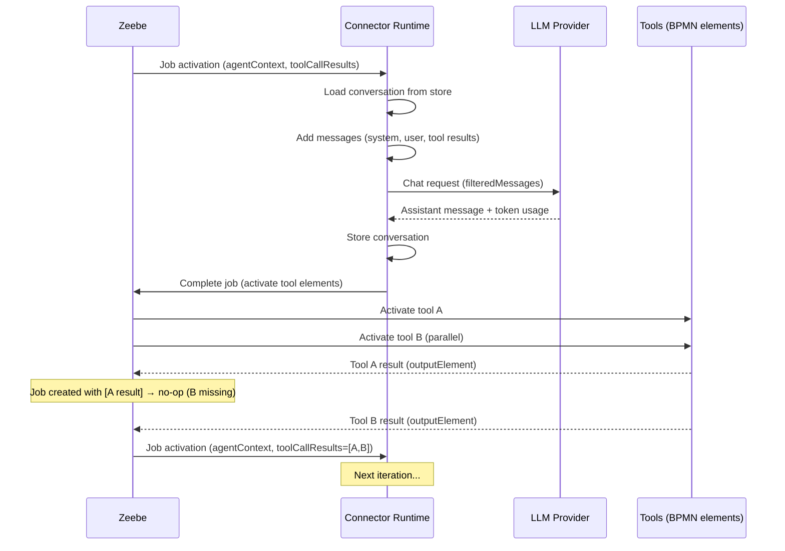
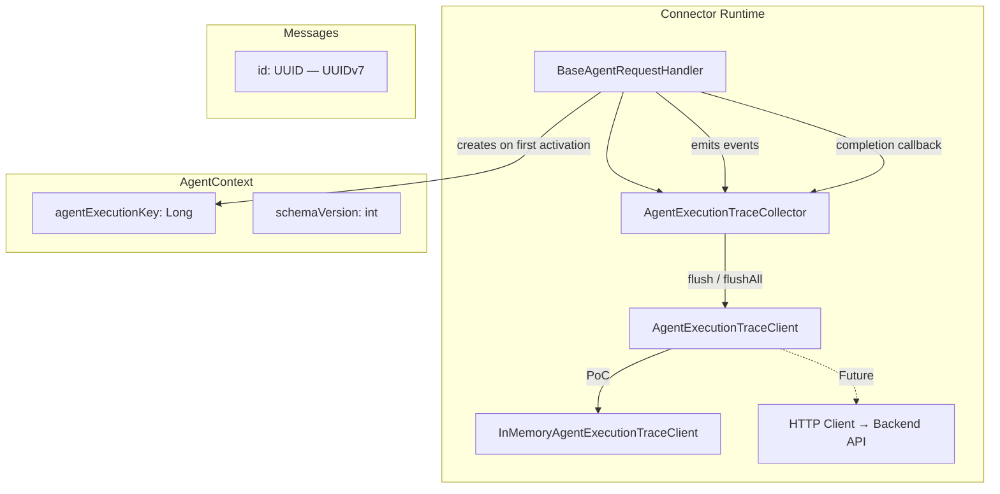
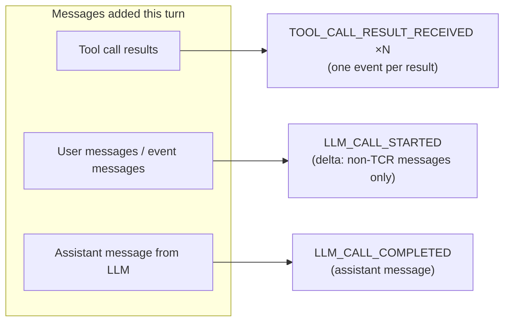
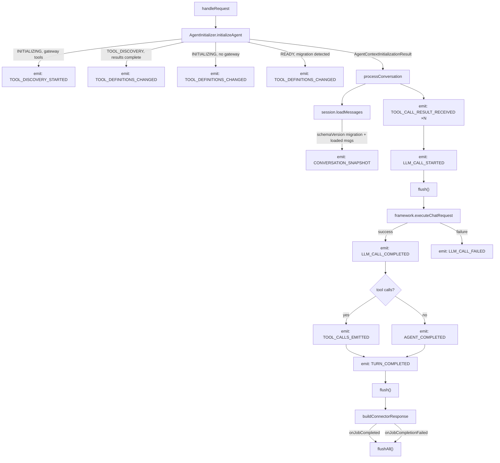
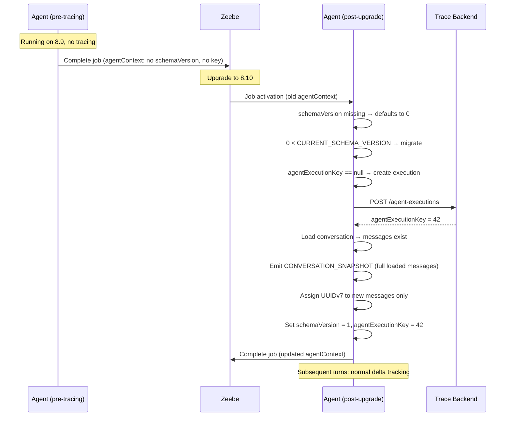

# Agent Execution Tracing — Design Document

* Authors: Agentic AI Team
* Date: April 23, 2026
* Status: **Proposed** (PoC)
* Related: [Metrics Coverage](metrics.md), [Metrics Reference](https://github.com/camunda/camunda-hub-design-prototype/blob/main/docs/drafts/agent-visibility-metrics-reference.md), [AI Agent Reference](../reference/ai-agent.md), [Conversation Storage SPI Redesign](../adr/003-conversation-storage-spi-redesign.md)

---

## Table of Contents

1. [Problem Statement](#1-problem-statement)
2. [Goals & Non-Goals](#2-goals--non-goals)
3. [Why Events, Not Entity Updates](#3-why-events-not-entity-updates)
4. [Background: The Distributed Agent Loop](#4-background-the-distributed-agent-loop)
5. [High-Level Architecture](#5-high-level-architecture)
6. [API Design](#6-api-design)
7. [Event Model](#7-event-model)
8. [Deduplication Strategy](#8-deduplication-strategy)
9. [Delta Tracking & Conversation Reconstruction](#9-delta-tracking--conversation-reconstruction)
10. [Integration Points](#10-integration-points)
11. [Event Examples](#11-event-examples)
12. [Backwards Compatibility](#12-backwards-compatibility)
13. [Metrics Coverage](#13-metrics-coverage)
14. [Feature Gaps & Planned Work](#14-feature-gaps--planned-work)
15. [PoC Scope](#15-poc-scope)

---

## 1. Problem Statement

The Camunda AI Agent executes as a distributed loop across Zeebe and the connector runtime. Each
iteration involves LLM calls (with associated token costs), tool invocations (which may include
user tasks, API calls, or remote agents), and conversation state mutations. Today, there is no
structured mechanism to observe what happened during an agent execution — which LLM calls were
made, what tokens were consumed, which tools ran and for how long, or how the conversation evolved
over time.

The [Agent Visibility Metrics Reference](https://github.com/camunda/camunda-hub-design-prototype/blob/main/docs/drafts/agent-visibility-metrics-reference.md)
defines a comprehensive set of metrics and data requirements across multiple scopes (tool call,
agent, process instance, process definition, cluster). Many of these metrics — token usage (#6-8),
LLM call duration (#10), agent iterations (#11), tool call count (#12), conversation history (D8),
tool call sequence (D5) — require structured event data that the agent runtime must produce.

This document describes the design for an **agent execution tracing system** that captures
fine-grained events during agent execution and pushes them to a Camunda backend for aggregation,
visualization, and auditability.

---

## 2. Goals & Non-Goals

### Goals

- **Auditability**: Every LLM call, tool invocation, and conversation state change is recorded.
  The event stream should be shaped so it can eventually serve as the source of truth for the full
  agent execution history.
- **Metrics support**: Produce the data required to fuel the metrics defined in the
  [Agent Visibility Metrics Reference](#12-metrics-coverage-analysis).
- **Resilience**: Events are pushed best-effort during execution and re-pushed on job completion.
  Server-side deduplication ensures correctness without requiring exactly-once delivery.
- **Backwards compatibility**: Agents that started on a pre-tracing version (e.g., 8.9) continue
  to work after upgrade. Tracing activates transparently on the first post-upgrade job activation.
- **Decoupled contract**: Event payloads are properly typed DTOs that form the contract between the
  agent runtime and the backend. The backend does not need to understand the agent's internal
  execution model (windowing algorithm, eviction rules, etc.).
- **PoC simplicity**: The initial implementation uses an in-memory client that logs structured
  events. The interface is designed for easy replacement with a real HTTP client.

### Non-Goals

- **OpenTelemetry integration**: This is a Camunda-specific tracing system, not an OTel exporter.
- **Real-time streaming**: Events are batched and flushed at defined points, not streamed per-emit.
- **Cost calculation**: Token costs are derived server-side (Optimize/Hub). The agent only produces
  raw token counts.
- **Alerting / drift detection**: These are backend capabilities built on top of the event data.

---

## 3. Why Events, Not Entity Updates

A natural first instinct is to model tracing as a mutable server-side entity: create an agent
execution record on the first activation, then PATCH/PUT it on each turn to update token counts,
append messages, and record tool calls. This approach fundamentally breaks in the AI Agent's
distributed execution model.

### The core problem: lost data from failed and retried jobs

Consider a turn where the agent calls the LLM (consuming tokens), receives a response, but fails
while parsing the result JSON. The job is retried by Zeebe with the **same job key and the same
input variables** — the `AgentContext` from before the failed attempt, not after. If we had
updated a server entity with "tokens consumed: 1500" during the first attempt, the retry would
call the LLM again and update the entity to "tokens consumed: 1200" (the retry's usage),
**silently erasing** the first attempt's token spend. For auditability and accurate cost tracking,
both attempts must be visible.

### Why entity updates fail in this execution model

| Scenario | Entity update behavior | Event behavior |
|----------|----------------------|----------------|
| **Job fails after LLM call, retried** | Retry overwrites first attempt's data. Tokens from the failed attempt are lost. | Both attempts produce separate events with unique dedup keys. Server records both. Total token usage is accurate. |
| **Job superseded** | Superseded job's update may race with the new job's update. Last-write-wins destroys data. | Both jobs push events independently. No conflict — events are append-only. |
| **Partial tool results (no-op turn)** | Entity would need a read-modify-write cycle to "append" a tool result. Concurrent no-op jobs (from rapid tool completions) would race. | Each no-op turn emits `TOOL_CALL_RESULT_RECEIVED` events. Server deduplicates by `toolCallId`. No coordination needed. |
| **Conversation reconstruction** | Entity stores "current conversation" — previous states are lost. No way to see what the LLM saw at iteration 3 vs iteration 7. | Events carry per-turn deltas. Server can reconstruct the conversation at any point in time by replaying events up to that turn. |
| **Network failure on push** | A failed PUT leaves the entity in an unknown state. Was the update applied? Do we retry? Idempotency requires careful version tracking. | A failed push is retried via `flushAll()` on job completion. Same events, same dedup keys — server ignores duplicates. Naturally idempotent. |

### Events as an audit log

The event model treats the trace as an **append-only log** rather than a mutable document. Each
event is a fact — "at this time, this happened" — and facts don't change. The server aggregates
events into derived views (total tokens, conversation timeline, tool call durations) but the
events themselves are immutable.

This aligns with the auditability goal: the event stream is a complete, ordered record of
everything that happened during the agent execution, including failed attempts, retried jobs,
and superseded activations. An entity-based model can only show the current state; an event-based
model shows the full history of how we got there.

### The parent entity is still needed

Despite using events, we still create a parent entity via `POST /agent-executions`. This serves as:

- **Identity**: Returns the `agentExecutionKey` (Long) that all subsequent events reference
- **Context**: Carries static execution metadata (process context, provider, limits, system prompt)
  that doesn't change across turns and shouldn't be repeated in every event
- **Lifecycle boundary**: Marks the start of an agent execution for the server to scope queries

The parent entity is created once and never updated by the agent. The server may update its own
derived fields (status, aggregated metrics) by processing the event stream, but that's a
server-side concern.

---

## 4. Background: The Distributed Agent Loop

Understanding the tracing design requires understanding how the AI Agent executes. The agent is
**not** a long-running process — it is a stateless connector invoked repeatedly by Zeebe as part
of a distributed loop.

### Execution model (Sub-process flavor)



### Key properties affecting tracing

| Property | Implication for tracing |
|----------|----------------------|
| **Stateless connector** | No in-memory state survives between job activations. All trace state must be persisted on `AgentContext` or pushed to the backend. |
| **Job supersession** | When a tool completes, Zeebe creates a new job. The previous job may still be processing. Its completion gets `NOT_FOUND`. Events from superseded jobs must still be recorded. |
| **Parallel tool execution** | Multiple tools run concurrently as BPMN elements. Tool call results arrive together in the next job activation. Individual tool durations cannot be derived from connector-side timestamps alone. |
| **No-op completions** | If not all expected tool results are present, the connector completes without calling the LLM. Partial results are still received and should be recorded. |
| **Job retries** | If the connector fails (e.g., LLM error, parsing failure), the same job (same `jobKey`) is retried. Retried jobs should produce separate events for auditability (the first attempt may have consumed tokens). |
| **Event sub-processes** | Non-interrupting events can fire during tool execution, producing additional `ToolCallResult` entries with `id = null`. These are partitioned from actual tool results and added as user messages. |
| **Gateway tool translation** | MCP/A2A tools have LLM-visible names (e.g., `MCP_Files___readFile`) that differ from the BPMN element ID (`MCP_Files`). Both must be tracked. |

### Agent state machine


---

## 5. High-Level Architecture



### Component responsibilities

| Component | Responsibility |
|-----------|---------------|
| `AgentExecutionTraceCollector` | Per-request event accumulator. Created in `BaseAgentRequestHandler`, set on `AgentExecutionContext`. Tracks which events have been flushed. Provides `flush()` (push new events) and `flushAll()` (re-push all events for reliability). |
| `AgentExecutionTraceClient` | Interface for pushing events to the backend. `createExecution()` creates the parent entity and returns an `agentExecutionKey` (Long). `pushEvents()` pushes a batch of events. |
| `InMemoryAgentExecutionTraceClient` | PoC implementation. Stores events in memory and logs structured JSON. |
| `AgentContext.agentExecutionKey` | Server-assigned stable identifier for the agent execution. `null` on first activation, populated after `createExecution()`, persisted across turns via Zeebe process variables. |
| `AgentContext.schemaVersion` | Data format version. `0` = pre-tracing (legacy). `1` = tracing-enabled. Used to trigger migration logic on upgrade. |
| `Message.id` | UUIDv7 identifier assigned at message creation time. Used for conversation windowing references (`firstIncludedMessageId`). |

---

## 6. API Design

### 6.1 Creation: `POST /agent-executions`

Called once per agent execution, on the first job activation where `agentExecutionKey` is `null`.
Returns a server-assigned `agentExecutionKey` (Long).

**If this call fails, the job must fail immediately and be retried by Zeebe.** The agent cannot
operate without a trace identity.

```java
public record CreateAgentExecutionRequest(
    long processDefinitionKey,
    long processInstanceKey,
    String elementId,
    long elementInstanceKey,
    String tenantId,
    ProviderInfo provider,
    LimitsInfo limits,
    String systemPrompt
) {
    public record ProviderInfo(String type, String model) {}
    public record LimitsInfo(int maxModelCalls) {}
}
```

### 6.2 Events: `POST /agent-executions/{agentExecutionKey}/events`

Called to push a batch of events. Best-effort — failures are logged but do not fail the job.
Events are deduplicated server-side by `(agentExecutionKey, dedupKey)`.

```java
public record PushEventsRequest(
    List<AgentTraceEvent> events
) {}
```

### 6.3 Client interface

```java
public interface AgentExecutionTraceClient {
    /**
     * Creates a new agent execution entity. Returns the server-assigned key.
     * Throws on failure — the caller must fail the job.
     */
    long createExecution(CreateAgentExecutionRequest request);

    /**
     * Pushes a batch of events for an existing execution. Best-effort —
     * failures are logged, not propagated.
     */
    void pushEvents(long agentExecutionKey, List<AgentTraceEvent> events);
}
```

### 6.4 Collector

```java
public class AgentExecutionTraceCollector {
    private final AgentExecutionTraceClient client;
    private final long agentExecutionKey;
    private final long jobKey;
    private final List<AgentTraceEvent> events = new ArrayList<>();
    private int flushedCount = 0;
    private int sequence = 0;

    /**
     * Records an event. Does not push immediately.
     */
    public void emit(AgentTraceEventPayload payload) {
        var dedupKey = deriveDedupKey(payload);
        events.add(new AgentTraceEvent(
            dedupKey,
            AgentTraceEventType.fromPayload(payload),
            Instant.now(),
            jobKey,
            payload
        ));
    }

    /**
     * Pushes only events that haven't been flushed yet.
     * Called before the LLM call and after processing completes.
     */
    public void flush() {
        if (flushedCount < events.size()) {
            var newEvents = events.subList(flushedCount, events.size());
            client.pushEvents(agentExecutionKey, List.copyOf(newEvents));
            flushedCount = events.size();
        }
    }

    /**
     * Re-pushes ALL events, including previously flushed ones.
     * Called from the job completion callback. Server deduplicates
     * by (agentExecutionKey, dedupKey).
     */
    public void flushAll() {
        if (!events.isEmpty()) {
            client.pushEvents(agentExecutionKey, List.copyOf(events));
        }
    }

    private String deriveDedupKey(AgentTraceEventPayload payload) {
        if (payload instanceof ToolCallResultReceived tcr) {
            // Tool call results use toolCallId for cross-turn dedup
            return tcr.toolCallId();
        }
        // All other events use a per-emission UUID
        return UUID.randomUUID().toString();
    }
}
```

---

## 7. Event Model

### 7.1 Event wrapper

```java
public record AgentTraceEvent(
    String dedupKey,
    AgentTraceEventType type,
    Instant timestamp,
    long jobKey,
    AgentTraceEventPayload payload
) {}
```

### 7.2 Event types

```java
public enum AgentTraceEventType {
    TOOL_DISCOVERY_STARTED,
    TOOL_DEFINITIONS_CHANGED,
    TOOL_CALL_RESULT_RECEIVED,
    LLM_CALL_STARTED,
    LLM_CALL_COMPLETED,
    LLM_CALL_FAILED,
    TOOL_CALLS_EMITTED,
    TURN_COMPLETED,
    LIMIT_HIT,
    CONVERSATION_SNAPSHOT,
    SYSTEM_PROMPT_CHANGED,
    AGENT_COMPLETED;

    public static AgentTraceEventType fromPayload(AgentTraceEventPayload payload) {
        // Pattern match on sealed interface subtypes
    }
}
```

### 7.3 Typed payloads

All payloads implement a sealed interface. Existing model types (`Message`, `AssistantMessage`,
`ToolDefinition`) are reused where they form a natural part of the contract. Trace-specific
types (`TokenUsageInfo`, `EmittedToolCall`) are defined separately to decouple the contract from
connector internals.

```java
public sealed interface AgentTraceEventPayload {

    /** Gateway tool discovery has started. */
    record ToolDiscoveryStarted(
        List<String> gatewayTypes
    ) implements AgentTraceEventPayload {}

    /**
     * The current set of tool definitions has been established or updated.
     * Emitted after initialization (static tools), after discovery completes
     * (discovered tools merged), and after process migration (tools updated).
     * Always carries the full current tool definition list.
     */
    record ToolDefinitionsChanged(
        List<ToolDefinition> toolDefinitions
    ) implements AgentTraceEventPayload {}

    /**
     * A single tool call result has been received. Emitted per result,
     * including on no-op turns (partial results). Deduplicated by toolCallId.
     */
    record ToolCallResultReceived(
        String toolCallId,
        String llmToolName,
        String elementId,
        Object content,
        @Nullable Instant completedAt
    ) implements AgentTraceEventPayload {}

    /**
     * An LLM call is starting. Carries the delta messages added in this turn
     * (excluding tool call results, which have their own events) and a
     * reference to the message window boundary.
     */
    record LlmCallStarted(
        List<Message> messages,
        @Nullable UUID firstIncludedMessageId
    ) implements AgentTraceEventPayload {}

    /**
     * An LLM call completed successfully. Carries the assistant's response,
     * per-call token usage, and wall-clock duration.
     */
    record LlmCallCompleted(
        AssistantMessage assistantMessage,
        TokenUsageInfo tokenUsage,
        long durationMs
    ) implements AgentTraceEventPayload {}

    /** An LLM call failed with an exception. */
    record LlmCallFailed(
        String errorClass,
        String errorMessage
    ) implements AgentTraceEventPayload {}

    /**
     * The LLM requested tool calls. Each entry carries both the LLM-visible
     * tool name and the BPMN element ID (they differ for gateway tools).
     */
    record ToolCallsEmitted(
        List<EmittedToolCall> toolCalls
    ) implements AgentTraceEventPayload {}

    /**
     * A point-in-time snapshot of the full conversation. Emitted on:
     * - Mid-flight upgrade (schemaVersion migration): catch-up for missed history
     * - Future: conversation compaction (messages dropped or summarized)
     */
    record ConversationSnapshot(
        List<Message> messages
    ) implements AgentTraceEventPayload {}

    /**
     * A configured limit (guardrail) was hit. Emitted by AgentLimitsValidator
     * before throwing the limit violation exception.
     */
    record LimitHit(
        String limitType,
        int configuredThreshold,
        int actualValue
    ) implements AgentTraceEventPayload {}

    /** The system prompt was changed. TODO: not wired in PoC. */
    record SystemPromptChanged(
        String systemPrompt
    ) implements AgentTraceEventPayload {}

    /**
     * A turn (job activation) completed processing. Emitted at the end of
     * processConversation, before job completion. The server cross-references
     * with Zeebe job completion data — TURN_COMPLETED events from jobs that
     * Zeebe did not accept (failed, superseded) are ignored.
     *
     * Iteration counting: COUNT(TURN_COMPLETED from completed jobs that also
     * have an LLM_CALL_COMPLETED event with the same jobKey).
     */
    record TurnCompleted() implements AgentTraceEventPayload {}

    /** The agent completed (no tool calls in LLM response). Signal only. */
    record AgentCompleted() implements AgentTraceEventPayload {}
}
```

### 7.4 Supporting types

```java
/**
 * Token usage for a single LLM call. Decoupled from AgentMetrics.TokenUsage
 * to form a stable API contract.
 */
public record TokenUsageInfo(
    int inputTokenCount,
    int outputTokenCount
    // Future: int reasoningTokenCount, int cachedTokenCount
) {}

/**
 * A tool call as emitted to the process, carrying both the LLM-visible name
 * (pre gateway transformation) and the BPMN element ID (post transformation).
 */
public record EmittedToolCall(
    String toolCallId,
    String llmToolName,
    String elementId,
    Map<String, Object> arguments
) {}
```

### 7.5 Quick reference: where to find key data

| What you're looking for | Event type | Field path |
|------------------------|-----------|------------|
| **AI response text** | `LLM_CALL_COMPLETED` | `payload.assistantMessage.content` — list of content blocks (text, images, etc.) |
| **Tool calls the LLM requested** | `TOOL_CALLS_EMITTED` | `payload.toolCalls[]` — each has `toolCallId`, `llmToolName`, `elementId`, `arguments` |
| **Tool call results** | `TOOL_CALL_RESULT_RECEIVED` | `payload.content` — the raw output returned by the tool |
| **Token usage (per LLM call)** | `LLM_CALL_COMPLETED` | `payload.tokenUsage.inputTokenCount`, `.outputTokenCount` |
| **LLM call duration** | `LLM_CALL_COMPLETED` | `payload.durationMs` |
| **User prompt / input messages** | `LLM_CALL_STARTED` | `payload.messages[]` — delta messages added this turn (excluding tool results) |
| **Tool call duration** | `TOOL_CALLS_EMITTED` + `TOOL_CALL_RESULT_RECEIVED` | Pair by `toolCallId`: duration = `completedAt` − `TOOL_CALLS_EMITTED.timestamp` |
| **Available tools** | `TOOL_DEFINITIONS_CHANGED` | `payload.toolDefinitions[]` |
| **System prompt** | `CreateAgentExecutionRequest` | `systemPrompt` field on the parent entity |
| **Model / provider** | `CreateAgentExecutionRequest` | `provider.type`, `provider.model` |
| **Limit violations** | `LIMIT_HIT` | `payload.limitType`, `.configuredThreshold`, `.actualValue` |
| **Full conversation** | Replay all events (see [§9](#9-delta-tracking--conversation-reconstruction)) | Or use `CONVERSATION_SNAPSHOT.messages` as a reset point |

> **AI response content vs tool calls**: The LLM's response is always in
> `LLM_CALL_COMPLETED.assistantMessage`. This message may contain **both** text content (`content`
> field) **and** tool call requests (`toolCalls` field). When the LLM requests tool calls, the same
> tool calls are also emitted as a separate `TOOL_CALLS_EMITTED` event with the additional
> `elementId` mapping. The `TOOL_CALLS_EMITTED` event is the authoritative source for tool call
> details because it includes the BPMN element ID (which the raw assistant message does not carry).

---

## 8. Deduplication Strategy

Deduplication is critical because the agent's distributed execution model creates multiple
scenarios where the same logical event can be pushed more than once.

### 8.1 Why deduplication is needed

```mermaid
flowchart TD
    subgraph "Scenario 1: Re-push on completion"
        A1[Events emitted during processing] --> F1[flush — events pushed]
        F1 --> C1[Job completes]
        C1 --> FA1[flushAll — same events re-pushed]
        FA1 --> D1[Server deduplicates by dedupKey]
    end

    subgraph "Scenario 2: Job retry after failure"
        A2[Job runs, calls LLM $$] --> E2[Events pushed via flush]
        E2 --> X2[JSON parsing fails]
        X2 --> R2[Same job retried, same jobKey]
        R2 --> A2b[Job runs again, calls LLM $$ again]
        A2b --> E2b[New events with NEW dedupKeys]
        E2b --> D2[Server stores BOTH attempts]
    end

    subgraph "Scenario 3: Tool result across turns"
        T3[Tool A completes] --> J3a[Job N: partial results, no-op]
        J3a --> |"emit TCR for A"| P3a[Pushed]
        T3b[Tool B completes] --> J3b["Job N+1: all results present"]
        J3b --> |"emit TCR for A again"| P3b[Same dedupKey = toolCallId]
        P3b --> D3[Server deduplicates A, stores B]
    end
```



### 8.2 Dedup key derivation

| Event type | Dedup key | Rationale |
|-----------|-----------|-----------|
| `TOOL_CALL_RESULT_RECEIVED` | `toolCallId` (stable) | The same tool result may arrive in multiple job activations (no-op turn → real turn). The `toolCallId` is unique per tool call within an execution. First-write-wins: the server records the first event and ignores subsequent pushes with the same key. |
| All other event types | Random UUID (per emission) | Each emission is a unique event. On `flushAll()`, the same events are re-pushed with the same UUIDs → server deduplicates. On a job retry, new emissions get new UUIDs → server records both attempts. This is critical for auditability: if a job calls the LLM, fails, and retries, both LLM calls (and their token costs) must be visible. |

### 8.3 Server-side dedup contract

The server deduplicates by `(agentExecutionKey, dedupKey)`:
- First push with a given `dedupKey` → stored
- Subsequent pushes with the same `dedupKey` → ignored (idempotent)

This means:
- `flush()` + `flushAll()` = safe (same UUIDs, deduplicated)
- Job retry = visible (new UUIDs, both stored)
- Tool result replay = safe (same `toolCallId`, deduplicated)
- Superseded job events = visible (different job, different UUIDs, stored)

---

## 9. Delta Tracking & Conversation Reconstruction

### 9.1 Principle

Each turn's events carry the **full content** of messages added in that turn. The server
reconstructs the complete conversation by replaying events in order. No diffing, no snapshots
needed for normal operation.

### 9.2 How messages flow through events

The delta is split across granular events, each carrying its portion of the new messages:



The `LLM_CALL_STARTED` event carries only messages **not already covered** by
`TOOL_CALL_RESULT_RECEIVED` events — typically user prompt messages and event sub-process messages.
If the only new messages are tool call results, `LLM_CALL_STARTED` has an empty message list (it
still serves as the "LLM call is starting" signal).

### 9.3 Server reconstruction algorithm

The server appends messages to its reconstructed conversation in event order:

1. `TOOL_CALL_RESULT_RECEIVED` → append as tool call result message
2. `LLM_CALL_STARTED` → append the user/event messages from the payload
3. `LLM_CALL_COMPLETED` → append the assistant message

After replaying all events for all turns, the server has the full, unfiltered conversation history.

### 9.4 Message windowing signal

The `LLM_CALL_STARTED` event includes `firstIncludedMessageId` — the UUID of the oldest
non-system message that was included in the LLM call's context window. This tells the server
**where the window boundary is** without requiring the server to understand the eviction algorithm.

- `firstIncludedMessageId` = ID of the first non-system message → messages before it were evicted
- `firstIncludedMessageId` = `null` → the boundary falls on a pre-upgrade message with no ID, or
  no eviction occurred

The server knows the full history (from replayed deltas). The `firstIncludedMessageId` tells it
which subset the LLM actually saw. This is decoupled from the agent's windowing implementation.

### 9.5 Conversation snapshots

A `CONVERSATION_SNAPSHOT` event carries the full conversation state at a point in time. It serves
as a **reset point** — the server replaces its reconstructed history with the snapshot content and
continues appending deltas from subsequent events.

Emitted in two scenarios:

| Scenario | Trigger | Purpose |
|----------|---------|---------|
| **Mid-flight upgrade** | `schemaVersion` migration (0 → 1) with existing conversation | Catches the server up on conversation history from before tracing was enabled |
| **Conversation compaction** (future) | Explicit compaction action removes/summarizes messages | Records the new ground truth after messages are dropped |

Compaction is an explicit action controlled by the agent runtime (not an implicit side effect), so
the snapshot event is emitted by the compaction code — no detection heuristics needed.

### 9.6 Message IDs

Each message carries a `UUID id` (UUIDv7, monotonically increasing, time-sortable) assigned at
message creation time.

- **New messages** (created post-upgrade): UUIDv7 assigned in the message factory/builder
- **Pre-existing messages** (loaded from store, pre-upgrade): `id = null` — IDs are **not**
  backfilled into existing messages, as some stores are append-only (e.g., AWS AgentCore)
- Over time, as old messages are evicted by the message window, all messages in context will
  naturally have IDs

UUIDv7 generation uses the `com.fasterxml.uuid:java-uuid-generator` library:

```java
import com.fasterxml.uuid.Generators;
import com.fasterxml.uuid.impl.TimeBasedEpochGenerator;

// UUIDv7 (Unix epoch-based, monotonic, sortable)
private static final TimeBasedEpochGenerator UUID_V7_GENERATOR =
    Generators.timeBasedEpochGenerator();

// NOT timeBasedReorderedGenerator() — that generates UUIDv6
```

---

## 10. Integration Points

### 10.1 Event emission points in `BaseAgentRequestHandler`



### 10.2 Where the collector lives

The collector is a per-request object set on `AgentExecutionContext`:

```java
public interface AgentExecutionContext {
    // ... existing methods ...

    /** Trace collector for this request. May be null if tracing is not configured. */
    @Nullable
    AgentExecutionTraceCollector traceCollector();
}
```

Created in `BaseAgentRequestHandler.handleRequest()`:

1. Read `agentExecutionKey` from `AgentContext`
2. If `null` → call `client.createExecution()` → store returned key on `AgentContext`
3. Create `AgentExecutionTraceCollector(client, agentExecutionKey, jobKey)`
4. Set on execution context

### 10.3 Flush points

| Flush point | Method | Purpose |
|-------------|--------|---------|
| Before LLM call | `flush()` | Push tool results + `LLM_CALL_STARTED` so the server shows the agent is "thinking." Everything before the LLM call runs in milliseconds; the LLM call is the expensive wait. |
| After processing | `flush()` | Push `LLM_CALL_COMPLETED`, `TOOL_CALLS_EMITTED` / `AGENT_COMPLETED`. |
| Job completion callback | `flushAll()` | Re-push all events for reliability. If a prior `flush()` failed silently, this recovers. Server deduplicates. |
| Job completion failure callback | `flushAll()` | Same — ensure events from failed completions are recorded. |

### 10.4 Completion callback wiring

The collector is attached to the `JobCompletionListener` created in `BaseAgentRequestHandler`:

```java
private JobCompletionListener createCompletionListener(
    C executionContext, ConversationStore store,
    @Nullable AgentResponse agentResponse,
    @Nullable AgentExecutionTraceCollector traceCollector) {

    return new JobCompletionListener() {
        @Override
        public void onJobCompleted() {
            if (traceCollector != null) traceCollector.flushAll();
            if (store != null && agentResponse != null)
                store.onJobCompleted(executionContext, agentResponse.context());
        }

        @Override
        public void onJobCompletionFailed(JobCompletionFailure failure) {
            if (traceCollector != null) traceCollector.flushAll();
            if (store != null && agentResponse != null)
                store.onJobCompletionFailed(executionContext, agentResponse.context(), failure);
        }
    };
}
```

### 10.5 Tool call timing via element template

Tool call durations are not measurable from the connector side when tools execute in parallel.
The element template stamps `completedAt` into the tool call result via the `outputElement`
expression:

```
outputElement: ={
  id: toolCall._meta.id,
  name: toolCall._meta.name,
  content: toolCallResult,
  completedAt: now()
}
```

The `completedAt` value flows into `ToolCallResult.properties()` via `@JsonAnySetter`. The
`TOOL_CALL_RESULT_RECEIVED` event reads it and includes it in the payload. If missing (pre-upgrade
element templates), the event uses the current timestamp as a fallback.

The `TOOL_CALLS_EMITTED` event timestamp serves as the approximate `startedAt` — it marks when
the connector instructed Zeebe to activate the tool elements.

### 10.6 Gateway tool name mapping

For gateway tools (MCP, A2A), the LLM-visible name differs from the BPMN element ID:

```
LLM sees:         MCP_Files___readFile
BPMN element:     MCP_Files
```

The `TOOL_CALLS_EMITTED` event captures **both** via the `EmittedToolCall` record:

```java
record EmittedToolCall(
    String toolCallId,
    String llmToolName,     // pre-transform: "MCP_Files___readFile"
    String elementId,       // post-transform: "MCP_Files"
    Map<String, Object> arguments
)
```

This data is available in `BaseAgentRequestHandler` where both the pre-transform
(`assistantMessage.toolCalls()`) and post-transform (`gatewayToolHandlers.transformToolCalls()`)
tool calls are in scope.

Similarly, `TOOL_CALL_RESULT_RECEIVED` carries both names so the server can link results to their
originating tool calls and to their BPMN elements.

---

## 11. Event Examples

A complete end-to-end example of a support agent execution. The agent uses an MCP-connected
Jira server and a regular `getCustomerInfo` tool. The example walks through the full lifecycle:
creation → initialization with tool discovery → first LLM call → partial tool results (no-op) →
all results arrive → second LLM call → final response.

All events below are pushed via `POST /agent-executions/42/events`.

### 11.1 Turn 1: Creation and initialization with MCP tool discovery

The agent enters the AHSP for the first time. `agentExecutionKey` is `null`, so the agent
first calls `POST /agent-executions` to create the execution entity, receiving key `42`.

The agent detects an MCP gateway tool element and initiates tool discovery.

```json
[
  {
    "dedupKey": "aaa-0001",
    "type": "TOOL_DISCOVERY_STARTED",
    "timestamp": "2026-04-23T14:29:55.100Z",
    "jobKey": 2251799813685300,
    "payload": {
      "gatewayTypes": ["mcp"]
    }
  },
  {
    "dedupKey": "aaa-0002",
    "type": "TURN_COMPLETED",
    "timestamp": "2026-04-23T14:29:55.110Z",
    "jobKey": 2251799813685300,
    "payload": {}
  }
]
```

> The agent completes the job with tool discovery tool calls. No LLM call yet.

### 11.2 Turn 2: Discovery results arrive → tool definitions → first LLM call → tool calls

The MCP server responded with its tool list. The agent merges the discovered tools with the
static tools, emits the full tool definition set, and proceeds to the first LLM call with the
user's prompt.

**Batch 1** (pushed before LLM call):

```json
[
  {
    "dedupKey": "bbb-0001",
    "type": "TOOL_DEFINITIONS_CHANGED",
    "timestamp": "2026-04-23T14:29:58.200Z",
    "jobKey": 2251799813685305,
    "payload": {
      "toolDefinitions": [
        {"name": "getCustomerInfo", "description": "Look up customer by ID"},
        {"name": "MCP_Jira___getOpenTickets", "description": "List open Jira tickets"},
        {"name": "MCP_Jira___getTicketDetails", "description": "Get Jira ticket details"}
      ]
    }
  },
  {
    "dedupKey": "bbb-0002",
    "type": "LLM_CALL_STARTED",
    "timestamp": "2026-04-23T14:29:58.210Z",
    "jobKey": 2251799813685305,
    "payload": {
      "messages": [
        {
          "role": "system",
          "id": "019078a1-1a2b-7c3d-4e5f-6a7b8c9d0e1f",
          "content": [{"type": "text", "text": "You are a support agent. Help the customer."}]
        },
        {
          "role": "user",
          "id": "019078a1-2b3c-7d4e-5f6a-7b8c9d0e1f2a",
          "content": [{"type": "text", "text": "My mobile app login is broken, customer ID C-5678"}]
        }
      ],
      "firstIncludedMessageId": null
    }
  }
]
```

> `firstIncludedMessageId` is `null` — all messages fit in the context window (no eviction).

**Batch 2** (pushed after LLM response):

```json
[
  {
    "dedupKey": "bbb-0003",
    "type": "LLM_CALL_COMPLETED",
    "timestamp": "2026-04-23T14:30:00.550Z",
    "jobKey": 2251799813685305,
    "payload": {
      "assistantMessage": {
        "role": "assistant",
        "id": "019078a1-4b2d-7f1e-9c3a-2d8e1f9a0b3c",
        "content": [
          {"type": "text", "text": "Let me look up your account and check for open issues."}
        ],
        "toolCalls": [
          {"id": "tc_01", "name": "getCustomerInfo", "arguments": {"customerId": "C-5678"}},
          {"id": "tc_02", "name": "MCP_Jira___getOpenTickets", "arguments": {"customerId": "C-5678"}}
        ]
      },
      "tokenUsage": {"inputTokenCount": 1250, "outputTokenCount": 89},
      "durationMs": 2340
    }
  },
  {
    "dedupKey": "bbb-0004",
    "type": "TOOL_CALLS_EMITTED",
    "timestamp": "2026-04-23T14:30:00.555Z",
    "jobKey": 2251799813685305,
    "payload": {
      "toolCalls": [
        {"toolCallId": "tc_01", "llmToolName": "getCustomerInfo", "elementId": "getCustomerInfo", "arguments": {"customerId": "C-5678"}},
        {"toolCallId": "tc_02", "llmToolName": "MCP_Jira___getOpenTickets", "elementId": "MCP_Jira", "arguments": {"customerId": "C-5678"}}
      ]
    }
  },
  {
    "dedupKey": "bbb-0005",
    "type": "TURN_COMPLETED",
    "timestamp": "2026-04-23T14:30:00.560Z",
    "jobKey": 2251799813685305,
    "payload": {}
  }
]
```

> The tool calls appear in **both** `LLM_CALL_COMPLETED.assistantMessage.toolCalls` and
> `TOOL_CALLS_EMITTED.toolCalls`. The key difference: `TOOL_CALLS_EMITTED` carries `elementId`.
> For `MCP_Jira___getOpenTickets`, the element ID is `MCP_Jira` (one MCP server element handling
> multiple tools). For `getCustomerInfo`, the names are identical (regular BPMN element).

### 11.3 Turn 3: Partial tool results — no-op

`getCustomerInfo` (tc_01) completed, but `MCP_Jira___getOpenTickets` (tc_02) is still running.
The agent records the partial result and completes without calling the LLM.

```json
[
  {
    "dedupKey": "tc_01",
    "type": "TOOL_CALL_RESULT_RECEIVED",
    "timestamp": "2026-04-23T14:30:01.100Z",
    "jobKey": 2251799813685310,
    "payload": {
      "toolCallId": "tc_01",
      "llmToolName": "getCustomerInfo",
      "elementId": "getCustomerInfo",
      "content": "{\"name\": \"Alice\", \"plan\": \"Enterprise\", \"accountId\": \"A-1234\"}",
      "completedAt": "2026-04-23T14:30:00.950Z"
    }
  },
  {
    "dedupKey": "ccc-0001",
    "type": "TURN_COMPLETED",
    "timestamp": "2026-04-23T14:30:01.105Z",
    "jobKey": 2251799813685310,
    "payload": {}
  }
]
```

> No `LLM_CALL_STARTED` or `LLM_CALL_COMPLETED` — the agent is waiting for tc_02. When the
> next turn arrives with both results, `TOOL_CALL_RESULT_RECEIVED` for tc_01 will be emitted
> again with the same `dedupKey` = `"tc_01"` — the server deduplicates it.

### 11.4 Turn 4: All tool results arrive → LLM call → final response

Both tool call results are now present. The agent calls the LLM, which responds with a final
text answer (no tool calls).

**Batch 1** (tool results + LLM call start):

```json
[
  {
    "dedupKey": "tc_01",
    "type": "TOOL_CALL_RESULT_RECEIVED",
    "timestamp": "2026-04-23T14:30:05.100Z",
    "jobKey": 2251799813685315,
    "payload": {
      "toolCallId": "tc_01",
      "llmToolName": "getCustomerInfo",
      "elementId": "getCustomerInfo",
      "content": "{\"name\": \"Alice\", \"plan\": \"Enterprise\", \"accountId\": \"A-1234\"}",
      "completedAt": "2026-04-23T14:30:00.950Z"
    }
  },
  {
    "dedupKey": "tc_02",
    "type": "TOOL_CALL_RESULT_RECEIVED",
    "timestamp": "2026-04-23T14:30:05.101Z",
    "jobKey": 2251799813685315,
    "payload": {
      "toolCallId": "tc_02",
      "llmToolName": "MCP_Jira___getOpenTickets",
      "elementId": "MCP_Jira",
      "content": "[{\"id\": \"JIRA-456\", \"summary\": \"Login fails on mobile\"}]",
      "completedAt": "2026-04-23T14:30:04.800Z"
    }
  },
  {
    "dedupKey": "ddd-0001",
    "type": "LLM_CALL_STARTED",
    "timestamp": "2026-04-23T14:30:05.110Z",
    "jobKey": 2251799813685315,
    "payload": {
      "messages": [],
      "firstIncludedMessageId": null
    }
  }
]
```

> tc_01 appears again (same `dedupKey` = `"tc_01"`) — the server deduplicates it. tc_02 is new.
> `LLM_CALL_STARTED.messages` is empty because the only new inputs are tool call results,
> already covered by their individual events.

**Batch 2** (LLM response + agent completion):

```json
[
  {
    "dedupKey": "ddd-0002",
    "type": "LLM_CALL_COMPLETED",
    "timestamp": "2026-04-23T14:30:07.450Z",
    "jobKey": 2251799813685315,
    "payload": {
      "assistantMessage": {
        "role": "assistant",
        "id": "019078a1-5c3d-7e2f-1a0b-3c4d5e6f7a8b",
        "content": [
          {"type": "text", "text": "Hi Alice! I found your account (Enterprise plan) and see you have an open ticket JIRA-456 about mobile login failures. This is a known issue affecting iOS users — the team is working on a fix expected by end of day. I'll add a priority flag to your ticket."}
        ],
        "toolCalls": []
      },
      "tokenUsage": {"inputTokenCount": 2150, "outputTokenCount": 187},
      "durationMs": 1850
    }
  },
  {
    "dedupKey": "ddd-0003",
    "type": "AGENT_COMPLETED",
    "timestamp": "2026-04-23T14:30:07.455Z",
    "jobKey": 2251799813685315,
    "payload": {}
  },
  {
    "dedupKey": "ddd-0004",
    "type": "TURN_COMPLETED",
    "timestamp": "2026-04-23T14:30:07.460Z",
    "jobKey": 2251799813685315,
    "payload": {}
  }
]
```

> The AI's final answer is in `assistantMessage.content`. `toolCalls` is empty — the LLM decided
> it has enough information. `AGENT_COMPLETED` signals the execution is done. The AHSP will
> complete.
>
> **Total for this execution**: 2 LLM calls (turns 2 and 4), 2 tool calls, 3400 input tokens,
> 276 output tokens, 4 turns (2 with LLM calls = 2 iterations).

---

## 12. Backwards Compatibility

### 11.1 Upgrade scenario



### 11.2 Field-level BC

| New field | Old data behavior | Migration |
|-----------|------------------|-----------|
| `AgentContext.schemaVersion` (int) | Missing → defaults to `0` via Jackson | Bumped to `CURRENT_SCHEMA_VERSION` on first post-upgrade activation |
| `AgentContext.agentExecutionKey` (@Nullable Long) | Missing → `null` via Jackson | Set after `createExecution()` call |
| `Message.id` (@Nullable UUID) | Missing → `null` via Jackson | **Not backfilled** — append-only stores (AWS AgentCore) cannot be rewritten. New messages get IDs; old messages keep `null`. |

### 11.3 Element template BC

Pre-upgrade element templates do not produce `completedAt` in the `outputElement` expression.
When `ToolCallResult.properties()` does not contain `completedAt`, the `TOOL_CALL_RESULT_RECEIVED`
event falls back to using the tool call result message's timestamp (the time the result was
processed by the connector).

---

## 13. Metrics Coverage

For the comprehensive metrics derivation reference — how the server uses events and Zeebe data to
compute each metric from the [Agent Visibility Metrics Reference](https://github.com/camunda/camunda-hub-design-prototype/blob/main/docs/drafts/agent-visibility-metrics-reference.md)
— see [metrics.md](metrics.md).

---

## 14. Feature Gaps & Planned Work

### 13.1 Agent runtime features needed for full metrics coverage

| Feature | Metrics unlocked | Status |
|---------|-----------------|--------|
| **Reasoning token tracking** | #8, #20, #27-29 (reasoning component), D6 | Not started. Two parts: (1) Extend `TokenUsageInfo` with `reasoningTokenCount` — requires Langchain4j `TokenUsage` to expose it per provider. (2) Extract reasoning/thinking text from the LLM response into a dedicated list of content blocks (separate from the assistant message content). Provider-dependent: Anthropic returns thinking blocks, OpenAI returns reasoning tokens separately. |
| **Cached token tracking** | Caching tokens (pending #) | Not started. Two parts: (1) Extend `TokenUsageInfo` with `cachedTokenCount` — same Langchain4j dependency. (2) Caching configuration (e.g., prompt caching settings) must be tracked so the server can correlate cached token counts with caching behavior. |
| **Max tokens limit** | Extends #14 (limit hits), D11 (limit config) | Not started. New limit type in `LimitsConfiguration`. |
| **LLM call duration timing** | #10 | **In PoC scope.** Wrap `framework.executeChatRequest()`. |
| **Element template `completedAt`** | #4 (tool call duration) | **In PoC scope.** Add `completedAt: now()` to `outputElement`. |
| **Limit hit event** | #14, #35, #36 | **In PoC scope.** Emit `LIMIT_HIT` in `AgentLimitsValidatorImpl.validateConfiguredLimits()` before throwing the exception. The collector is available on the execution context at that point. |
| **System prompt change detection** | `SYSTEM_PROMPT_CHANGED` event | Event type defined, wiring deferred. |

### 13.2 Planned features that interact with tracing

| Feature | Interaction with tracing |
|---------|------------------------|
| **Conversation compaction** | Replacing older messages with a summary message to reduce conversation size. When implemented, the compaction code emits a `CONVERSATION_SNAPSHOT` event with the compacted message set. The server treats it as a reset point for conversation reconstruction. No detection heuristics needed — the emit is explicit. Compaction will involve an auxiliary LLM call (to generate the summary), which produces its own `LLM_CALL_COMPLETED` event for token tracking but no `TURN_COMPLETED` — so it is not counted as an iteration. |
| **Multi-model support** | If the agent switches models mid-execution, the `provider` field in `LLM_CALL_COMPLETED` (or a dedicated event) would need to carry the per-call model info. Currently assumed static per execution. |

---

## 15. PoC Scope

### What's included

- `AgentContext` schema changes: `schemaVersion` (int), `agentExecutionKey` (@Nullable Long)
- `Message` hierarchy: `id` field (UUIDv7) on all four message types
- `tracing` package with all DTOs: `AgentTraceEvent`, `AgentTraceEventPayload` (sealed interface
  with all payload records), `AgentTraceEventType`, `TokenUsageInfo`, `EmittedToolCall`,
  `CreateAgentExecutionRequest`
- `AgentExecutionTraceClient` interface + `InMemoryAgentExecutionTraceClient` (logs structured JSON)
- `AgentExecutionTraceCollector` with `emit()`, `flush()`, `flushAll()`
- Integration in `BaseAgentRequestHandler`: collector creation, event emission at all points,
  flush calls, completion callback wiring
- LLM call duration timing (`System.nanoTime()` around `executeChatRequest()`)
- Element template change: `completedAt: now()` in `outputElement` expression
- Schema version migration logic in `AgentInitializerImpl`
- `LIMIT_HIT` emission in `AgentLimitsValidatorImpl`
- `CONVERSATION_SNAPSHOT` emission on mid-flight upgrade
- Backwards compatibility for all field additions

### What's deferred

- Real HTTP client (replaced by in-memory + logging)
- Reasoning tokens, cached tokens, max tokens limit
- Chain of thought / reasoning text extraction
- `SYSTEM_PROMPT_CHANGED` wiring (event type defined only)
- Conversation compaction / summarization
- Server-side aggregation, visualization, alerting
