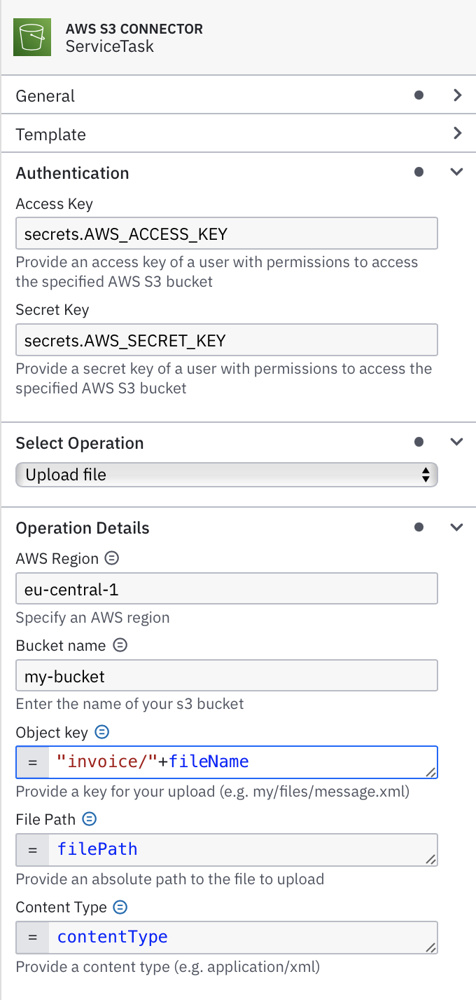
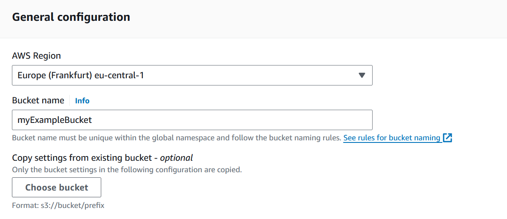
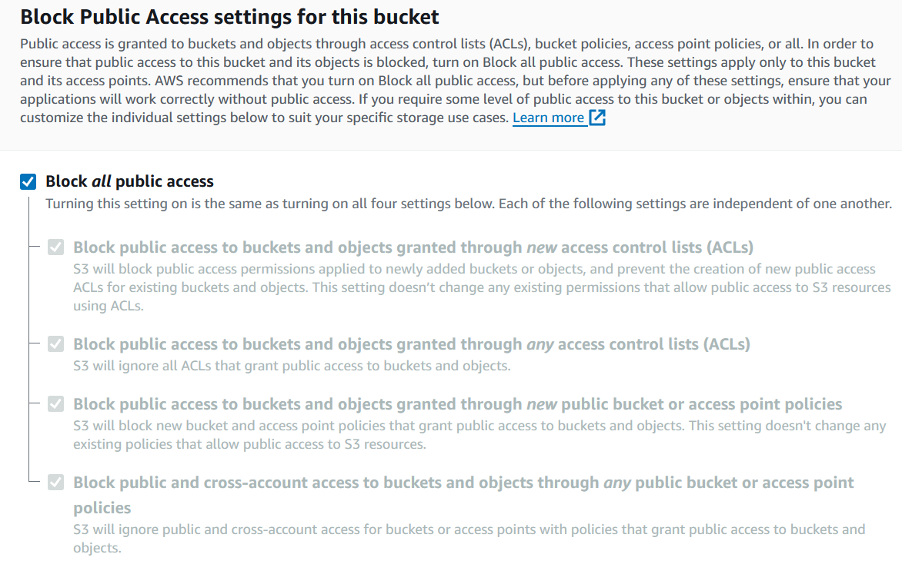

# AWS S3 Connector

Camunda Outbound Connector to interact with the content of an S3 bucket

DISCLAIMER: You are responsible for your AWS configuration in your environment, keep in mind that you have to make
sure that you keep credentials in a safe place and only give access to specific resources, and be as restrictive as 
possible. This is not a security tutorial for AWS. You should definitively know what you are doing!

## Compatibility

- JDK 21+
- Camunda Platform v8.7.x
- Connector SDK v8.7.x
- AWS SDK v2.x

## Features

- Upload a generated file to an AWS S3 bucket
- Delete a file from an AWS S3 bucket
- Download a file from an AWS S3 bucket
- Files are saved in the local filesystem to allow interaction between activities


## Setup

### Connector configuration

| name            | description                                | example                     |
|-----------------|--------------------------------------------|-----------------------------|
| `accessKey`     | the AWS access key for the authorized user | `secrets.AWS_ACCESS_KEY`    |
| `secretKey`     | the AWS secret key for the authorized user | `secrets.AWS_SECRET_KEY`    |
| `region`        | the AWS region of your S3 bucket           | eu-central-1                |
| `bucketName`    | the name of the S3 bucket                  | camunda-s3-connector-bucket |
| `objectKey`     | path + file name in the s3 bucket          | `="invoice/"+fileName`      |
| `operationType` | what to do on s3                           | `PUT_OBJECT`                |
| `filePath`      | absolute path to the file to upload        | `=filePath`                 |
| `contentType`   | the content type of the content            | `=contentType`              |

NOTE: please do not put secrets directly into your configuration. See the secrets section for more details.

#### How it looks in the modeler


### required AWS Resources
- S3 bucket (non-public) with server-side encryption and versioning enabled
- IAM User with putObject, deleteObject and getObject rights to the bucket
- Access key and Secret key for the IAM user

### create AWS Resources if not yet present
#### 1. create AWS S3 Bucket:
   First, you need to log into the AWS management console and navigate to S3.
    There you can create a new bucket by setting your AWS region and a unique name.
   

Moreover, making sure that the “Block all public access” option is enabled to keep the bucket private.


#### 2. create IAM User and Access/Security Key
Once the bucket has been set up, you must create an IAM (Identity and Access Management) user in the IAM area. 
To do this, navigate to IAM > Users and add a new user.

##### Get credentials from AWS

In order to access AWS from your connector you need the above mentioned user with a IAM policy for S3. Additionally
you need to generated credentials for the user. You can do this over the AWS console in IAM:

- Log into your AWS console
- Go to IAM > Users
- Select your created user, e.g. `camunda-s3-connector-user`
- Go to Security credentials > Access keys
- Click `Create access key`
- Select `Third-party service`
- Check that you understand the risk of having a permanent access key
- add a tag if wished
- Click on create and save your credentials in a save place

ATTENTION: There are many ways to achieve this in IAM, I only describe the easiest,
but possibly not the safest way to do it


#### 3. IAM policy

Next, you create an IAM policy that grants the user authorization to upload, delete and retrieve objects in the bucket. 
To do this, you must create an IAM policy in the IAM area and create a JSON policy with the corresponding authorizations.

```json
{
    "Version": "2012-10-17",
    "Statement": [
        {
            "Sid": "AllowPutAndDeleteInS3",
            "Effect": "Allow",
            "Action": [
                "s3:PutObject",
                "s3:DeleteObject",
                "s3:GetObject"
            ],
            "Resource": "arn:aws:s3:::<bucket-name>/*"
        }
    ]
}
```
Afterwards, you need to add the created policy to your previously created IAM user.

## Runtime

### Running the connector

- You can run it as a standalone connector described here: [run a standalone connector](https://github.com/NovatecConsulting/camunda-aws-s3-connector/tree/main/connector-aws-s3-standalone)
- Or you can run it together with some JobWorkers described here: [run a connector](https://github.com/NovatecConsulting/camunda-aws-s3-connector/tree/main/connector-aws-s3-example)

### Handling secrets
Since your connector needs to run in a custom connector runtime, you cannot just add secrets in the cloud console since
they will not be auto-magically transported into your connector runtime. You can provide them by:

- adding them as environment variables (e.g. when you use the SpringBoot connector runtime)
- adding them as an env file to your docker container

NOTE: This behaviour will most likely be improved in the future

## File Handling

The connector has two file adapters:

- *cloud file adapter* to S3
- *local file adapter* to the local file system

They are implementations of the [Connector File API](./fileapi)

### Why is this necessary?
If you are handling a lot of files (maybe even big files) it is a best practice approach to NOT store your file or the content
in a process variable for several reasons:

- Zeebe currently only support variables < 2MB
- The files become part of the process state
- You have no way to clean it up (yet)

With the local file adapter the file can be written to a temp directory and the file path can be handed to other activities.
If you want to move files to another process instance, just upload it back to S3 and start another process with the
input variables needed to download the file again from S3.

### Current Restrictions

It is currently not possible to receive process instance specific variables like the process instance key in the connector 
or with a feel expression. Both improvements exist as a feature request. The only way to get an instance key is by calling
the value from an activated job in a JobWorker and setting it as a process variable for others to pick up.

NOTE: the process instance key is used for generating file paths so local and remote files are not overwritten by other
instances

### This connector was initially developed by the BPM team at [Novatec Consulting GmbH](https://www.novatec-gmbh.de)
