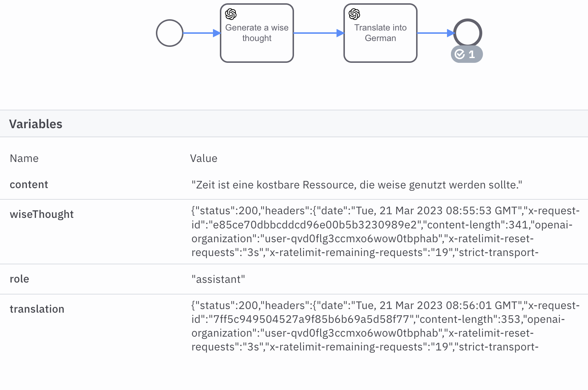

# OpenAI Connector

The **OpenAI Connector** allows you to use [ChatGPT](https://platform.openai.com/docs/guides/chat/chat-completions-beta)
or [Moderation API](https://platform.openai.com/docs/guides/moderation/moderation) in your Camunda 8 processes.

This Connector reuses the base implementation of [HTTP JSON Connector](../http-json) by providing a compatible element template.

## What can I use it for?

Large language models like GPT-3 or GPT-4 can create and edit content, or respond to user prompt in an interactive manner.
Please refer to the [example API use-cases](https://platform.openai.com/examples) provided by OpenAI.

## Model selection

Refer to the [Models](https://platform.openai.com/docs/models/models) section of OpenAI documentation.
Selection of models is user-specific and depends on your account privileges. Therefore, some models (e.g. GPT-4 at the time of writing)
may appear as non-existing when you attempt to use them, although they are defined in the element template.

## Moderation

It is recommended to use the Moderation API to sanitize both inputs and outputs of the language model.
This way you will be able to prevent violation of OpenAI policies and displaying the potentially unsafe content in your system.
