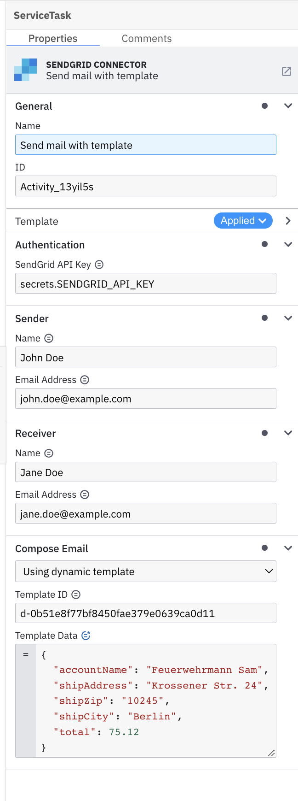
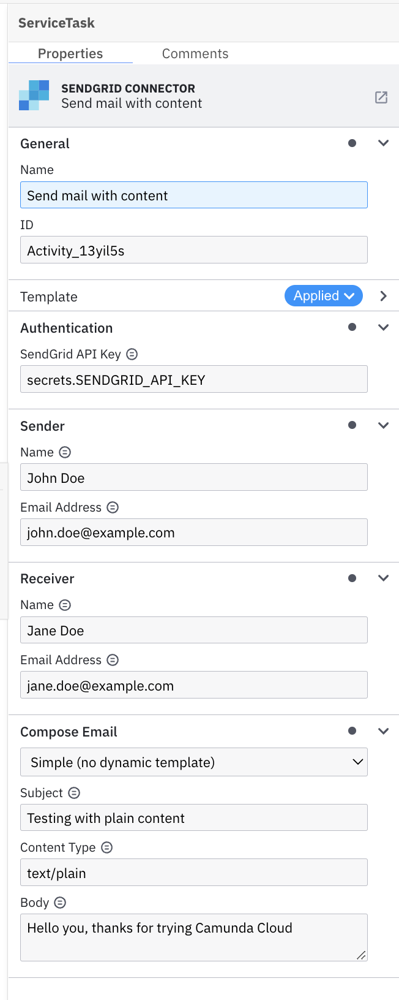

# Camunda SendGrid Connector

Find the user documentation in our [Camunda Platform 8 Docs](https://docs.camunda.io/docs/components/integration-framework/connectors/out-of-the-box-connectors/sendgrid/).

## Build

```bash
mvn clean package
```

## API

### Input

```json
{
  "apiKey": "secrets.SENDGRID_API_KEY",
  "from": {
    "name": "John Doe",
    "email": "john.doe@example.com"
  },
  "to": {
    "name": "Jane Doe",
    "email": "jane.doe@example.com"
  },
  "template": {
    "id": "d-0b51e8f77bf8450fae379e0639ca0d11",
    "data": {
      "accountName": "Feuerwehrmann Sam",
      "shipAddress": "Krossener Str. 24",
      "shipZip": "10245",
      "shipCity": "Berlin",
      "total": 75.12
    }
  }
}
```

### Output

```json
{
  "error": "Error message if something went wrong"
}
```

### Email Template

If the email should be sent with a template the request has to contain a `template` object.

```json
{
  "apiKey": "secrets.SENDGRID_API_KEY",
  "from": {
    "name": "John Doe",
    "email": "john.doe@example.com"
  },
  "to": {
    "name": "Jane Doe",
    "email": "jane.doe@example.com"
  },
  "template": {
    "id": "d-0b51e8f77bf8450fae379e0639ca0d11",
    "data": {
      "accountName": "Feuerwehrmann Sam",
      "shipAddress": "Krossener Str. 24",
      "shipZip": "10245",
      "shipCity": "Berlin",
      "total": 75.12
    }
  }
}
```

### Email Content

```json
{
  "apiKey": "secrets.SENDGRID_API_KEY",
  "from": {
    "name": "John Doe",
    "email": "john.doe@example.com"
  },
  "to": {
    "name": "Jane Doe",
    "email": "jane.doe@example.com"
  },
  "content": {
    "subject": "Testing with plain content",
    "type": "text/plain",
    "value": "Hello you, thanks for trying Camunda Cloud"
  }
}
```

## Element Template

The element templates for sending an email using a template or content can be found in
the [element-templates/sendgrid-connector.json](element-templates/sendgrid-connector.json) file.

### Properties: Send an Email using Template



### Properties: Send an Email using Content


