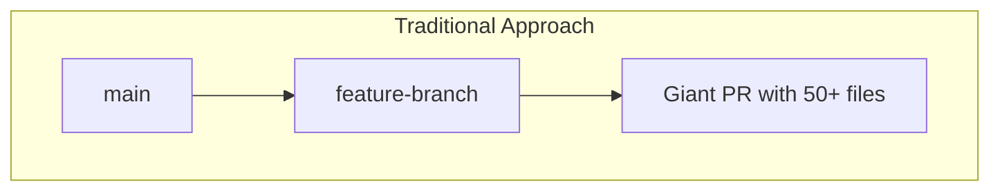
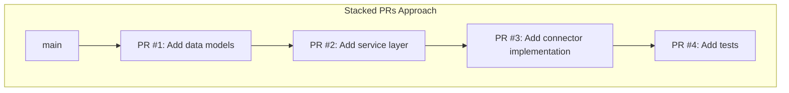
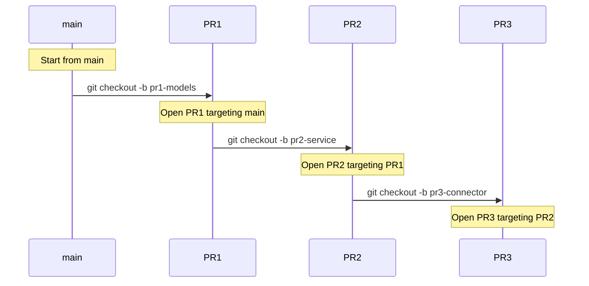
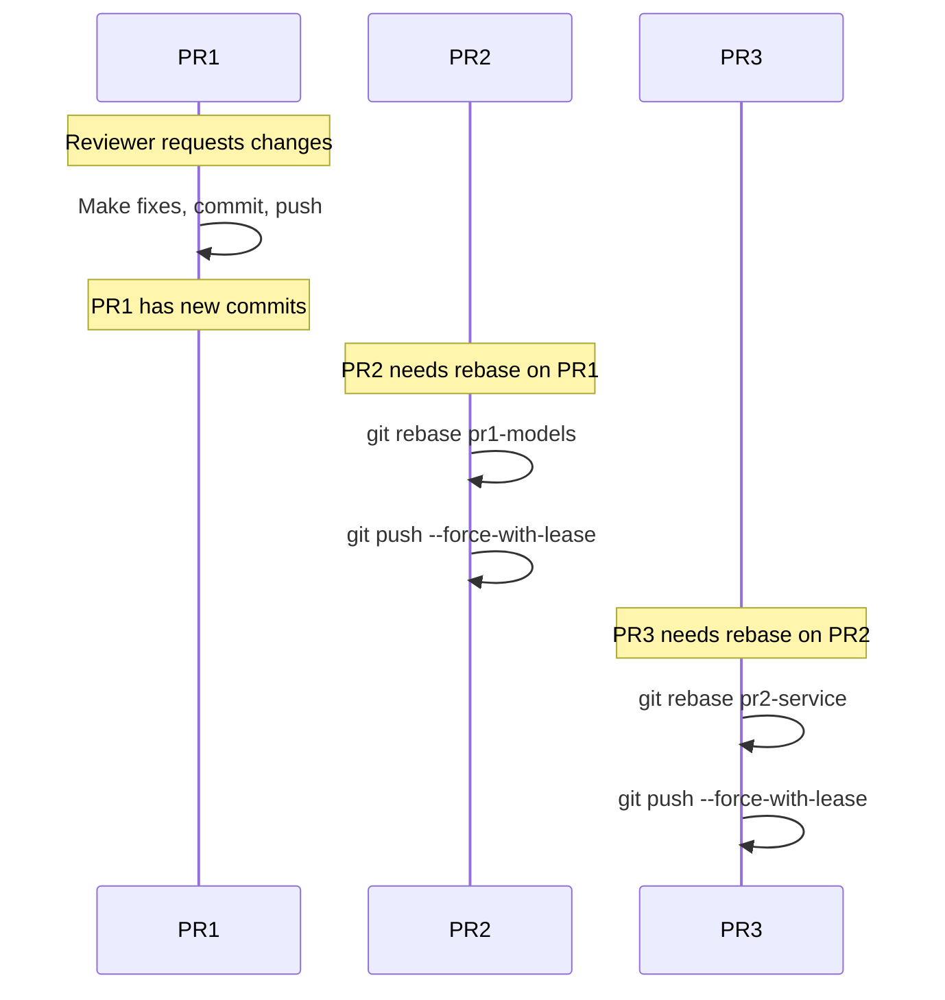
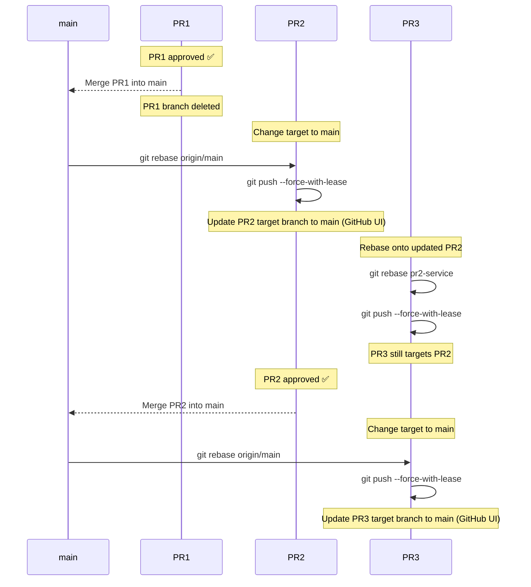

# Stacked Pull Requests

For large features, we recommend using **stacked PRs** - breaking down a large change into smaller, incremental pull
requests that build on top of each other.





## Benefits of Stacked PRs

| Benefit                  | Description                                |
|--------------------------|--------------------------------------------|
| **Easier reviews**       | 200-400 lines per PR instead of 2000+      |
| **Faster feedback**      | Get early feedback on foundational changes |
| **Reduced conflicts**    | Frequent merges to main minimize conflicts |
| **Incremental progress** | Ship partial features, easier rollbacks    |

## How to Create Stacked PRs

**Initial Setup:**



## Case 1: Addressing Review Comments on PR1

When you receive feedback on PR1 and need to make changes, all subsequent PRs must be rebased:



**Commands:**

```bash
# After fixing PR1, rebase PR2 onto updated PR1
git checkout pr2-service
git rebase pr1-models
git push --force-with-lease

# Then rebase PR3 onto updated PR2
git checkout pr3-connector
git rebase pr2-service
git push --force-with-lease
```

## Case 2: PR1 Approved and Merged

When PR1 is merged into main, PR2 needs to rebase onto main, and subsequent PRs rebase onto their parent:



**Commands:**

```bash
# After PR1 is merged, rebase PR2 onto main
git fetch origin
git checkout pr2-service
git rebase origin/main
git push --force-with-lease
# Then update PR2's target branch to "main" in GitHub UI

# Rebase PR3 onto updated PR2 (PR3 still targets PR2)
git checkout pr3-connector
git rebase pr2-service
git push --force-with-lease

# After PR2 is merged, rebase PR3 onto main
git fetch origin
git checkout pr3-connector
git rebase origin/main
git push --force-with-lease
# Then update PR3's target branch to "main" in GitHub UI
```

## Summary: Rebase Rules

| Scenario       | Action                                                         |
|----------------|----------------------------------------------------------------|
| Changes to PRn | Rebase all PRs after PRn (PRn+1, PRn+2, ...) onto their parent |
| PRn merged     | Rebase PRn+1 onto `main`, update target branch in GitHub UI    |

## Why `--force-with-lease` instead of `--force`?

When rebasing stacked PRs, you need to force push because you're rewriting history. However, `git push --force` can
accidentally overwrite a teammate's commits if they pushed to your branch (e.g., a co-author fix).

`git push --force-with-lease` is a **safer alternative** that only overwrites the remote branch if no one else has
pushed to it since you last fetched:

| Command              | Behavior                                                           |
|----------------------|--------------------------------------------------------------------|
| `--force`            | Overwrites remote **unconditionally** — may lose teammate's work ❌ |
| `--force-with-lease` | Overwrites **only if** remote hasn't changed — safe ✅              |

If `--force-with-lease` fails, fetch first and review what changed:

```bash
git fetch origin
git log origin/pr2-service  # See what changed before deciding
```

## Tools for Managing Stacked PRs

Managing stacked PRs manually can be tedious. These tools automate the rebasing and tracking:

| Tool                                                            | Description                                                                                              | Install                                       |
|-----------------------------------------------------------------|----------------------------------------------------------------------------------------------------------|-----------------------------------------------|
| [**stack-pr**](https://github.com/modular/stack-pr)             | Simple CLI tool for creating and managing stacked PRs on GitHub. Lightweight and easy to use.            | `pip install stack-pr`                        |
| [**Graphite**](https://graphite.dev)                            | Full-featured stacking platform with CLI + web UI. Auto-rebases, tracks dependencies, syncs with GitHub. | `brew install withgraphite/tap/graphite`      |
| [**git-town**](https://www.git-town.com)                        | Git extension for high-level workflow commands. Handles stacking, syncing, and shipping.                 | `brew install git-town`                       |
| [**gh-stack**](https://github.com/timothyandrew/gh-stack)       | Lightweight GitHub CLI extension for viewing/managing stacks.                                            | `gh extension install timothyandrew/gh-stack` |
| [**git-branchless**](https://github.com/arxanas/git-branchless) | Advanced Git workflow with undo, navigation, and stacking support.                                       | `brew install git-branchless`                 |

**Example with Graphite:**

```bash
# Create a stack
gt create pr1-models      # Creates PR1
gt create pr2-service     # Creates PR2 on top of PR1
gt create pr3-connector   # Creates PR3 on top of PR2

# After changes to PR1, rebase entire stack automatically
gt stack rebase

# Submit all PRs in the stack
gt stack submit
```

> [!TIP]
> **Want to learn more?**
> Read [Stacked Diffs (and why you should know about them)](https://newsletter.pragmaticengineer.com/p/stacked-diffs) by
> Gergely Orosz for an in-depth explanation of how companies like Google, Meta, and Uber use this workflow.

## When to Use Stacked PRs

✅ **Good candidates:**

- Large features (500+ lines)
- Refactoring with new functionality
- Changes spanning multiple layers (model → service → connector)
- Team members waiting on your code

❌ **Not necessary for:**

- Small bug fixes
- Single-file changes
- Isolated utility functions
