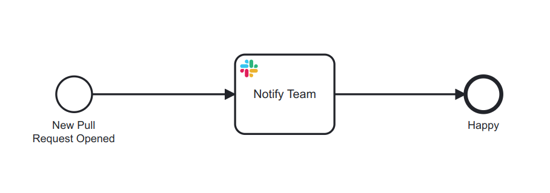

# Inbound Prototype Example

We use the following example to showcase inbound capabilities:




## What does it do?

* The process reacts to [Github `pull_request`](https://docs.github.com/en/developers/webhooks-and-events/webhooks/webhook-events-and-payloads#pull_request) webhooks.
* Activates on `pull_request.opened` in the `camunda` organization
* Sends a message to the `#general` slack channel notifiying the team on the new PR


## How does it work

The user configures the inbound webhook connector via `zeebe.property` bindings on the `bpmn:StartEvent`:

```xml
<bpmn:startEvent id="StartEvent_1" name="New Pull Request Opened">
  <bpmn:outgoing>Flow_147usyy</bpmn:outgoing>
  <bpmn:extensionElements>
    <zeebe:properties>
      <!-- type of inbound connector -->
      <zeebe:property name="inbound.type" value="webhook" />

      <!-- available via ${INBOUND_BASE}/GITHUB_INBOUND -->
      <zeebe:property name="inbound.context" value="GITHUB_INBOUND" />

      <!-- where to get the inbound secret from to validate against -->
      <zeebe:property name="inbound.secretExtractor" value="=get value(request.headers, &#34;x-hub-signature&#34;)" />
      
      <!-- secret to validate the request against -->
      <zeebe:property name="inbound.secret" value="secrets.GITHUB_INBOUND_SECRET" />
      
      <!-- activation condition for inbound behavior -->
      <zeebe:property name="inbound.activationCondition" value="=(&#10;  request.body.action = &#34;opened&#34; and &#10;  starts with(request.body.repository.full_name, &#34;camunda/&#34;)&#10;)" />

      <!-- which variables to pass from the webhook to start the process -->
      <zeebe:property name="inbound.variableMapping" value="={&#10;  &#34;githubLoginToSlackMapping&#34;: {&#10;    &#34;nikku&#34;: &#34;Nico Rehwaldt&#34;,&#10;    &#34;menski&#34;: &#34;menski&#34;&#10;  },&#10;  &#34;pull_request&#34;: {&#10;    &#34;htmlURL&#34;: request.body.pull_request.html_url,&#10;    &#34;githubUser&#34;: request.body.pull_request.user.login,&#10;    &#34;slackUser&#34;: get value(githubLoginToSlackMapping, githubUser),&#10;    &#34;githubUserURL&#34;: request.body.pull_request.user.html_url,&#10;    &#34;userLink&#34;: (&#10;      if slackUser = null then&#10;        &#34;GitHub user &#60;&#34; + githubUserURL + &#34;|&#34; + githubUser + &#34;&#62;&#34;&#10;      else&#10;         &#34;@&#34; + slackUser&#10;    )&#10;  }&#10;}" />
    </zeebe:properties>
  </bpmn:extensionElements>
</bpmn:startEvent>
```
